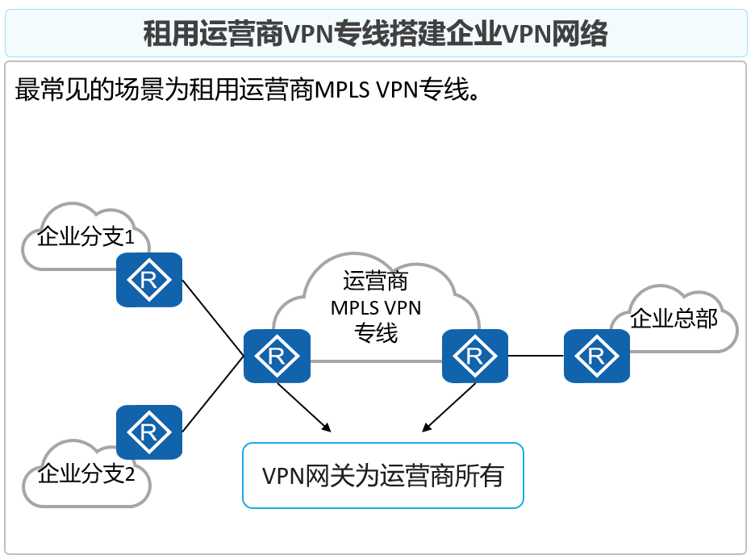
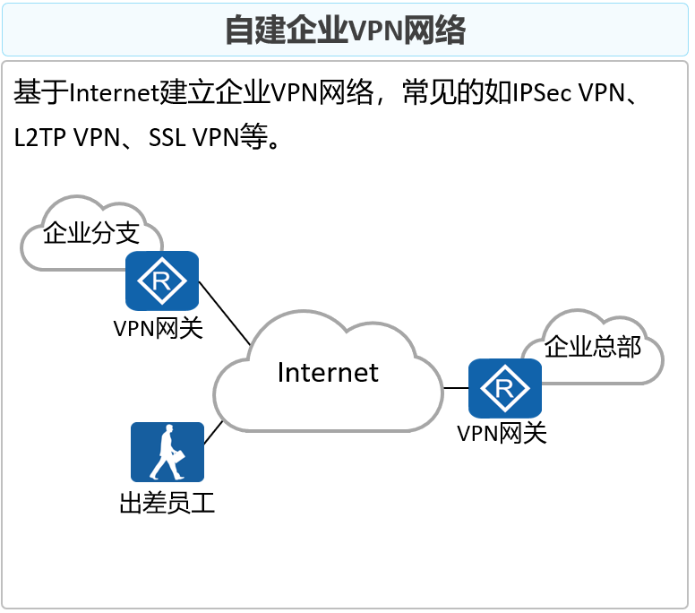

# VPN基础概论

**为了实现远距离的数据传输：**  
	1.通过Internet网络传递（不安全、不可靠、数据容易丢失等问题）  
	2.搭建专线网络（安全的、可靠的、造价昂贵）

**VPN：虚拟私有网络，在Internet网络上构建的虚拟的专线网络**  
==所有的VPN本质都是 数据的再封装==

**VPN的两个特点：**
==专用（Private）==
- VPN网络是专门供VPN用户使用的网络，对于VPN用户，使用VPN与使用传统专网没有区别。  
- VPN能够提供足够的安全保证，确保VPN内部信息不受外部侵扰。  
- VPN与底层承载网络（一般为IP网络）之间保持资源独立，即VPN资源不被网络中非该VPN的用户所使用
==虚拟（Virtual）==
- VPN用户的通信是通过公共网络进行的，而这个公共网络同时也可以被其他非VPN用户使用，  
- VPN用户获得的只是一个逻辑意义上的专网。

**VPN分类 - 根据建设单位不同**

**VPN分类 - 根据实现的网络层次**
- 远程访问VPN（Remote Access VPN）

- 局域网到局域网的VPN（Site-to-site VPN）

**VPN分类 - 根据实现的网络层次**

**VPN关键技术 - 身份认证、数据加密与验证**
身份认证、数据加密和认证技术可以有效保证VPN网络与数据的安全性：  
- 身份认证：可用于部署了远程接入VPN的场景，VPN网关对用户的身份进行认证，保证接入网络的都是合法用户而非恶意用户。也可以用于VPN网关之间对对方身份的认证。  
- 数据加密：将明文通过加密变成密文，使得数据即使被黑客截获，黑客也无法获取其中的信息。  
- 数据验证：通过数据验证技术对报文的完整性和真伪进行检查，丢弃被伪造和被篡改的报文。

| VPN   | 用户身份认证                 | 数据加密和验证          | 备注                             |
| ----- | ---------------------- | ---------------- | ------------------------------ |
| GRE   | 不支持                    | 支持简单的关键字验证、检验和验证 | 可以结合IPSec使用，利用IPSec的数据加密和验证特性。 |
| L2TP  | 支持基于PPP的CHAP、PAP、EAP认证 | 不支持              |                                |
| IPSec | 支持                     | 支持               | 支持预共享秘钥验证或证书认证；支持IKEv2的EAP认证。  |
| SSL   | 支持                     | 支持               | 支持用户名/密码或证书认证。                 |
| MPLS  | 不支持                    | 不支持              | 一般运行在专用的VPN骨干网络。               |
