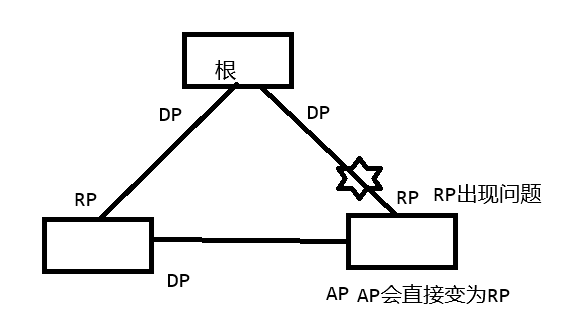

# RSTP
**STP与RSTP的区别**
- STP算法是被动的算法，依赖定时器等待的方式判断拓扑变化，收敛速度慢。
- RSTP就是在STP基础上做了改进
- ==RSTP所有改进的地方都是为了更加快速的收敛网络==
stp    802.1D  
rstp   802.1W  
mstp   802.1S

**RSTP报文格式：**

**RSTP对于STP的改进：**
1.端口角色  
- STP：DP 指定端口  RP 根端口  
- RSTP：DP 指定端口 RP 根端口  AP 预备端口  BP 备份端口  
- AP端口作为RP端口的备份、BP端口作为DP端口的备份

2.端口状态  
- STP：disable、blocking、listening、learning、forwarding  
- RSTP：discarding、learning、forwarding  
- 将三种不转发业务数据的状态变为了一种状态

3.BPDU类型：  
- STP：配置BPDU、TCN BPDU  
    1.type字段描述为0，表示BPDU是STP的配置BPDU  
    2.flag字段（TC bit、TCA bit）  
- RSTP：RST BPDU（配置BPDU）  
    1.type字段描述为2，表示BPDU是RSTP的RST BPDU  
    2.flag字段（TC bit、P bit、2个bit表示端口角色、2个bit表示端口状态 、A bit、TCA bit）

==STP只能向下兼容，STP设备收到RST BPDU会丢弃，RSTP设备收到配置BPDU会正常接收

4.BPDU报文的处理：  
	1.BPDU报文的发送者  
		STP：拓扑稳定后，只有根桥发送BPDU，其他非根桥设备转发BPDU  
		RSTP：所有设备发送自身的BPDU（就算没有收到根桥发送的BPDU，也会按照2s的时间发送BPDU）  
	2.更短的BPDU超时时间  
		STP：20s的BPDU老化  
	    ==RSTP：默认18s的老化 可以调整为6s     [HUAWEI] stp timer-factor \<1-10\>  ==
	3.次级BPDU的处理  
		STP：需要等待接口的BPDU老化再进行处理  
		RSTP：触发次级BPDU的处理机制，直接处理（直接向对端发送更好的BPDU）

5.快速收敛机制
   1.根端口快速切换  
    当设备根端口失效，如果存在AP端口，则AP端口会直接成为RP端口，不需要等待2个转发延迟时间，直接进入转发状态
    

   2.边缘端口
    将端口设置为边缘端口，可以让接口直接进入转发状态  
    边缘端口可以正常发送BPDU，不能接收BPDU  
    如果边缘端口收到了BPDU，则会退出边缘端口状态，进行RSTP的计算

   3.P/A机制
   ==P/A机制要求两台交换设备之间链路必须是点对点（P2P）的全双工模式 ==
      1.上下游设备在最开始都认为自身是根桥设备（发送RST BPDU给对方）  
      2.收到对端的RST BPDU后，上游设备知道自身作为根桥设备，下游设备知道自身为非根桥设备  
      3.上游设备会发送RST BPDU（P bit置位），且将DP端口设置为discarding状态  
      4.下游设备收到P bit置位的RST BPDU时，会将RP端口设置为discarding状态，同时会执行同步置位的操作  
      5.下游设备将除了AP端口和BP端口以外的其他所有端口都设置为discarding状态  
      6.同步置位完成后，下游设备会将RP端口设置为forwarding状态，并向上游回复一个RST BPDU（A bit置位）  
      7.上游设备收到下游设备发送的A bit置位的RST BPDU，将DP端口进入到forwarding状态  
      *P/A机制同步完成  

6.拓扑变更通知
   1.STP：DP、AP、RP端口进入转发状态 或者  RP端口进入down 认为拓扑发生变化  
          拓扑发生变更后，由变更的设备向根桥通告TCN BPDU，  
          根桥设备收到后，回复TCA bit置位的配置BPDU  和 TC bit置位的配置BPDU  
          其他设备收到TC bit置位的配置BPDU后，将mac地址表老化时间设置为一个转发延迟时间15s  
   2.RSTP：任何一个非边缘指定端口(DP)进入到转发状态，认为拓扑发生变化  
          1.设备认为拓扑发生了变化，在变化的端口上 启动TC while time定时器（4s）  
            在定时器时间内发送TC bit置位的RST BPDU  
          2.设备收到TC bit置位的RST BPDU后：  
            1.将所有接口（除了接收RST BPDU的接口和边缘端口以外的其他所有接口）的MAC地址清空  
            2.在清空MAC地址表的接口上 启动TC while time 定时器，发送TC bit置位的RST BPDU

**RSTP的保护机制：**  
1.BPDU保护：边缘端口的保护  
  设置了边缘端口的接口，不能接收BPDU，如果接收则退出边缘端口状态  
  设置了边缘端口，如果收到BPDU，则认为出现了网络攻击  
  在边缘端口配置BPDU保护，在收到BPDU后，接口会进入error-down  
  [Huawei-GigabitEthernet0/0/1]stp edged-port enable   
  [Huawei]stp bpdu-protection   
  [Huawei]display stp inter g0/0/1 查看stp端口状态

2.根保护（保护根桥）：   
  防止网络根桥设备，被恶意切换  
  可以在存有指定端口的设备上进行配置  
  [S1-root-GigabitEthernet0/0/1]stp root-protection   
  如果指定端口收到了更好的BPDU，则会将接口进入discarding状态  
  在接口不接收口更好BPDU后，等待2个转发延迟时间，端口重新进入forwarding状态

3.环路保护：根端口、阻塞端口的保护  
  防止网络出现环路  
  根端口和阻塞端口 因为网络拥塞或其他原因导致 没有收到 上游DP端口发送的BPDU报文  
  则根端口转换为指定端口，阻塞端口转换为指定端口，网络中不存在阻塞端口 出现环路  
  [S3-GigabitEthernet0/0/2]stp loop-protection   
  RP、AP端口长时间没有收到上游发送BPDU报文后，则切换端口角色，但是端口状态变为discarding  
  端口状态一直持续，收到上游发送的BPDU为止

4.TC BPDU保护：  
  防止网络中出现大量的TC BPDU，设备收到后刷新接口的MAC地址  
  对于数据的转发会执行泛洪的操作（浪费设备的资源）  
  [S3]stp tc-protection threshold \<1-255\>  
  设备收到大量的TC BPDU后，会按照正常的逻辑处理2个TC BPDU，多出的部分按照设置阈值（默认值1）进行处理  
  即多出的TC BPDU当作一个报文进行处理一次

