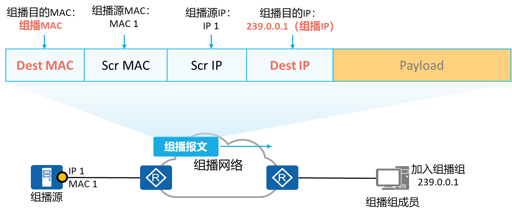
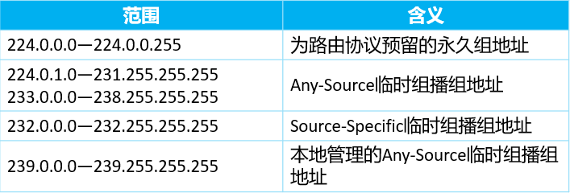
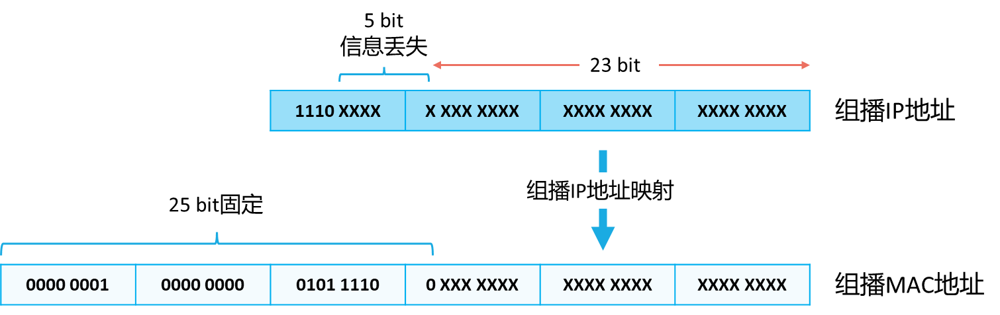

# **组播基础**
组播目的IP地址：目的IP地址为组播IP地址，地址范围从224.0.0.0到239.255.255.255
组播目的MAC地址：目的MAC地址为组播MAC地址，组播MAC地址由组播IP地址映射而来

在IPv4地址空间中，D类地址（224.0.0.0/4）被用于组播。一个组播地址就表示一个点到多点的数据流，比如IPTV数据流，语音会议数据流。
大多数情况下，同一个组播网络里不同的业务（比如，IPTV，语音会议）就需要使用不同的组播IP地址。
IANA对D类地址做了进一步的定义，几种主要的组播地址如下表所示：

组播MAC
以太网传输IPv4单播报文的时候，目的MAC地址使用的是接收者的MAC地址。但是在传输组播数据时，其目的地不再是一个具体的接收者，而是一个成员不确定的组，所以要使用IPv4组播MAC地址。
IANA规定，IPv4组播MAC地址的高24位为0x01005e，第25位为0，低23位为IPv4组播地址的低23位，例如组播组地址224.0.1.1对应的组播MAC地址为01-00-5e-00-01-01。

注意：
1.由于组播ip地址映射到组播MAC时，有5bit丢失所以会造成 不通的组播ip地址会对应 相同的组播MAC（私网MAC不会出现该情况）
#什么是组播mac
==2.对于组播MAC的地址: 第8位固定为1，其他位不全为1==

•IPv4组播地址的前4位是固定的1110，对应组播MAC地址的高25位，后28位中只有23位被映射到MAC地址，因此丢失了5位的地址信息，直接结果是有32个IPv4组播地址映射到同一MAC地址上。例如IP地址为224.0.1.1、224.128.1.1、225.0.1.1、239.128.1.1等组播组的组播MAC地址都为01-00-5e-00-01-01。网络管理员在分配地址时必须考虑这种情况。
•IETF认为同一个局域网中两个或多个组地址生成相同的MAC地址的几率非常低，不会造成太大的影响。
•组播MAC地址标识了一组设备，这种MAC地址第1个字节的最低比特位为1，例如0100-5e-00ab。
•一个组播MAC地址所标识的一组设备有着共同的特点，那就是它们都加入了相同的组播组，这些设备将会侦听目的MAC地址为该组播MAC地址的数据帧。只有单播MAC地址才能够被分配给一个以太网接口，组播或广播MAC地址是不能被分配给任何一个以太网接口的，换句话说，这两种类型的MAC地址不能作为数据帧的源MAC地址，而只能作为目的MAC地址。
•对于组播MAC地址，相信大家并不会太陌生，例如STP协议的BPDU载荷便是被直接封装在以太网数据帧中的，并且数据帧的目的MAC地址为0180-c200-0000，这就是一个组播MAC地址，类似这样的例子还有很多，此处不再一一列举，这些组播MAC地址并不与组播IP地址存在关联。
•除此之外，还有一类组播MAC地址是我们需要格外关注的，那就是与组播IP地址存在映射关系的组播MAC地址。本课程介绍的组播MAC地址对应该类型。