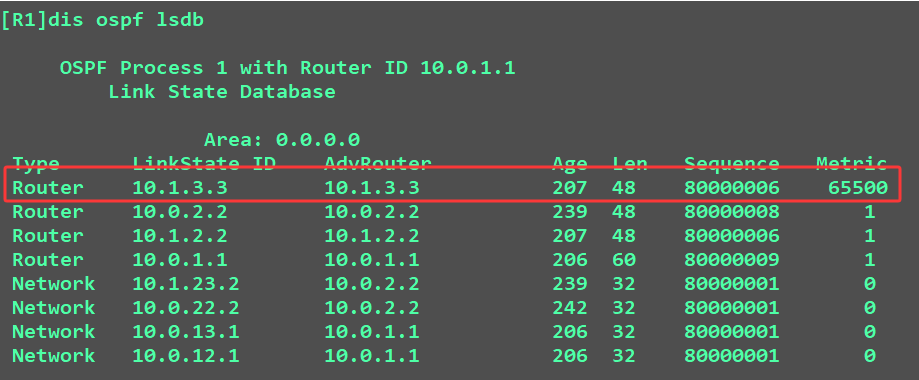

# 防火墙的双机热备份
**防火墙的双机热备份目的：**
- 通过增加设备数量来实现冗余性，提高可靠性；  
- 将多台设备变为逻辑的一台设备（多虚一），为了更好的管理设备

**防火墙可以通过双机热备实现多虚一（华为最多支持两台防火墙）**

**双机热备场景：**
1.防火墙链接二层网络
	防火墙连接的是同一个网段内网络，连接交换机  
2.防火墙链接三层网络
	防火墙连接的是不同的网段的网络，连接路由器

## 一、防火墙连接二层网络  
防火墙链接二层网络需要通过**vrrp协议**来实现网关的冗余  
**==对于vrrp的主备设备，无法通过优先级值选举，只能通过管理员配置手工指定==**

只通过VRRP无法实现防火墙的双机热备组建  
因为防火墙需要通过会话检测实现通信，如果主墙的会话信息没有给备墙同步，则主备切换后，一定会出现业务中断  
需要实现防火墙主备会话信息同步
防护墙通过HRP协议来实现信息同步：**==HRP（Huawei Redundancy Protocol）==** 华为冗余协议  
```R
[FW1]hrp track interface GigabitEthernet 1/0/1   
[FW1]hrp interface GigabitEthernet 1/0/1 remote 10.1.12.2   两端相互指定对端的hrp地址  
[FW2]hrp track interface GigabitEthernet 1/0/1   
[FW2]hrp interface GigabitEthernet 1/0/1 remote 10.1.12.1   
[FW1]hrp enable   
[FW2]hrp enable 
```
对于主墙向备墙同步的信息，都是安全策略相关的内容

```R
HRP_S[FW2]hrp standby config enable   使能备设备安全策略的相关配置
HRP_M[FW1]hrp mirror session enable   快速主备之间同步会话信息
```
**对于规划的VRRP主设备，管理员手工指定，对于指定的设备会成为所有VRRP组的主设备否则会造成流量来回路径不一致**


## 二、防火墙连接三层网络防火墙链接三层网络
因为是跨网段的链接，所以**不需要vrrp**提供虚拟冗余网关  
==所以两台防火墙设备只需要相互同步会话信息即可==
通过HRP来实现会话信息同步：

```d
[FW3]hrp track interface GigabitEthernet 1/0/2   
[FW3]hrp interface GigabitEthernet 1/0/2 remote 10.1.34.4   
[FW3]hrp enable   
HRP_M[FW3]hrp standby-device   将设备状态切换为备设备

[FW4]hrp track interface GigabitEthernet 1/0/2  
[FW4]hrp interface GigabitEthernet 1/0/2 remote 10.1.34.3   
[FW4]hrp enable   
HRP_S[FW4]hrp standby-device              指定设备为备设备
```
*HRP_S[FW4]hrp adjust ospf-cost enable     在备设备上指定OSPF协议下发最大的cost值*
**执行该命令后：**
	==备设备的所有 OSPF 接口 Cost 值会被自动修改为最大值（65535）意味着：ospf的流量都不会走备设备，全走主设备==

主备设备没有使用上的区别，因为会话表项都是可以同步
**如果要实现负载分担转发，需要如何配置？**
	==将备设备下发最大值的cost功能关闭，即可实现负载分担==
```d
	HRP_S[FW4]undo hrp adjust ospf-cost enable 
```
**在负载分担情况下，为了确保两台防火墙设备的信息是同步的**
所以需要开启快速会话同步功能  
```d
HRP_S[FW3]hrp mirror session enable   
HRP_M[FW4]hrp mirror session enable
```

**需要注意点是：**
1.在配置防火墙热备份时，需要选择一台防火墙作为所有流量的主设备，因为要==保证出入流量的路径一致。==
2.防火墙上的接口如果想要使能ospf计算，必须将接口加入对应的安全区域。


HRP知识补充：
**HRP心跳线：**
- 双机热备组网中，心跳线是两台防火墙交互消息了解对端状态、备份配置命令和各种表项的通道。  
- 心跳接口可以是一个物理接口（GE接口），或者多个物理接口捆绑成的一个逻辑接口（Eth-Trunk）

**抢占：默认开启，默认抢占时延为60s。