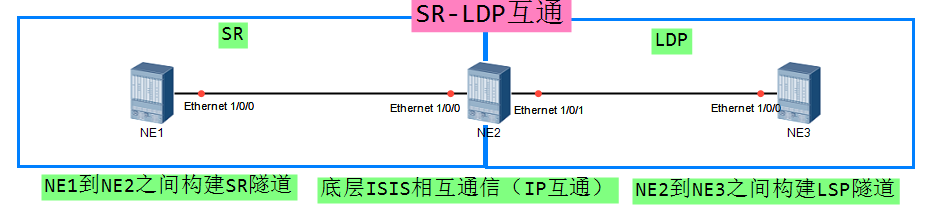

此时NE1不存在NE3环回口的前缀段ID
NE3不存在NE1的LDP LSP
（即NE1和NE3之间无法通过标签实现通信）

NE2需要进行标签消息的映射
```
#
segment-routing
 mapping-server prefix-sid-mapping 3.3.3.3 32 300
#
isis 1
 segment-routing mapping-server send
```
NE2设备配置完映射消息后将NE3的环回口直接作为node sid进行发布
```
[NE2]dis segment-routing prefix mpls forwarding 
Prefix             Label      OutLabel   Interface         NextHop          Role  MPLSMtu   Mtu     State          
3.3.3.3/32         16300      NULL       Mapping LDP       ---              E&T   ---       ---     Active
```

```
[NE1]dis segment-routing prefix mpls forwarding 
Prefix             Label      OutLabel   Interface         NextHop          Role  MPLSMtu   Mtu     State          
3.3.3.3/32         16300      16300      GE3/0/0           10.1.12.2        I&T   ---       1500    Active    
```

需要NE2进行完成标签消息的映射
```
#
mpls
 lsp-trigger segment-routing-interworking best-effort host
```
NE2配置标签的生成方式为SR的BE 主机路由
```
[NE2]dis mpls lsp 
FEC                In/Out Label    In/Out IF                      Vrf Name

1.1.1.1/32         48034/NULL      -/-                            
```
```
[NE3]dis mpls lsp 
FEC                In/Out Label    In/Out IF                      Vrf Name

1.1.1.1/32         NULL/48034      -/GE3/0/0                      

1.1.1.1/32         48002/48034     -/GE3/0/0      
```
