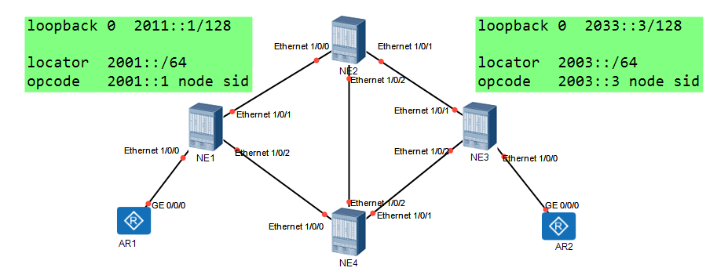

SRv6设备类型：
1.SRv6源节点：生成SRv6报文的节点
2.SRv6中间节点：只根据IPv6的DIP地址进行报文的转发
3.SRv6目标节点：接收并处理SRv6报文（报文的DIP必须是本地存在的SID或者接口地址信息）


SRv6的基本原理：
1.SRH：段路由头
   1.为了基于IPv6转发平面实现SR
   2.为IPv6报文新增加路由扩展头
     该字段存储了IPv6 segment list信息
     其作用和SR-MPLS的段列表相同

2.SRH的扩展头格式
  截图
   1.段列表
     段列表是从路径的最后一段开始编码
     segment list[0]  是路径的倒数第一个编码
     segment list[1]  是路径的倒数第二个编码
      。。。。
     segment list[n-1] 是路径的第二个编码
     segment list[n]   是路径的第一个编码
    *封装的编码是一种倒序的封装
     该字段使用时， n 作为第一个被使用segment list
                    0 作为最后一个被使用segment list

3.SRv6 segment
  因为IPv6的地址长度为128 bit
  所以IPv6直接将地址作为SRv6的SID（segment identifier）
  1.SRv6 SID由两部分组成
    1.locator：具有定位功能，所以在SR域内要求是唯一的
       1.配置locator信息后，系统会自动生成一条locator网段的路由，并通过IGP扩散到全网
       2.locator对于IPv6-prefix参数，长度由prefix-length决定
       3.locator段内所有的IPv6地址都可以作为SRv6 SID进行分配
    2.function：代表设备的指令，指令都是设备预先设置完成的，该部分用于指示SRv6 SID的生成节点
       1.opcode：是function执行功能
          1.静态配置的（管理员决定静态占用的地址长度）
          2.自动生成的（管理员决定动态占用的地址长度）
       2.arguments（function的可选字段）
          如果存在该字段，则SRv6 SID的构成为 locator  +  function  +  arguments
       3.arguments占据了IPv6地址的最低比特位

SRv6 BE 
SRv6 policy

## 配置思路：
1.构建底层IGP互联通信（ISIS ipv6）
2.设置SRv6的信息通过IGP相互扩散


```
NE1：
#
segment-routing ipv6                      SRv6试图
 encapsulation source-address 2011::1     指定SRv6封装报文的SIP
 locator NE1 ipv6-prefix 2001:: 64 static 32     指定locator的网段，并设置静态占用的长度
  opcode ::1 end psp                             设置end参数代码，即设备的node sid
#

isis 1
 segment-routing ipv6 locator NE1 auto-sid-disable  ISIS执行SRv6的通告并关闭自动分配的操作
```

```
NE3:
#
segment-routing ipv6
 encapsulation source-address 2033::3
 locator NE3 ipv6-prefix 2003:: 64 static 32
  opcode ::3 end psp
#

isis 1
 segment-routing ipv6 locator NE3  auto-sid-disable
```

```
NE1：
#
ip vpn-instance A
 ipv4-family
  route-distinguisher 100:1
  apply-label per-instance
  vpn-target 1:1 export-extcommunity
  vpn-target 1:1 import-extcommunity
#
ospf 1 vpn-instance A
 import-route bgp
 opaque-capability enable
 area 0.0.0.0
#
interface GigabitEthernet3/0/0
 ip binding vpn-instance A
 ip address 192.168.1.254 255.255.255.0
 ospf enable 1 area 0.0.0.0
#
bgp 100
 router-id 10.1.1.1
 private-4-byte-as enable
 peer 2033::3 as-number 100
 peer 2033::3 connect-interface LoopBack0
 #
 ipv4-family vpnv4
  policy vpn-target
  peer 2033::3 enable
  peer 2033::3 prefix-sid  邻居之间使能通告前缀SID的能力
 #
 ipv4-family vpn-instance A
  network 100.1.1.1 255.255.255.255
  segment-routing ipv6 locator NE1 auto-sid-disable  绑定SRv6的locator
  segment-routing ipv6 best-effort         设置隧道的优选为SRv6 BE隧道
```

```
NE3：
#
ip vpn-instance A
 ipv4-family
  route-distinguisher 100:2
  apply-label per-instance
  vpn-target 1:1 export-extcommunity
  vpn-target 1:1 import-extcommunity
#
ospf 1 vpn-instance A
 import-route bgp
 opaque-capability enable
 area 0.0.0.0
#
interface GigabitEthernet3/0/0
 ip binding vpn-instance A
 ip address 192.168.2.254 255.255.255.0
 ospf enable 1 area 0.0.0.0
#
bgp 100
 router-id 10.3.3.3
 private-4-byte-as enable
 peer 2011::1 as-number 100
 peer 2011::1 connect-interface LoopBack0
 #
 ipv4-family vpnv4
  policy vpn-target
  peer 2011::1 enable
  peer 2011::1 prefix-sid
 #
 ipv4-family vpn-instance A
  network 100.2.2.2 255.255.255.255
  segment-routing ipv6 locator NE3 auto-sid-disable 
  segment-routing ipv6 best-effort
```

### NE1和NE3进行站点SRv6 SID代码的编写
``
```
NE1：
#
segment-routing ipv6
 locator NE1 
  opcode ::100 end-dt4 vpn-instance A
```

```
NE3：
#
segment-routing ipv6
 locator NE3 
  opcode ::300 end-dt4 vpn-instance A
```

至此 SRv6 BE隧道建立完成，数据通信完成
```
数据报文到达目标后，会根据信息进行检索，即将DIP 2003::300查找对应的VPN实例
[NE3]display segment-routing ipv6 local-sid end-dt4 vpn-instance A forwarding 
                    My Local-SID End.DT4 Forwarding Table
                    -------------------------------------
SID        : 2003::300/128                                FuncType    : End.DT4
VPN Name   : A                                            VPN ID      : 1
LocatorName: NE3                                          LocatorID   : 1
Flavor     : NO-FLAVOR                                    SidCompress : NO
UpdateTime : 2025-08-10 15:31:04.533
```

# SRv6 policy
```
NE1：
#
segment-routing ipv6
 encapsulation source-address 2011::1
 locator NE1 ipv6-prefix 2001:: 64 static 32
  opcode ::1 end psp
  opcode ::102 end-x interface GigabitEthernet3/0/1 nexthop 2012::2 psp
  opcode ::104 end-x interface GigabitEthernet3/0/2 nexthop 2014::4 psp
  opcode ::100 end-dt4 vpn-instance A
#
```

```
NE2：
#
segment-routing ipv6
 encapsulation source-address 2022::2
 locator NE2 ipv6-prefix 2002:: 64 static 32
  opcode ::2 end psp
  opcode ::201 end-x interface GigabitEthernet3/0/0 nexthop 2012::1 psp
  opcode ::203 end-x interface GigabitEthernet3/0/1 nexthop 2023::3 psp
  opcode ::204 end-x interface GigabitEthernet3/0/2 nexthop 2024::4 psp
#
isis 1
 segment-routing ipv6 locator NE2 auto-sid-disable
```

```
NE4：
#
segment-routing ipv6
 encapsulation source-address 2044::4
 locator NE4 ipv6-prefix 2004:: 64 static 32
  opcode ::4 end psp
  opcode ::401 end-x interface GigabitEthernet3/0/0 nexthop 2014::1 psp
  opcode ::402 end-x interface GigabitEthernet3/0/2 nexthop 2024::2 psp
  opcode ::403 end-x interface GigabitEthernet3/0/1 nexthop 2034::3 psp
#
isis 1
 segment-routing ipv6 locator NE4 auto-sid-disable
```

```
NE3：
#
segment-routing ipv6
 encapsulation source-address 2033::3
 locator NE3 ipv6-prefix 2003:: 64 static 32
  opcode ::3 end psp
  opcode ::302 end-x interface GigabitEthernet3/0/1 nexthop 2023::2 psp
  opcode ::304 end-x interface GigabitEthernet3/0/2 nexthop 2034::4 psp
  opcode ::300 end-dt4 vpn-instance A
#
```


```
对于SBFD和hot stanby配置：
NE1：
te ipv6-router-id 2011::1
#
bfd
#
sbfd
 reflector discriminator 10.1.1.1
 destination ipv6 2033::3 remote-discriminator 10.3.3.3
#
segment-routing ipv6
 srv6-te-policy backup hot-standby enable
 srv6-te-policy bfd seamless enable

NE3：
te ipv6-router-id 2033::3
#
bfd
#
sbfd
 reflector discriminator 10.3.3.3
 destination ipv6 2011::1 remote-discriminator 10.1.1.1
#
segment-routing ipv6
 srv6-te-policy backup hot-standby enable
 srv6-te-policy bfd seamless enable
```

NE1和NE3进行显示路径的配置，并配置SRv6的策略
```
NE1：
#
segment-routing ipv6
 segment-list NE1_NE3_backup
  index 1 sid ipv6 2001::104
  index 2 sid ipv6 2004::403
 segment-list NE1_NE3_master
  index 1 sid ipv6 2001::102
  index 2 sid ipv6 2002::204
  index 3 sid ipv6 2004::403
 srv6-te policy test endpoint 2033::3 color 100
  candidate-path preference 200
   segment-list NE1_NE3_master
  candidate-path preference 100
	   segment-list NE1_NE3_backup
```
 
```
NE3：
#
segment-routing ipv6
 segment-list NE3_NE1_backup
  index 1 sid ipv6 2003::304
  index 2 sid ipv6 2004::401
 segment-list NE3_NE1_master
  index 1 sid ipv6 2003::302
  index 2 sid ipv6 2002::204
  index 3 sid ipv6 2004::401
 srv6-te policy test endpoint 2011::1 color 300
  candidate-path preference 200
   segment-list NE3_NE1_master
  candidate-path preference 100
   segment-list NE3_NE1_backup
```

NE1和NE3将站点的路由进行颜色标记
```
NE1：
ip ip-prefix 1 index 10 permit 100.2.2.2 32
#
route-policy color permit node 10
 if-match ip-prefix 1
 apply extcommunity color 0:100
```
```
NE3：
ip ip-prefix 1 index 10 permit 100.1.1.1 32
#
route-policy color permit node 10
 if-match ip-prefix 1
 apply extcommunity color 0:300
```

NE1和NE3进行BGP路由通告时打上标记信息
```
NE1：
#
bgp 100
 router-id 10.1.1.1
 private-4-byte-as enable
 peer 2033::3 as-number 100
 peer 2033::3 connect-interface LoopBack0
 #
 ipv4-family vpnv4
  policy vpn-target
  peer 2033::3 enable
  peer 2033::3 route-policy color import   配置入方向策略
  peer 2033::3 prefix-sid
 #
 ipv4-family vpn-instance A
  network 100.1.1.1 255.255.255.255
  segment-routing ipv6 locator NE1 auto-sid-disable
  segment-routing ipv6 traffic-engineer best-effort
                     BGP优选TE隧道优于BE隧道
#
```

```
NE3：
#
bgp 100
 router-id 10.3.3.3
 private-4-byte-as enable
 peer 2011::1 as-number 100
 peer 2011::1 connect-interface LoopBack0
 #
 ipv4-family vpnv4
  policy vpn-target
  peer 2011::1 enable
  peer 2011::1 route-policy color import
  peer 2011::1 prefix-sid
 #
 ipv4-family vpn-instance A
  network 100.2.2.2 255.255.255.255
  segment-routing ipv6 locator NE3 auto-sid-disable
  segment-routing ipv6 traffic-engineer best-effort
```

NE1和NE3进行隧道的优选
```
NE1：
#
tunnel-policy test
 tunnel select-seq ipv6 srv6-te-policy load-balance-number 1
#
ip vpn-instance A
  tnl-policy test
```

```
NE3
#
tunnel-policy test
 tunnel select-seq ipv6 srv6-te-policy load-balance-number 1
#
ip vpn-instance A
  tnl-policy test
```