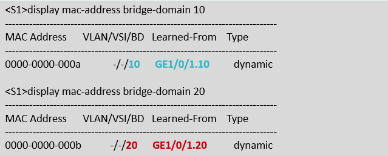
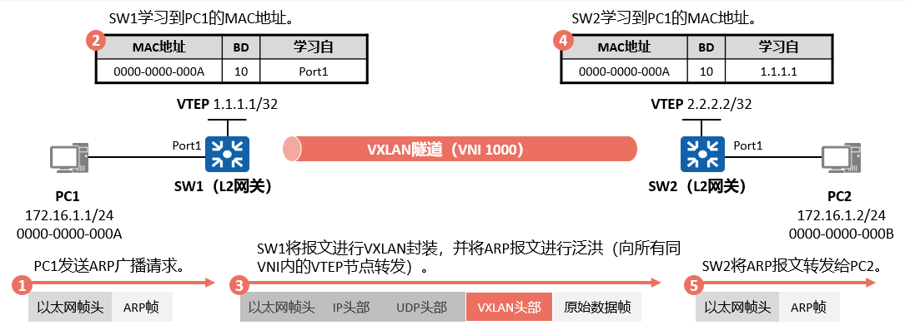
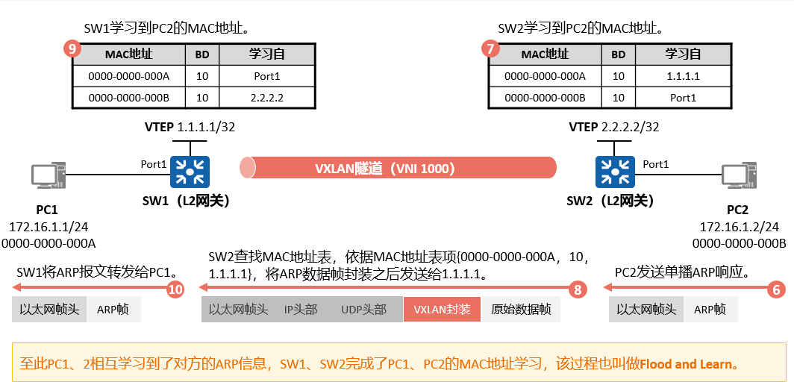
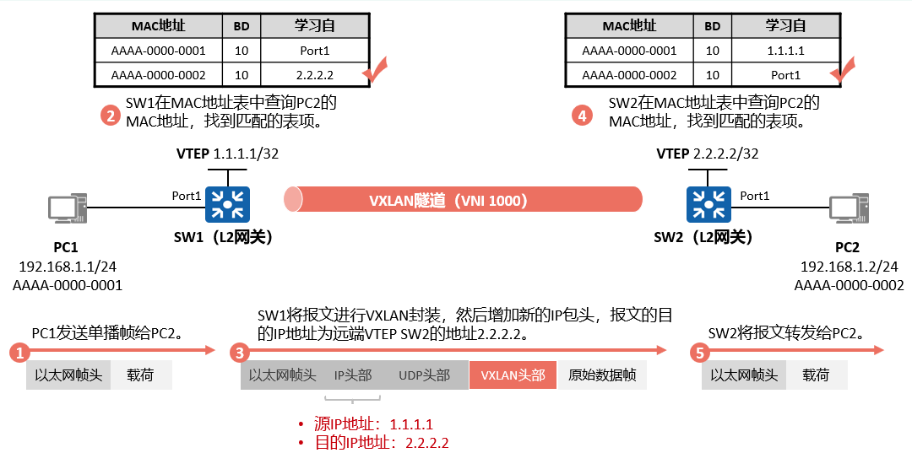

# **VXLAN隧道的建立方式**
VXLAN隧道由一对VTEP确定，报文在VTEP设备进行封装之后在VXLAN隧道中依靠路由进行传输。
只要VXLAN隧道的两端VTEP是三层路由可达的，VXLAN隧道就可以建立成功。  

根据VXLAN隧道的创建方式将VXLAN隧道分为以下两种
1. 静态隧道：通过用户手工配置本端和远端的VNI、VTEP IP地址和头端复制列表（head-end peer-list）来完成。
2. 动态隧道：通过BGP EVPN（Ethernet VPN，以太网虚拟私有网络）方式动态建立VXLAN隧道。在VTEP之间建立BGP EVPN对等体，然后对等体之间利用BGP EVPN路由来互相传递VNI和VTEP IP地址信息，从而实现动态地建立VXLAN隧道。

## **静态VXLAN隧道**
- 静态VXLAN隧道并不是一个有状态的隧道（如IPsec VPN），只是数据传输时的隧道封装，类似于GRE VPN。
- 头端复制列表中的地址，即进行隧道封装传输时可封装的隧道目的地址。

### **VXLAN MAC地址表项**  
VXLAN实现的是在Overlay网络中进行二层转发，转发单播数据帧依赖的依旧是MAC地址表项。  
VTEP接收到BD内来自本地的数据帧，将数据帧的源MAC地址添加到该BD的MAC地址表中，出接口为收到数据帧的接口。  
该表项用于指导发往本VTEP下连接终端的数据帧的转发。
   
**如何将数据帧转发至连接在远端VTEP下的设备呢？**
MAC地址动态学习  
转发属于远端VTEP下所连接设备的数据帧，需要先学习到远端设备的MAC地址。  
该过程与传统MAC地址表形成过程类似，依赖于主机之间的报文交互，一般通过ARP报文交互形成MAC地址表项。

  

**同子网已知目的地址单播报文转发**
  

**BUM流量转发**  
传输BUM（Broadcast、Unknown、Multicast）流量时，  
VTEP会将流量复制多份发送到头端复制列表中的对端VTEP，从而在Overlay网络中实现泛洪转发的效果。
  

**跨子网转发**
