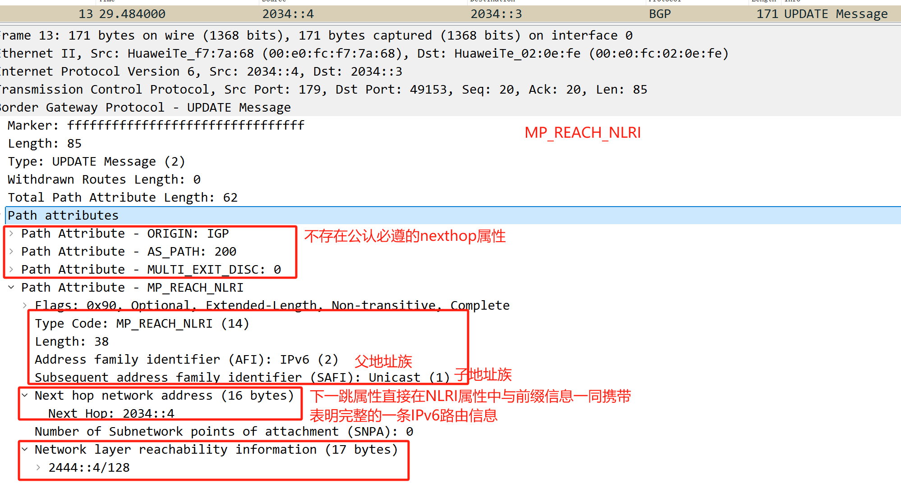
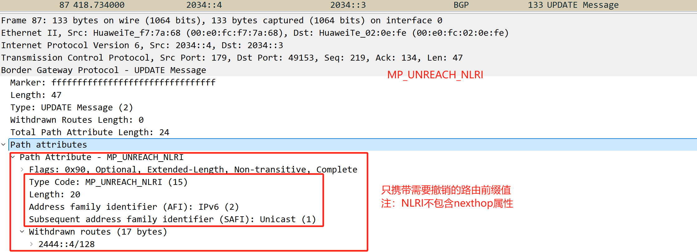
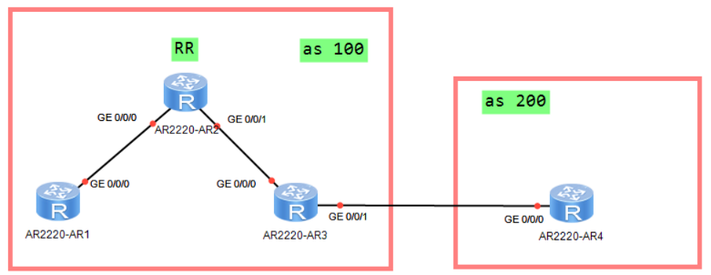

# BGP4+
对于ipv4支持的bgp，称为bgp4  
对于IPv6支持的bgp，称为bgp4+
 
BGP对于协议支持的，称为MP-BGP 
bgp4、bgp4+都是MP-BGP中一种单独协议支持叫法  
还存在vpnv4bgp ebgp等等

**==BGP因为基于TCP的，所以需要两端地址可达（即设备不能使用链路本地地址建立BGP邻居）==**
**==所以的BGP4+的邻居都需要通过全球单播地址来建立==**
## **BGP对于IPv6的支持，就是增加了可扩展的TLV**
**1.MP-REACH-NLRI（14）多协议可达的网络层可达信息**  
路由更新


**2.MP-UNREACH-NLRI（15）多协议不可达的网络层可达信息**
路由撤销



[AR4-bgp-af-ipv6]network 2444::4 128 对于IPv6地址的通告，需要在ipv6单薄地址族下进行
**AR2：**
```
#  
bgp 100  
 router-id 10.2.2.2  
 peer 2011::1 as-number 100   
 peer 2011::1 connect-interface LoopBack0  
 peer 2033::3 as-number 100   
 peer 2033::3 connect-interface LoopBack0  
 #  
 ipv4-family unicast  
  undo synchronization  
 #  
 ipv6-family unicast  
  undo synchronization  
  peer 2011::1 enable  
  peer 2011::1 reflect-client  
  peer 2033::3 enable  
  peer 2033::3 reflect-client  
#
```
**AR3：**
```
#  
bgp 100  
 router-id 10.3.3.3  
 peer 2022::2 as-number 100   
 peer 2022::2 connect-interface LoopBack0  
 peer 2034::4 as-number 200   
 #  
 ipv4-family unicast  
  undo synchronization  
 #  
 ipv6-family unicast  
  undo synchronization  
  peer 2022::2 enable  
  peer 2022::2 next-hop-local  
  peer 2034::4 enable  
#
```
**AR4：**
```  
#  
bgp 200  
 router-id 10.4.4.4  
 peer 2034::3 as-number 100   
 #  
 ipv4-family unicast  
  undo synchronization  
 #  
 ipv6-family unicast  
  undo synchronization  
  network 2444::4 128   
  peer 2034::3 enable  
#
```
