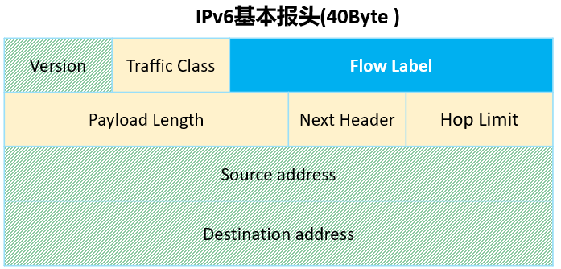
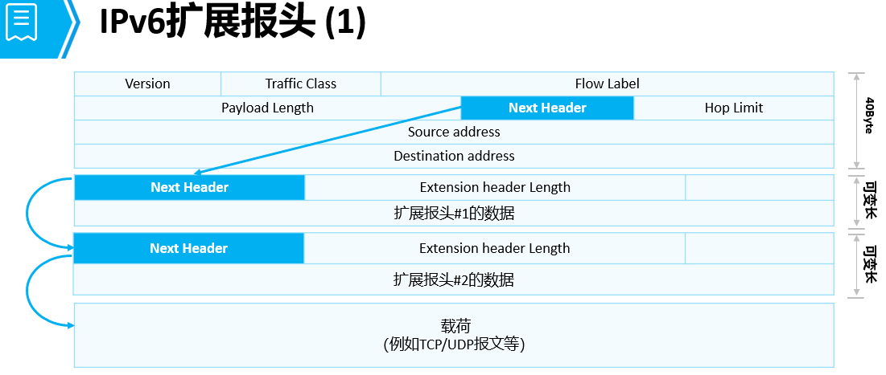

# IPv6报文格式

**IPv6报头：**  
	1.基本报头： 固定长度为40字节
	
		1.version：4bit，表示v6版本  
		2.traffic class：8bit，用于qos的优先级值匹配  
		3.flow label：20bit，流标签可以用来表示特定流的信息，转发路径上的路由器可以根据流标签来区分流并进行处理  
		4.payload length：16bit，有效载荷长度，表示基本报头后携带的所有数据内容长度  
		5.next header：8bit，用来表示当前头部报文后下一个报头的类型，提高了转发的效率  
		6.hop limit：8bit，和ipv4的ttl值作用相同，只是名称做了改变  
		7.SIpv6：16字节  
		8.DIpv6：16字节
	2.扩展报头：
	
		1.逐跳选项报头 0 在转发路径上的每一台设备都要查看并处理该字段（资源预留）  
		2.目的选项报头 60 该字段携带的信息是，只有目标节点才会处理的信息  
		3.路由报头 43 由源节点设备指定数据必须经过特定的设备访问  
		4.分段报头 44 和IPv4一样执行数据包分片的  
		5.认证报头 51 由==IPsec提供报文字段的保护（认证、数据完整性校验、防重放）  ==
		6.封装安全净载报头50 由==IPsec提供报文字段的保护（认证、数据完整性校验、防重放）  ==
		7.目的选项报头 60 该字段携带的信息是，只有目标节点才会处理的信息
	

**IPv6报头设计中对原IPv4报头所做的一项重要改进就是将所有可选字段移出IPv6报头，置于扩展头中。**
IPv6扩展报头是可能跟在基本IPv6报头后面的可选报头。为什么在IPv6中要设计扩展报头呢？
- 因为在IPv4的报头中包含了所有的选项，每个中间路由器都必须检查这些选项是否存在，如果存在，就必须处理它们。
- 这种设计方法会降低路由器转发IPv4数据包的效率。
- 为了==解决转发效率问题==，在IPv6中，相关选项被移到了扩展报头中。
- 中间路由器就不需要处理每一个可能出现的选项，这种处理方式提高了路由器处理数据包的速度，也提高了其转发性能。　　

通常，一个典型的IPv6包，没有扩展头。
仅当需要路由器或目的节点做某些特殊处理时，才由发送方添加一个或多个扩展头。
与IPv4不同，IPv6扩展头长度任意，不受40Byte限制，以便于日后扩充新增选项，这一特征加上选项的处理方式使得IPv6选项能得以真正的利用。
==但是为了提高处理选项头和传输层协议的性能，扩展头总是8Byte长度的整数倍。==