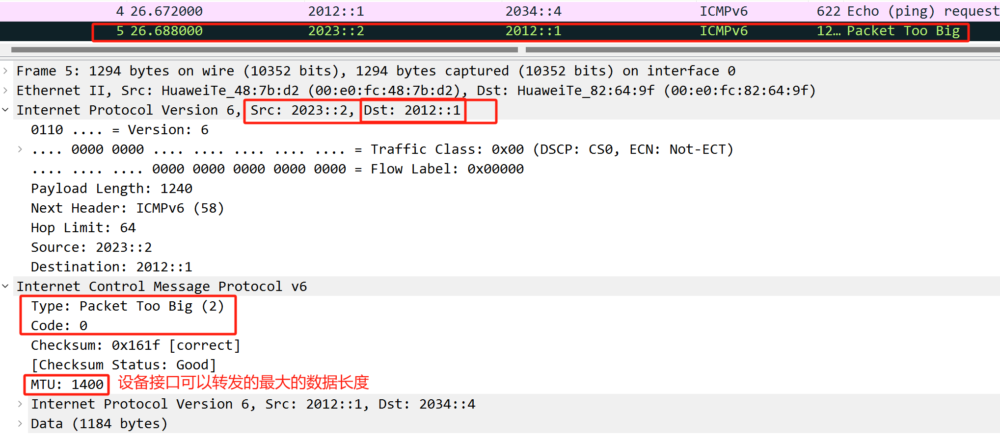
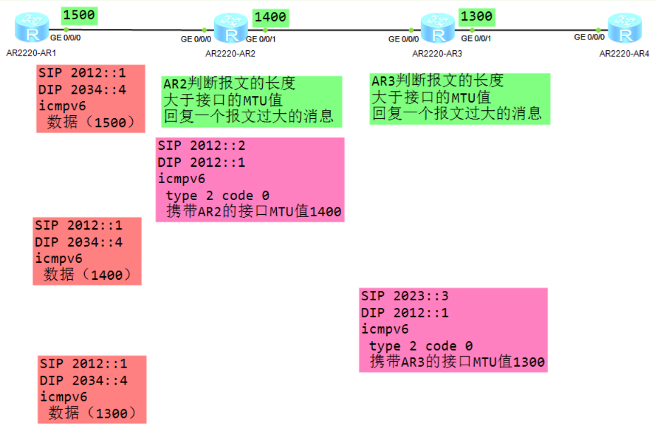

## ICMPv6-报文、分片

**ICMPv6是IPv6的基础协议之一，协议号58**  
ICMPv6的报文格式：
  

**ICMPv6的报文类型：**  
1.差错消息（type值取值范围是0-127）  
	通知报文问题提示  
2.信息消息（type值取值范围是128-255）  
通知报文信息提示  
	Type=128 request报文  
	Type=129 reply报文  
邻居发现（RFC2461和RFC4861）  
	Type=133 路由器请求（Router Solicitation）  
	Type=134 路由器公告（Router Advertisement）  
	Type=135 邻居请求（Neighbor Solicitation）  
	Type=136 邻居公告（Neighbor Advertisement）  
	Type=137 重定向 （Redirect）  
组播侦听者发现协议（RFC2710和RFC3810）  
	Type=130 查询消息  
	Type=131 报告消息  
	Type=132 离开消息  
	Type=143 MLDv2报告消息

**IPv4和IPv6的ICMP的比较：**

| IP   | 协议     | 功能   | 命令           | 新增  |
| ---- | ------ | ---- | ------------ | --- |
| ipv4 | icmp   | 差错提示 | ping，tracert |     |
| ipv6 | icmpv6 | 差错提示 | ping，tracert | NDP |

**对于IPv6的分片**:
==由源设备来执行，中间设备不需要执行分片  ==
该方式的实现是因为icmpv6的packet too big报文  
源设备会探测路径上每台设备接口的MTU值  
按照最小值作为报文数据的长度转发
 

**ICMPv6分片如何实现？**

