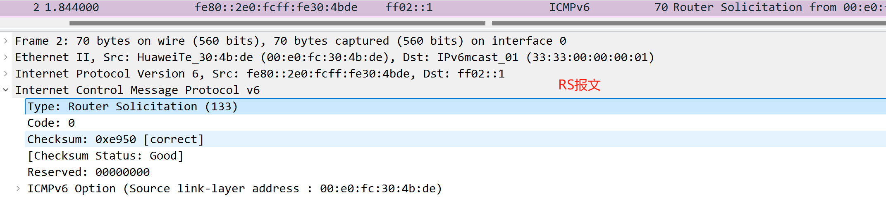
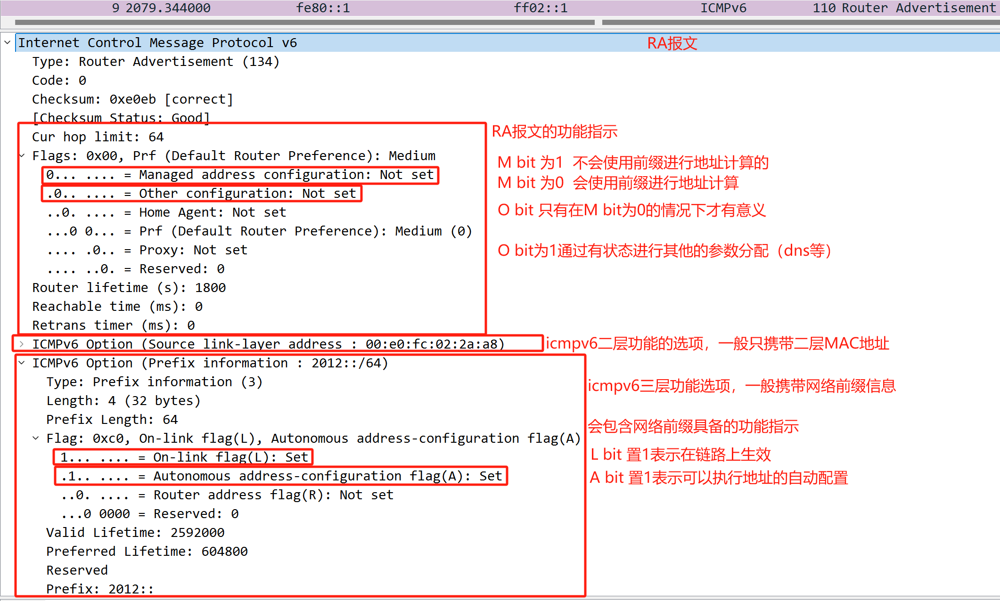
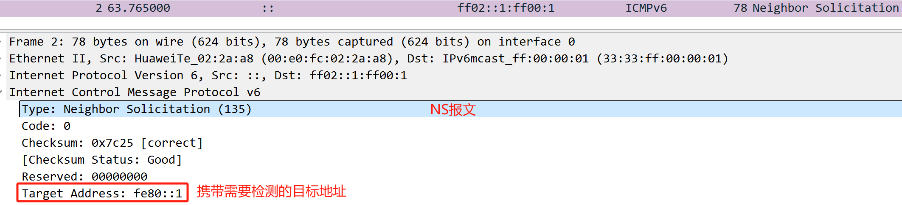
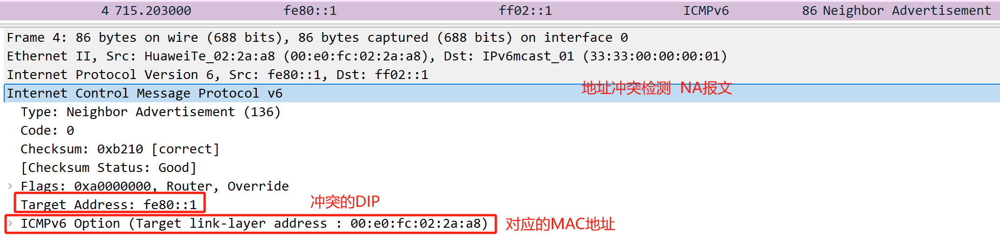
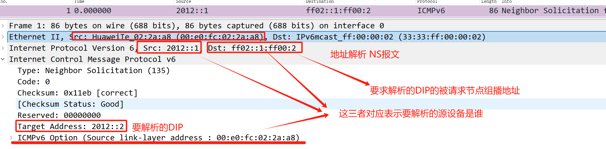

# ICMPv6，NDP
**IPv6——ICMPv6——NDP（包含具体的功能）**  
NDP：邻居发现协议  
	1.路由器发现  
	2.无状态自动配置  
	3.重复地址检测  
	4.地址解析  
	5.邻居状态跟踪  
	6.前缀重编址  
	7.重定向
 
对于邻居发现协议功能的实现，需要通过icmpv6的信息消息  
RS 133、
RA 134、
NS 135、
NA 136

## **路由器发现：**  
终端探测路径上的路由器设备  
通过RS(router solicitation)报文来实现  
设备接口开启地址前缀获取功能：  
==[AR2-GigabitEthernet0/0/0]ipv6 address auto global  ==
在链路上探测路由器设备获取网络前缀  
执行配置后，设备的接口会自动生成链路本地地址  
然后会发送RS报文  
RS报文的SIP为设备的链路本地地址  
**==RS报文的DIP为FF02::2==**
RS报文内携带ICMPv6地址（type 133 code 0）


## **无状态自动配置： SLAAC（**IPv6 Stateless Address Auto-configuration）**  
路由器回复路径上RS报文  通过RA报文来实现  
为路径上的设备通告路由前缀信息：  
```
interface GigabitEthernet0/0/0  
ipv6 enable  
ipv6 address 2012::1/64  
ipv6 address FE80::1 link-local  
undo ipv6 nd ra halt 开启IPv6 RA报文的通告
```
该命令配置完成后，会周期的在链路上通告RA报文  **会在\<200,600\>之间任意取值作为以此通告的周期**  
可以通过配置命令调整周期的最小时间 和 最大时间：  
```D
[AR1-GigabitEthernet0/0/0]ipv6 nd ra min-interval \<3-1350\> 设置最小值  
[AR1-GigabitEthernet0/0/0]ipv6 nd ra max-interval \<4-1800\> 设置最大值  
```
RA报文的SIP是设备接口的链路本地地址  
**==RA报文的DIP是FF02::1  ==**
RA报文的携带内容（type 134 code 0）

  

设备通过接收RA报文得到网络前缀，在根据eui-64计算的接口标识，两者组合成为接口的ipv6全球单播地址  
对于RA报文具体功能值的设置：  
```D
[AR1-GigabitEthernet0/0/0]ipv6 nd autoconfig managed-address-flag 设置M bit置位  
[AR1-GigabitEthernet0/0/0]ipv6 nd autoconfig other-flag 设置O bit置位
```

## **地址冲突检测：**  
ipv6不存在ARP协议，需要通过icmpv6来完成地址冲突检测  
**ipv6的所有单播地址都要进行地址冲突检测**
==通过NS报文来实现  ==
SIP ::  (检测冲突地址的IPv6地址)
**==DIP FF02::1:FF00:1 被请求节点组播地址  ==**
目标地址是使用自身接口地址对应的被请求节点组播地址  
报文内携带（type 135 code 0）  
携带的需要检测的单播地址

  
**如果地址发生了冲突如何处理？**
### 1.先配置地址的设备，收到了冲突设备发送的NS报文  
**判断发生冲突，回复一个NA报文**
NA报文的SIP是发生冲突的地址  
**NA报文的DIP是FF02::1** 
NA报文内携带的内容（type 136 code 0）  
携带冲突的目标地址 和 设备接口的MAC地址

###  2.后配置地址的设备，收到NA报文的处理  
**会将地址添加重复标记，即不使用该地址**  
因为地址未使用，所以也不会产生直连路由

## **地址解析：**  
访问的DIP需要封装DMAC  
DMAC需要先进行获取  
使用NS、NA两个报文来实现  
在设备进行地址解析时，发送NS报文  
SMAC 接口的MAC地址  
**DMAC 被请求节点组播地址对应的MAC地址**
SIP 接口的全球单播地址  
DIP 对端全球单播地址对应的被请求节点组播地址  
报文内携带的信息（type 135 code 0 ）

  

1.如果设备的地址在NS报文的被请求节点组播范围内，会接收该NS报文  
1.如果自身的地址不是NS报文要解析的地址，则丢弃该报文  
2.如果自身的地址是NS报文要解析的地址  
1.会向对方回复一个NA报文（单播报文）  
对于NA报文是单播的考虑，是因为地址在建立后已经发布的地址冲突检测  
所以NA报文通告，可以想成只为新添加的设备通知


 2.如果设备的地址不在NS报文的被请求节点组播范围内，则直接丢弃该NS报文

**邻居状态跟踪：**  
IPv6对于设备之间建立邻居状态关系  
因为不存在ARP协议，所以IPv6需要存在一个协议来维护设备之间的关系（邻居状态跟踪）  
[AR1]display ipv6 neighbors  
-----------------------------------------------------------------------------  
IPv6 Address : 2012::2  
Link-layer : 00e0-fc30-4bde State : REACH  
Interface : GE0/0/0 Age : 0  
VLAN : - CEVLAN: -  
VPN name : Is Router: TRUE  
Secure FLAG : UN-SECURE
 
IPv6 Address : FE80::2  
Link-layer : 00e0-fc30-4bde State : REACH  
Interface : GE0/0/0 Age : 0  
VLAN : - CEVLAN: -  
VPN name : Is Router: TRUE  
Secure FLAG : UN-SECURE  
-----------------------------------------------------------------------------  
Total: 2 Dynamic: 2 Static: 0  
该功能就是设备之间的状态机


1.Empty，空状态 在该状态不存在邻居表项  
2.Incomplete，在该状态下，本端发送了报文，但没有收到对端的报文信息  
3.Reachable，在该状态下，本端收到对端发送的报文信息  
4.Stale，陈旧的 ，当停止数据交互30s后，会进入stale状态  
5.Delay，延迟的 ，如果想要在进行数据交互，则会进入delay状态进行邻居状态的激活  
本端会主动发送一个NS报文给对端，如果对端能回复，则邻居状态激活进入reachable  
如果对端不回复，则邻居状态进入下一个阶段  
6.Probe，探测的 ，该状态下，本端会在3s内发送3个NS报文给对端  
如果对端能回复，则邻居状态激活进入reachable  
如果对端不回复，则邻居状态进入下一个阶段Empty


**前缀重编址：**  
使用RA报文来实现（就是在SLAAC是对于网络前缀添加了时间值）  
作用：设备的接口可以存在多个IPv6地址，且IPv6地址之间可以无缝切换
 
添加的时间值：  
1.实验时间：就是地址在冲突检测时花费时间  
2.可用时间：就是地址可以使用的时间  
1.优选时间：在该时间内，地址是可以主动发起通信连接的  
2.弃用时间：在该时间内，地址只能被动等待连接  
3.不可用时间：地址不可以使用的时间
 
[AR1-GigabitEthernet0/0/0]ipv6 nd ra prefix 2012:: 64 20000 15000  
可用时间 优选时间  
该命令可以设置前缀的时间值，并且过滤通告的前缀信息  
默认情况下，所有的接口前缀都会通告，该命令指定后只有被指定的前缀才能通告
 
[AR1-GigabitEthernet0/0/0]ipv6 nd ra prefix 2021::/64 40000 30000 no-autoconfig  
设置前缀flag字段的A bit 不置位，该前缀不会进行SLAAC
 
[AR1-GigabitEthernet0/0/0]ipv6 nd ra prefix 2021::/64 40000 30000 off-link  
设置前缀flag字段的L bit 不置位，该前缀不会用于本地链路（模拟器没有生效）

**IPv6重定向**  
和IPv4的重定向功能相等  
触发的条件：收到数据的接口，也是发送数据的接口  
重定向报文：  
SIP 网关设备的接口地址  
DIP PC设备的接口地址  
携带信息：（type 137 code 0）  
target address 更优的下一跳（链路本地地址）  
destination address 需要重定向的目的地址