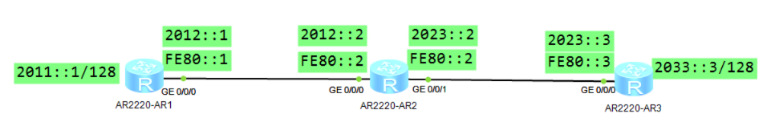
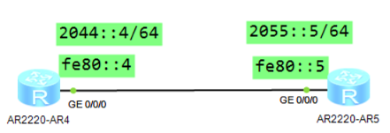

## IPv6静态路由
**对于静态路由，需要管理员手工配置：**  
1.对于静态路由的下一跳指示可以存在两种  
	1.和自身直连同网段的全球单播地址  
	2.同链路的链路本地地址（必须配置互联端口）



```
[AR1]ipv6 route-static 2033::3 128 2012::2
[AR2]ipv6 route-static 2033::3 128 GigabitEthernet 0/0/1 fe80::3  
[AR2]ipv6 route-static 2011::1 128 GigabitEthernet 0/0/0 fe80::1
[AR3]ipv6 route-static 2011::1 128 2023::2 
```
**IPv4与IPv6路由表的对照：**
```
[AR1]dis ip routing-table   
Route Flags: R - relay, D - download to fib  
------------------------------------------------------------------------------  
Routing Tables: Public  
         Destinations : 4        Routes : 4        
Destination/Mask    Proto   Pre  Cost      Flags NextHop         Interface
      127.0.0.0/8   Direct  0    0           D   127.0.0.1       InLoopBack0  
      127.0.0.1/32  Direct  0    0           D   127.0.0.1       InLoopBack0  
127.255.255.255/32  Direct  0    0           D   127.0.0.1       InLoopBack0  
255.255.255.255/32  Direct  0    0           D   127.0.0.1       InLoopBack0  
                    Direct  0    0           D   127.0.0.1       InLoopBack0

[AR1]dis ipv6 routing-table   
Routing Table : Public  
Destinations : 2	Routes : 2
 Destination  : ::1                             PrefixLength : 128  
 NextHop      : ::1                             Preference   : 0  
 Cost         : 0                               Protocol     : Direct  
 RelayNextHop : ::                              TunnelID     : 0x0  
 Interface    : InLoopBack0                     Flags        : D
 Destination  : FE80::                          PrefixLength : 10  
 NextHop      : ::                              Preference   : 0  
 Cost         : 0                               Protocol     : Direct  
 RelayNextHop : ::                              TunnelID     : 0x0  
 Interface    : NULL0                           Flags        : D
```

5、IPv6静态路由


**直连路由器：全球单播地址的前缀不同如何通信？**
==通告链路本地地址==

**链路本地地址如何学习到？**
RS,RA 报文

==配置静态路由：ipv6 route-static 2055::5 64 g0/0/0 fe80::4==