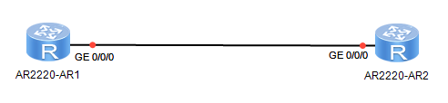

# BGP高级特性

**AR2要求AR1只发布AR2接收的路由条目，不需要发布AR2过滤的路由条目**
==为了实现该需求，BGP提供ORF能力==
## **ORF：出方向路由过滤**  
AR1和AR2两者进行策略的协商  
AR2配置入策略，且将入策略的功能告知AR1   
AR1根据收到的策略功能自动构建出策略

10.1.1.1  
10.1.1.2  
10.1.1.3  
10.1.1.4  
10.1.1.5


`AR1`：  

```
#
bgp 100
 peer 10.1.12.2 as-number 200 
 #
 ipv4-family unicast
  undo synchronization
  import-route static
  peer 10.1.12.2 enable
  peer 10.1.12.2 capability-advertise orf ip-prefix receive
```

`AR2`：  

```
#
ip ip-prefix 1 index 10 permit 10.1.1.2 32
ip ip-prefix 1 index 20 permit 10.1.1.4 32
#
bgp 200
 peer 10.1.12.1 as-number 100 
 #
 ipv4-family unicast
  undo synchronization
  peer 10.1.12.1 enable
  peer 10.1.12.1 ip-prefix 1 import
  peer 10.1.12.1 capability-advertise orf ip-prefix send
```

**BGP对等体组：**  
优化原有BGP的配置  
原有配置：  

```
#
bgp 200
 peer 1.1.1.1 as-number 200 
 peer 1.1.1.1 connect-interface LoopBack0
 peer 3.3.3.3 as-number 200 
 peer 3.3.3.3 connect-interface LoopBack0
 peer 4.4.4.4 as-number 200 
 peer 4.4.4.4 connect-interface LoopBack0
 peer 10.1.12.1 as-number 100 
 #
 ipv4-family unicast
  undo synchronization
  peer 1.1.1.1 enable
  peer 1.1.1.1 reflect-client
  peer 3.3.3.3 enable
  peer 3.3.3.3 reflect-client
  peer 4.4.4.4 enable
  peer 4.4.4.4 reflect-client
```

**优化配置：**  
#  

```
bgp 200
 group 1 internal       
```

创建组并指定在`as`内使用  
`peer 1 as-number 200` （该命令可以省略）  

```
 peer 1 connect-interface LoopBack0
 #
 ipv4-family unicast
  undo synchronization 
```

撤销同步  

```
  peer 1 reflect-client
  peer 1.1.1.1 group 1 
  peer 3.3.3.3 group 1 
  peer 4.4.4.4 group 1 
```

GTSM：通用TTL安全保护机制  
[AR2-bgp]peer 3.3.3.3 valid-ttl-hops \<1-255\>  
通过在BGP邻居之间设置TTL值的范围，防止接收攻击者的报文  
[AR2-bgp]peer 10.1.12.1 ebgp-max-hop \<1-255\>