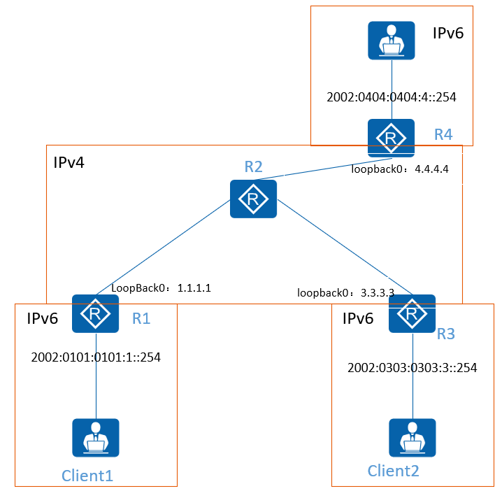

# 动态6to4隧道
6to4隧道，通过提前规划好的网络前缀，来实现不同站点目标地址的确定
 
**6to4的要求：**  
1.规划的站点IPv6网络前缀必须是固定的==2002==开头 16bit  
2.在固定的前缀后加入本端隧道的SIPv4地址 32bit  
3.后续的16bit作为子网前缀，区分不同的站点网段 16bit
   

**搞懂地址如何将IPv4地址嵌套再IPv6地址当中：**
IPv4 2.2.2.2 # 1个地址块标识8bit二进制
IPv6 2002:: /64 # 1个地址块标识4\*4bit二进制  
1字节ipv4地址正好等于1块IPv6地址：2---\> 0000 0010 = 02  

IPv6 2002:2.2.2.2::2 
IPv6 2002:0202:0202::2

对于6to4站点之间可以使用地址嵌套的方式实现隧道目标地址的自动获取
 
**那如果对于IPv6站点，如何实现与6to4站点之间的通信？**
可以通过6to4中继来实现  
1.6to4站点如何访问IPv6站点？  
	通过配置递归路由来实现，隧道目标的封装，递归后的路由作为6to4封装DIPv4的值  
2.IPv6站点如何访问6to4站点？  
	直接通过6to4地址的格式，解封装得到DIPv4地址

==自动从ipv6地址中剥离出ipv4地址进行封装==
## 动态6to4隧道

**R1:**

```D
interface Tunnel0/0/1
 ipv6 enable 
 ipv6 address FE80::1 link-local
 tunnel-protocol ipv6-ipv4 6to4
 source 1.1.1.1
#
ipv6 route-static 2002:0303:0303:3:: 64 Tunnel 0/0/1 
```

**R3:**

```D
#
interface Tunnel0/0/1
 ipv6 enable 
 ipv6 address FE80::3 link-local
 tunnel-protocol ipv6-ipv4 6to4
 source 3.3.3.3
#
ipv6 route-static 2002:0101:0101:1:: 64 Tunnel 0/0/1
```

## **IPv6过渡技术-动态6to4中继隧道：**
==本质：通过静态路由的递归从而找到路径==

**R1:**

```D
#
interface Tunnel0/0/1
 ipv6 enable 
 ipv6 address FE80::1 link-local
 tunnel-protocol ipv6-ipv4 6to4
 source 1.1.1.1
#
ipv6 route-static 2002:0303:0303:3:: 64 Tunnel 0/0/1
ipv6 route-static 2044:: 64 2002:0404:0404:FFFF::254  
ipv6 route-static 2002:0404:0404:FFFF:: 64 Tunnel 0/0/1
```
```

```

**R3:**

```D
#
interface Tunnel0/0/1
 ipv6 enable 
 ipv6 address 2002:0404:0404:FFFF::254/64 
 ipv6 address FE80::4 link-local
 tunnel-protocol ipv6-ipv4 6to4
 source 4.4.4.4
#
ipv6 route-static 2002:0101:0101:1:: 64 Tunnel 0/0/1
```

