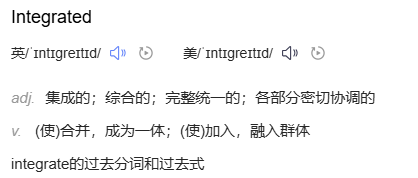
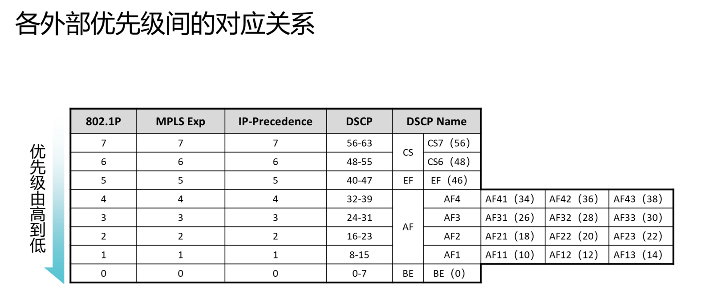
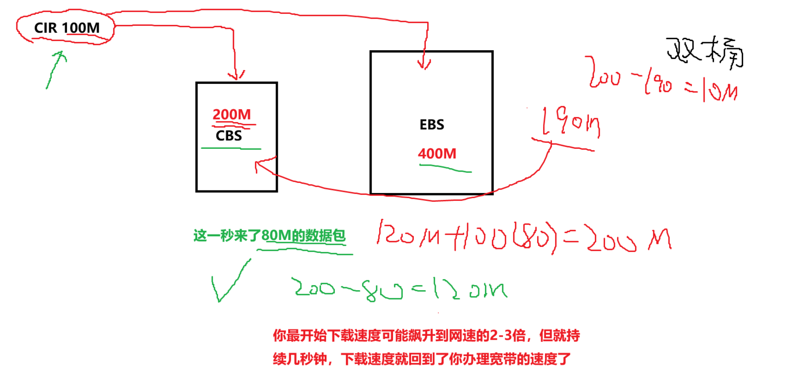
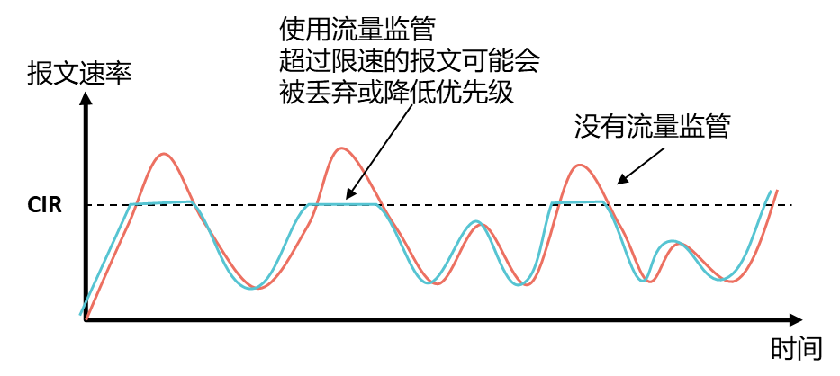

# QoS基础
**QoS基础：QoS是服务质量的意思，使用他的原因主要是因为网络资源不够。**
这个技术你学习下来并不会导致你的网络通或者不通。他只是一个对==**网络质量做调优**==的协议 
理论上来说如果网络的带宽是无限的话，每个人的业务资源都充足，那么就无需对网络质量做过多的调试了，都不会丢包，都会正常转发。  
但是实际上来说，大多数场景都面临着带宽不够用的情况。==并且也不愿意去扩充带宽==。
==QoS就是去完成交通指挥员的这么一个效果==。  

### **QoS功能：**  
1.对数据包进行三六九等的划分**（标记）  
2.对九等的数据包先处理，三等的数据包后处理，保证关键性的业务报文延迟低、丢包率低。（队列调度）  
3.对各种类型的报文去预留带宽（限速）
 
### **如何评判这个网络质量的好坏？**  
1.延迟（时延）：时间上的延迟，也就是这个数据包从发出到接受处理花了多久。延迟越高用户**实时互动的网络业务**体验感就很差。
1. 设备处理性能下降导致数据包处理变慢，延迟上升。
2. 链路拥堵，导致数据包从链路发送出去时需要排队，使得时延上升。
3. 通信距离有关）

2.丢包率：数据包丢弃的概率，概率越高用户体验感越差。比高延迟更难让实时互动类的业务需求满足。
1. 设备性能确实不行了
2. 带宽资源不够
3. 流量监管技术相对可以提高网络中的丢包率

3.带宽：网络资源，越多肯定是越好的。  
4.抖动：峰值的延迟值-谷值的延迟值得到的数值就是抖动。（判断这个网络是否稳定的一个参考）  
5.稳定性

**影响QoS的因素又有哪些呢？**
带宽（Bandwidth）: 网络中IP包的传输速率，可用平均速率或峰值速率来表征。  
	——带宽竞争，可以通过增大带宽来解决，但不能无限增大。  
延迟 （Latency）: 在两个参考点间，某一IP包从发送到接收间的时间间隔。  
	——时延敏感流量，如视频、语音等。  
时延抖动 (Jitter）: 沿同一路径传输的一个数据流（Stream）中，不同分组传输延迟的变化。  
	——与时延相关，时延小则抖动的范围小，对语音、视频等实时业务影响大。  
丢包率（Packet Loss）: 某一业务在网络中传输时，可允许的最大丢包率。  
	——衡量网络可靠性，少量丢包对业务的影响不大，但大量丢包会严重影响传输效率。  
可用性（Availability）: 用户与IP业务连接的可靠性，包括建立时间、保持时间等。
 
**通常QoS提供以下三种服务模型：**
Best-Effort service（尽力而为服务模型）  
Integrated service（综合服务模型，简称IntServ）  
Differentiated service（区分服务模型，简称DiffServ）



==**一个好的网络质量：延迟低+丢包低+抖动低+带宽高+稳定性好**==

### 尽力而为转发模型
最基础的转发模型叫做**尽力而为转发模型**，这个模型的转发机制是，先进先出，先到先得。  
我不管你是领导还是普通人，都严格按照这个要求去执行。  
（不做QoS时，整个网络默认采用的就是尽力而为BE（best-effort）的模型。
 
****•QoS旨在针对各种应用的不同需求，为其提供不同的服务质量。如：**
1. 可以限制骨干网上 FTP 使用的带宽，也可以给数据库访问以较高优先级。
2. 对于 ISP，其用户可能传送语音、视频或其他实时业务，QoS 使ISP 能区分这些不同的报文，并提供不同服务。
3. 可以为时间敏感的多媒体业务提供带宽和低时延保证，而其他业务在使用网络时，也不会影响这些时间敏感的业务
 
## QoS工作在区分服务模型下，所以既然要区分服务，就需要知道你们大概是个什么水平什么级别。  
```D
[Huawei-behavior-test]remark（重新标记） ?  
	8021p Remark outer vlan 802.1p  
	cvlan-8021p Inner vlan 802.1p priority of QinQ packets  
	dscp Remark DSCP (DiffServ CodePoint)  
	fr-de Remark fr-de  
	local-precedence Remark local precedence and drop level of packets  
	mpls-exp Remark MPLS EXP
```
 
```D
[Huawei-behavior-test]remark dscp ?  
	INTEGER\<0-63\>  DSCP (DiffServ CodePoint) value  
	af11           AF11 DSCP (001010)  
	af12           AF12 DSCP (001100)  
	af13           AF13 DSCP (001110)  
	af21           AF21 DSCP (010010)  
	af22           AF22 DSCP (010100)  
	af23           AF23 DSCP (010110)  
	af31           AF31 DSCP (011010)  
	af32           AF32 DSCP (011100)  
	af33           AF33 DSCP (011110)  
	af41           AF41 DSCP (100010)  
	af42           AF42 DSCP (100100)  
	af43           AF43 DSCP (100110)  
	cs1            CS1 (IP Precedence 1) DSCP (001000)  
	cs2            CS2 (IP Precedence 2) DSCP (010000)  
	cs3            CS3 (IP Precedence 3) DSCP (011000)  
	cs4            CS4 (IP Precedence 4) DSCP (100000)  
	cs5            CS5 (IP Precedence 5) DSCP (101000)  
	cs6            CS6 (IP Precedence 6) DSCP (110000)  
	cs7            CS7 (IP Precedence 7) DSCP (111000)  
	default        Default DSCP (000000)  
	ef             EF DSCP (101110)
```
 
### **AF叫assured forward（确保转发）：**  
**第一个数字，如AF21中的2，2表示类别（class）：**  
用来区分不捅流量的，把多个流量划分成多个类别。不同的流量分配不同的资源。  
	AF1X就是类别1  
	AF2X就是类别2.  
	AF1X分配给视频流量去使用  
	AF2X分配给语音流量去使用  
	AF3X可以分配给游戏流量去使用
 
**第二个数字，如AF21中的1，1表示丢弃优先级（drop precedence)**  
作用：在同一个类别内，区分流量丢弃的优先级的，**优先级高的数字会被优先丢掉，优先级小的数字更加能够可靠的传输**。  
如AF11属于AF1这一类里面的丢弃优先级为1的类型。AF13表示AF1这一类里面丢弃优先级为3的类型。如果网络发生拥塞时，==AF13的业务比AF11的业务会更早被管理员配置丢弃掉。==
 
### **CS：（class selector）**：  
如果你觉得AF区分起来太麻烦，换算具体的优先级也不直观，可以采用CS的分类。CS的每一个值对应着+8.  
EF（语音流量划分的EF，加速转发）  
**打标记：**  
```D
acl number 2000  
rule 5 permit source 192.168.100.0 0.0.0.255  

traffic classifier test  
if-match acl 2000  

traffic behavior test  
remark dscp ef  

traffic policy test  
classifier test behavior test  

interface GigabitEthernet0/0/1  
ip address 192.168.100.254 255.255.255.0  
traffic-policy test inbound
```
 
不同优先级的报文到达设备后，会进入到设备内部的不同队列中，这个**不同的队列**才是影响数据包先后转发**顺序的根因**。
  


### **流量限速机制通过两大协议完成：**  
1.流量监管：不缓存数据包，数据包的数量超出我可接受的范围就直接丢包，将流量大小控制在合理范围内。  
（丢包率很高，但每个报文的时延比较正常）  
2.流量整形：适当缓存数据，超出我可接受范围外的一些报文我仍然存放在设备上，等待链路空闲时再进行数据包的发送。  
（丢包率相对较低，但是有一部分报文的延迟很高）
 
### **令牌桶token bucket：**  
他是一种用于限速控制的底层机制，他用于限制网络中流量的突发流量，确保流量可以按照可控的速度通过网络。  
==** **令牌桶的工作机制：通过“令牌”的生成和“令牌”的消耗来控制数据包的发送速率。** ==
令牌就是你去买吃的喝的用的粮票，你去买衣服用的布票......你有票你就买，没票你就给我歇着。  
令牌桶最基础的叫单速单桶（一个补充令牌的速度，一个桶）
 
**单速单桶：**


**单速双桶**：

  

**双速双桶**：两个桶各补各的令牌，允许长期的突发流量存在，这种突发的流量直接从P桶中拿走令牌就可以了。  
（可能100M的网的体验感一直是150M网的标准）
   

### **流量监管：**  
又叫削峰不填谷。超出部分的流量直接砍了，也不会在流量不多的时候把砍掉的部分拿出来重新发送。
