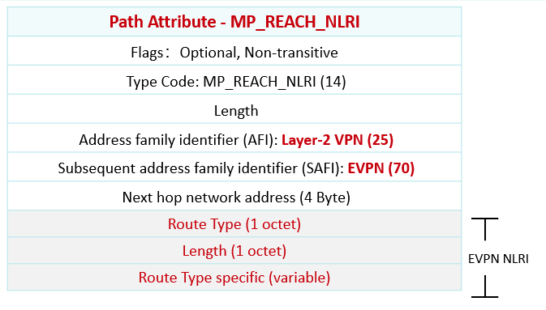
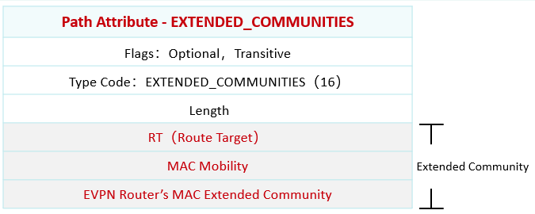
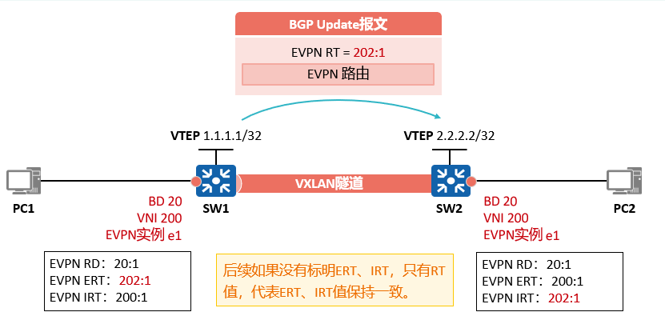

# 使用BGP EVPN作为控制面协议
**BGP EVPN通过扩展BGP协议新定义了几种BGP EVPN路由（在MP_REACH_NLRI属性中新定义了几种NLRI，称作EVPN NLRI）。
 
这些BGP EVPN路由可以用于传递VTEP地址和主机信息，因此BGP EVPN应用于VXLAN网络中，  
可以使VTEP发现和主机信息学习从==数据平面转移到控制平面==。
- Type 2路由（MAC/IP路由）：用于主机MAC地址/ARP/IP路由通告。
- Type 3路由（Inclusive Multicast路由）：用于传递二层VNI和VTEP IP地址信息，实现VTEP的自动发现和VXLAN隧道的动态建立，实现BUM报文转发。
- Type 5路由（IP前缀路由）：用于主机MAC地址/ARP/IP路由通告，外部网络路由通告。
 
**1.EVPN NLRI**  
EVPN NLRI通过路径属性MP_REACH_NLRI携带，地址族标识符（AFI）为25，代表L2VPN，子地址族标识符（SAFI）为70。

**2.Extended Community**  
BGP EVPN与MPLS VPN类似，为了控制路由的发送、接收，BGP EVPN同样存在VPN实例的概念（EVPN实例），与传统的IP VPN实例相同，EVPN实例存在RD和RT值，传递路由时使用扩展团体属性携带EVPN实例RT值。  
除了RT值之外，为了支持一些特性，BGP EVPN在扩展团体属性中增加了一些新子类型：MAC Mobility、EVPN Router’s MAC Extended Community。

**3.EVPN VPN-Instance**  
EVPN实例与BD进行绑定，BD下的MAC地址表项会通过BGP EVPN路由进行传递，在传递时会携带BD绑定的EVPN实例ERT值，对端收到之后对比本地EVPN实例的IRT值，将EVPN路由放入对应的EVPN实例路由表，同时解析EVPN路由表获取MAC地址表项，放入本端与该EVPN实例绑定的BD的MAC地址表中。
