# 园区网络虚拟化

**网络结点：**
防火墙（Firewall）节点：部署L4~L7安全策略时需该节点。可旁挂部署，或部署在园区出口处。
边界网关（Border）节点：用于实现Fabric和外部网络之间的互联互通。一般为核心交换机。
边缘（Edge）节点：Fabric边缘设备，用于连接用户侧设备及Fabric。有线用户的数据从边缘节点进入VXLAN封装。
透传（Transparent）节点：Fabric的透传节点，无需支持VXLAN。
接入节点：也被称为扩展（Extended）节点，这是有线用户的接入节点，该节点为可选节点。用户可以从这里接入网络，接入节点无需支持VXLAN。
AP：无线接入节点，用户从这里接入无线网络，并最终接入Fabric。

# Underlay和Fabric
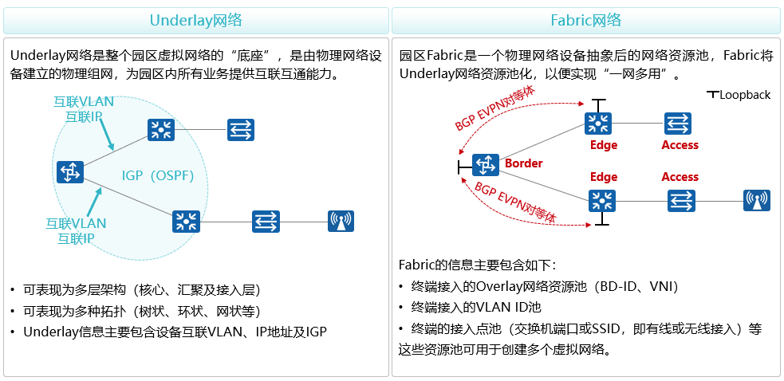
# Overlay
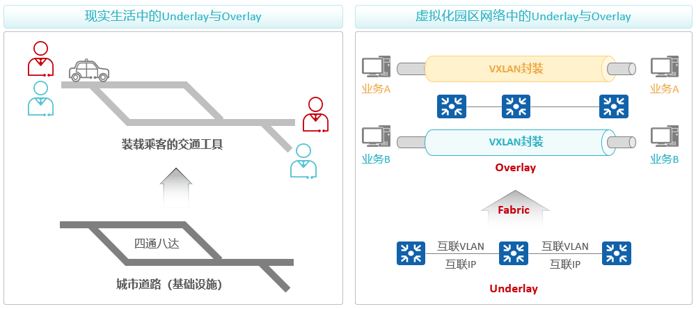

# 什么是VN
•使用VXLAN能够在Underlay网络上构建若干个VN（Virtual Network，虚拟网络，通过VXLAN VNI+IP VPN-Instance隔离实现）。
•VN被视为Overlay网络。
•每个虚拟网络的业务数据在Fabric内都通过VXLAN进行封装，以便实现转发面的隔离；控制面使用的协议是BGP EVPN，该协议用于构建VXLAN隧道、交互Overlay路由信息。

**每个VN都包含如下参数：**
•网络服务资源（DHCP服务器、第三方RADIUS/Portal服务器等）。
•外部网络（可选）。
•用户IP地址段、VLAN及网关地址。
•有线接入端口和（或）无线接入点。
•其他参数。
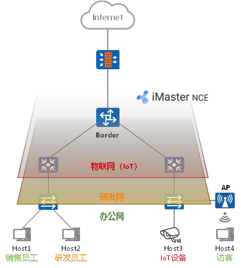

VN设置
•用户网关位置
•外部网络
•网络服务资源
•用户子网及网关

有线接入
•接入站点、设备及端口
•认证方式
•VLAN信息

无线接入
•接入站点、设备
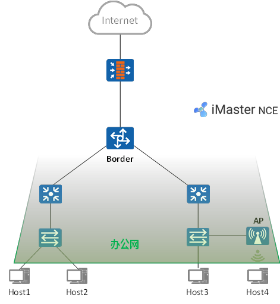
## 典型案例分析：需求
**Fabric需求：**
•基于物理网络构建一个Fabric。
•采用分布式网关方案。

**VN需求：**
•创建2个VN，分别为办公（OA）及研发（RD）。
•缺省时，2个VN完全隔离，VN内可实现同子网、跨子网互访。
•2个VN均可访问FW所连接的外部网络。
•2个VN内的终端均可通过DHCP Server获取IP地址。
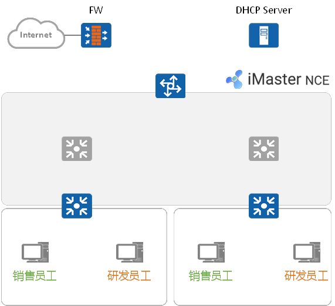

**Fabric管理**
**Fabric创建及配置：**
①用户根据业务需求，将物理设备（核心交换机、汇聚交换机及接入交换机）添加到Fabric中。
②用户指定交换机的角色：Border节点及Edge节点。
③iMaster NCE-Campus自动将Border指定为RR，优化网络逻辑架构、BGP对等体关系模型。
④用户预定义2个“外部网络”，用于供2个VN到达外部网络。
⑤用户定义1个“网络服务资源”，用于后续终端通过该资源（中的DHCP Server）获取IP地址。
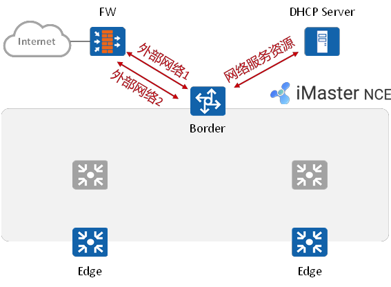
**Fabric管理 (2)**
Fabric及Underlay网络自动化部署：
①iMaster NCE-Campus根据已发现的物理网络拓扑，结合用户所定义的Fabric网络，自动进行网络编排（用户可选择OSPF多区域或单区域）。
②iMaster NCE-Campus根据网络编排结果将Underlay网络配置自动下发到设备，使得设备之间IP可达。
③iMaster NCE-Campus将Fabric配置自动下发到设备，设备之间建立BGP EVPN对等体关系，完成控制面的准备工作。
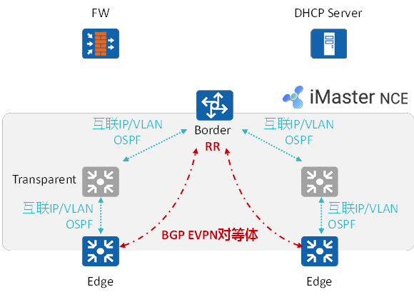
**创建VN：**
①用户在iMaster NCE-Campus上分别创建OA及RD虚拟网络，指定虚拟网络的IP网段/VLAN、网关地址、所关联的外部网络及网络服务资源，以及终端接入点位。
②iMaster NCE-Campus将用户意图翻译成配置下发到网络设备上。
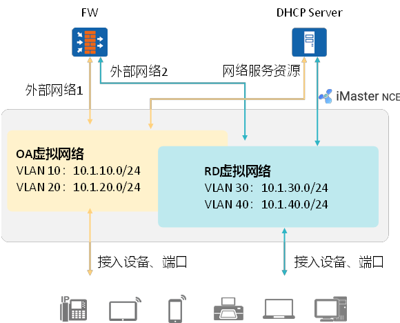

**VXLAN隧道自动建立：**
①BGP EVPN将用于建立VXLAN的相关信息在对等体之间通告。
②设备之间建立VXLAN隧道，为后续的数据转发做准备。
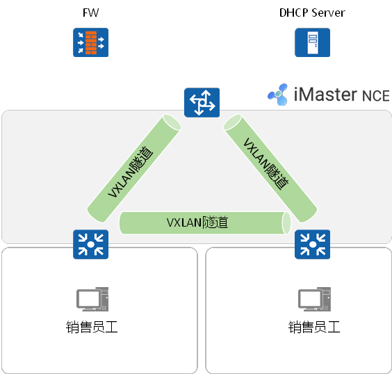
**地址获取：**
①销售员工A接入网络，首先完成用户认证，认证成功后，认证点Edge1获得该用户的授权结果，将用户划分到对应VLAN。
②A发起DHCP请求，该请求到达网关设备Edge1后，Edge1将DHCP请求进行中继，中继报文通过VXLAN隧道转发给Border。
③Border将VXLAN解封装，并将DHCP中继报文转发给DHCP Server。
④DHCP Server为A分配IP地址。
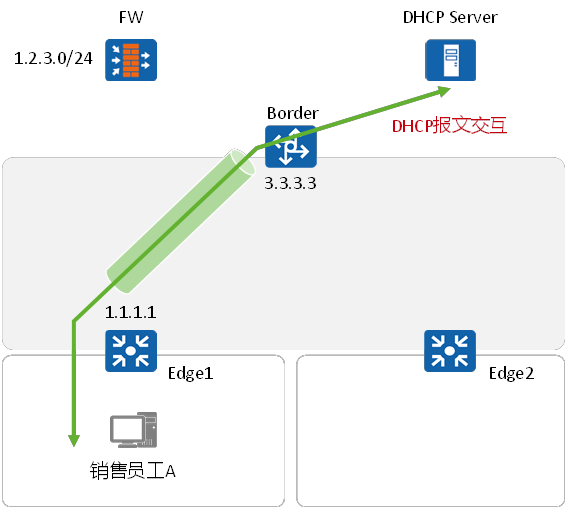
**访问外部网络：**
①当用户将外部网络（目的网段为1.2.3.0/24）关联到OA虚拟网络后，iMaster NCE-Campus会将上述外部路由重分发到BGP，并通告给Edge1和Edge2。
②当A发送数据到1.2.3.0/24时，流量送达Edge1后，由其进行VXLAN封装，然后送至Border，Border将VXLAN解封装，然后将IP报文转发给FW。
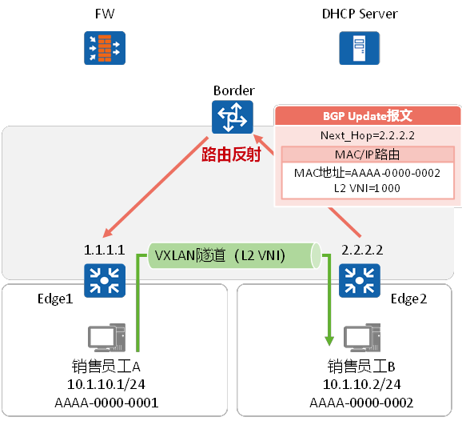