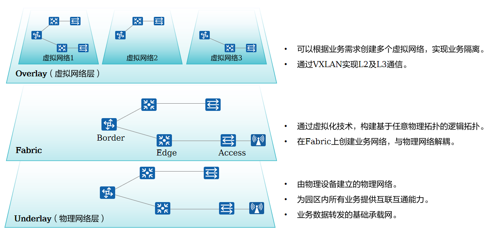
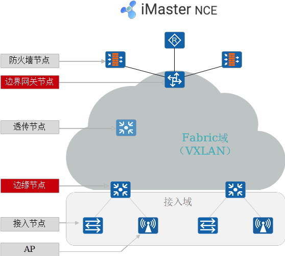
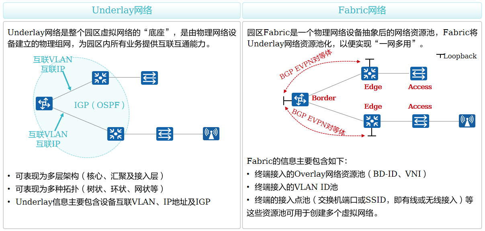

# 园区网络虚拟化

**网络结点：**
防火墙（Firewall）节点：部署L4~L7安全策略时需该节点。可旁挂部署，或部署在园区出口处。
边界网关（Border）节点：用于实现Fabric和外部网络之间的互联互通。一般为核心交换机。
边缘（Edge）节点：Fabric边缘设备，用于连接用户侧设备及Fabric。有线用户的数据从边缘节点进入VXLAN封装。
透传（Transparent）节点：Fabric的透传节点，无需支持VXLAN。
接入节点：也被称为扩展（Extended）节点，这是有线用户的接入节点，该节点为可选节点。用户可以从这里接入网络，接入节点无需支持VXLAN。
AP：无线接入节点，用户从这里接入无线网络，并最终接入Fabric。

# Underlay和Fabric
