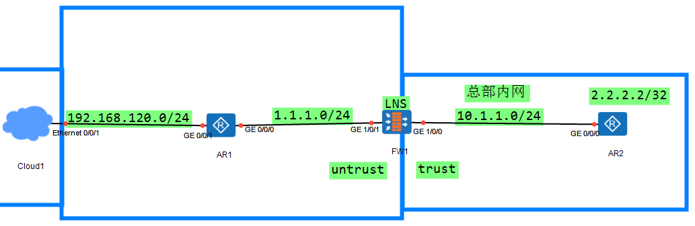

L2TP（2层隧道协议）
是一种用于承载PPP报文的隧道技术
该技术的应用场景为出差员工远程访问企业内网资源的

出差员工要访问企业内部，意味着需要获取内网的地址    ？
地址获取后需要进行身份的验证    ？

L2TP的使用场景：
1.企业员工通过拨号方式接入internet
2.移动办公用户访问企业内网
3.企业分支与总部的内容互联，实现总部用户和分支用户之间的互访

**L2TP的设备类型：**
	1.NAS（网络连接服务设备）
	  是运营商向拨号用户提供的拨号服务器
	  该设备也是拨号用户访问外部网络的必经设备
	2.LNS（L2TP网络服务设备）
	  是企业总部的出口网关

## 移动办公用户访问企业内网


```
LNS：
#
interface GigabitEthernet1/0/0
 undo shutdown
 ip address 10.1.1.254 255.255.255.0
#
interface GigabitEthernet1/0/1
 undo shutdown
 ip address 1.1.1.1 255.255.255.0
#
ip route-static 192.168.120.0 24 1.1.1.254
ip route-static 2.2.2.2 32 10.1.1.2
#
firewall zone trust
 add interface GigabitEthernet1/0/0
#
firewall zone untrust
 add interface GigabitEthernet1/0/1
```

```
#
ip pool pool
 section 1 172.16.1.100
#
aaa
 service-scheme l2tp   创建服务模板
  ip-pool pool         绑定地址池
 domain default        进入默认域
  service-scheme l2tp  绑定服务模板
#
interface Virtual-Template1     创建虚拟模板接口（serial接口）
 ppp authentication-mode pap
 remote service-scheme l2tp
 ip address 172.16.1.254 255.255.255.0
#
firewall zone dmz
 add interface Virtual-Template1
#
l2tp enable 
# 
l2tp-group 1   创建L2TP组
 tunnel password cipher Huawei@123    设置隧道登录的密码
 allow l2tp virtual-template 1 remote client  绑定拨号接口，并设置隧道的名称

#
user-manage group /default/l2tp 创建用户组
#
user-manage user test        创建用户
 parent-group /default/l2tp  加入用户组，创建的用户默认在default组中
 password Huawei@123         设置密码
```

```
#
security-policy
 rule name l2tp     放行L2TP隧道的访问（L2TP隧道的建立）
  source-zone untrust
  destination-zone local
  destination-address 1.1.1.1 mask 255.255.255.255
  action permit
 rule name PC_AR2   放行业务数据PC2到AR2的访问
  source-zone dmz
  destination-zone trust
  source-address 172.16.1.0 mask 255.255.255.0
  destination-address 10.1.1.0 mask 255.255.255.0
  destination-address 2.2.2.2 mask 255.255.255.255
  action permit
```

