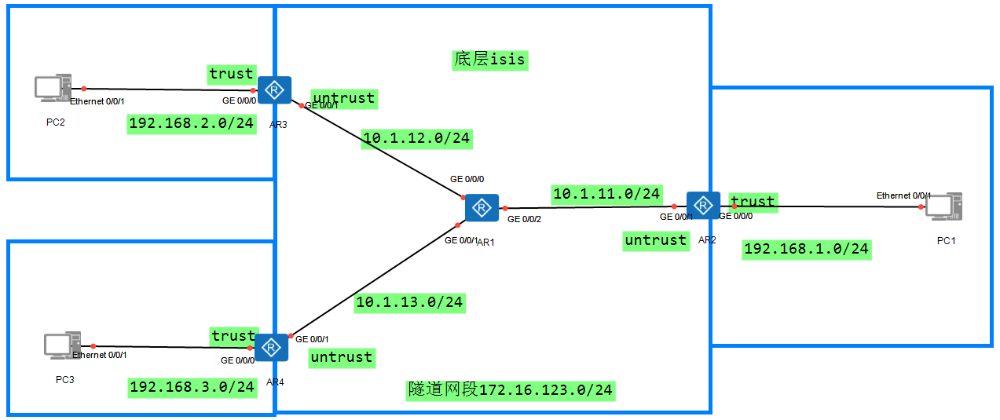

DSVPN：动态智能VPN
主要用在HUB-Spoke组网方式下为公网地址动态变化的分支构建的VPN隧道

DSVPN通过将下一跳解析（NHRP）和mGRE相结合：
1.NHRP协议动态收集、维护和发布各节点的公网地址信息，解决分支间动态公网地址的问题
2.mGRE，使得VPN隧道可以传输组播报文、广播报文（一个隧道口可以与多个对端建立隧道）

分支的公网口地址动态变化
总部的公网口地址固定


```
AR2：
#
ospf 1 router-id 172.16.123.1
 area 0.0.0.0
  network 172.16.123.1 0.0.0.0
  network 192.168.1.254 0.0.0.0
#
interface Tunnel 0/0/0
 ip address 172.16.123.1 255.255.255.0
 tunnel-protocol gre p2mp       设置隧道的协议为点到多点
 source GigabitEthernet1/0/1
 ospf network-type broadcast    设置隧道接口的类型为广播
 nhrp entry multicast dynamic   设置NHRP协议动态获取对端映射的消息
```


```
AR3：
#
ospf 1 router-id 172.16.123.2
 area 0.0.0.0
  network 172.16.123.2 0.0.0.0
  network 192.168.2.254 0.0.0.0
#
interface Tunnel 0/0/0
 ip address 172.16.123.2 255.255.255.0
 tunnel-protocol gre p2mp
 source GigabitEthernet1/0/1
 ospf network-type broadcast
 nhrp entry 172.16.123.1 10.1.11.1 register
#设置为NHRP静态指定对端的映射信息
```

```
AR4
#
ospf 1 router-id 172.16.123.3
 area 0.0.0.0
  network 172.16.123.3 0.0.0.0
  network 192.168.3.254 0.0.0.0
#
interface Tunnel 0/0/0
 ip address 172.16.123.3 255.255.255.0
 tunnel-protocol gre p2mp
 source GigabitEthernet1/0/1
 ospf network-type broadcast
 nhrp entry 172.16.123.1 10.1.11.1 register
```

```D
[AR3]dis nhrp peer all     分支对于总部的NHRP状态描述
------------------------------------------------------------------------------- 
Protocol-addr   Mask  NBMA-addr       NextHop-addr    Type         Flag         
------------------------------------------------------------------------------- 
172.16.123.1    32    10.1.11.1       172.16.123.1    static       hub          
------------------------------------------------------------------------------- 
Tunnel interface: Tunnel0/0/0
Created time    : 00:03:05
Expire time     : --

Number of nhrp peers: 1

[AR3]dis nhrp peer all    分支流量互访后，会自动建立分支与分支之间的NHRP状态表项
------------------------------------------------------------------------------- 
Protocol-addr   Mask  NBMA-addr       NextHop-addr    Type         Flag         
------------------------------------------------------------------------------- 
172.16.123.1    32    10.1.11.1       172.16.123.1    static       hub          
------------------------------------------------------------------------------- 
Tunnel interface: Tunnel0/0/0
Created time    : 00:03:29
Expire time     : --
------------------------------------------------------------------------------- 
Protocol-addr   Mask  NBMA-addr       NextHop-addr    Type         Flag         
------------------------------------------------------------------------------- 
172.16.123.3    32    10.1.13.3       172.16.123.3    dynamic      route tunnel 
------------------------------------------------------------------------------- 
Tunnel interface: Tunnel0/0/0
Created time    : 00:00:12
Expire time     : 01:59:48
------------------------------------------------------------------------------- 
Protocol-addr   Mask  NBMA-addr       NextHop-addr    Type         Flag         
------------------------------------------------------------------------------- 
172.16.123.2    32    10.1.12.2       172.16.123.2    dynamic      local        
------------------------------------------------------------------------------- 
Tunnel interface: Tunnel0/0/0
Created time    : 00:00:12
Expire time     : 01:59:48

Number of nhrp peers: 3
```