# Option-A
**前置的配置：**
AS内底层配置IGP互通（ospf ，isis），  
全局使能MPLS LDP  
接口使能mpls， mpls ldp

**方案配置：**
1.同一个AS内的PE与ASBR之间建立MP-BGP邻居（VPNv4）  
2.ASBR之间的接口绑定实例，并建立实例BGP邻居
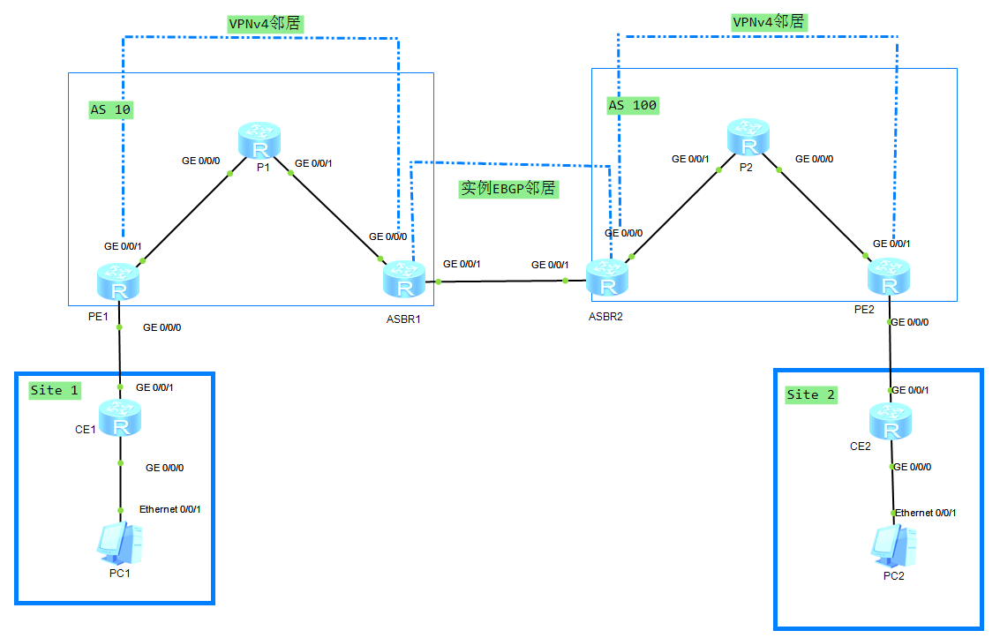
**具体关键配置：AS10内： **
PE1：
``` 
ip vpn-instance A  
 ipv4-family  
  route-distinguisher 100:1  
  vpn-target 1:1 export-extcommunity  
  vpn-target 1:1 import-extcommunity  
#  
bgp 10  
 peer 4.4.4.4 as-number 10   
 peer 4.4.4.4 connect-interface LoopBack0  
 #  
 ipv4-family unicast  
  undo peer 4.4.4.4 enable  
 #   
 ipv4-family vpnv4  
  policy vpn-target  
  peer 4.4.4.4 enable  
 #  
 ipv4-family vpn-instance A   
  network 192.168.1.0   
#  
ospf 2 router-id 2.2.2.2 vpn-instance A  
 import-route bgp  
 area 0.0.0.0 
```
**AS10：ASBR1： **
```
ip vpn-instance B  
 ipv4-family  
  route-distinguisher 100:2  
  vpn-target 1:1 export-extcommunity  
  vpn-target 1:1 import-extcommunity  
#  
interface GigabitEthernet0/0/1  
 ip binding vpn-instance B  
 ip address 10.0.45.4 255.255.255.0   
#  
bgp 10  
 peer 2.2.2.2 as-number 10   
 peer 2.2.2.2 connect-interface LoopBack0  
 #  
 ipv4-family unicast  
  undo peer 2.2.2.2 enable  
 #   
 ipv4-family vpnv4  
  policy vpn-target  
  peer 2.2.2.2 enable  
 #  
 ipv4-family vpn-instance B   
  peer 10.0.45.5 as-number 100   
#
```
AS 100内 ：  PE2：
```
#  
ip vpn-instance C  
 ipv4-family  
  route-distinguisher 200:1  
  vpn-target 1:1 export-extcommunity  
  vpn-target 1:1 import-extcommunity  
#  
bgp 100  
 peer 5.5.5.5 as-number 100   
 peer 5.5.5.5 connect-interface LoopBack0  
 #  
 ipv4-family unicast  
  undo peer 5.5.5.5 enable  
 #   
 ipv4-family vpnv4  
  policy vpn-target  
  peer 5.5.5.5 enable  
 #  
 ipv4-family vpn-instance C   
  network 192.168.2.0   
#  
ospf 2 router-id 2.7.7.7 vpn-instance C  
 import-route bgp  
 area 0.0.0.0   
#
```
 AS 100 内：ASBR2：
```
ip vpn-instance D  
 ipv4-family  
  route-distinguisher 200:2  
  vpn-target 1:1 export-extcommunity  
  vpn-target 1:1 import-extcommunity  
#  
interface GigabitEthernet0/0/1  
 ip binding vpn-instance D  
 ip address 10.0.45.5 255.255.255.0  
#  
bgp 100  
 peer 7.7.7.7 as-number 100   
 peer 7.7.7.7 connect-interface LoopBack0  
 #  
 ipv4-family unicast  
  undo peer 7.7.7.7 enable  
 #   
 ipv4-family vpnv4  
  policy vpn-target  
  peer 7.7.7.7 enable  
 #  
 ipv4-family vpn-instance D   
  peer 10.0.45.4 as-number 10   
#
```
### **控制平面：**
如何从PC1去访问PC2：
1.CE2与PE2之间建立OSPF邻居关系，通过G0/0/0绑定的VPN-Instance-C学习到192.168.2.1/24 路由条目，  
2.为了让Site 1 学习到192.168.2.0/24  
	PE2在BGP，VPN-Instance C 下 通告192.168.2.1/24这条路由，  
	由于是实例路由，携带RD=200:1 RT=1:1，PE2为它分配了一个1026的私网标签然后将路由信息通过MPLS 通告给MPLS LDP 邻居5.5.5.5（ASBR2），ASBR2得知，想要访问192.168.2.0/24 需要封装私网标签1026  
3.ASBR2通过实例EBGP邻居将192.168.2.0/24的路由条目通告给ASBR1，  
4.ASBR1通告G0/0/1下的VPN-Instance B得到192.168.2.0/24 所以会在通告给VPNv4的邻居时打上私网标签1028，通告给2.2.2.2PE1，想要访问192.168.2.0/24 需要封装1028这个私网标签
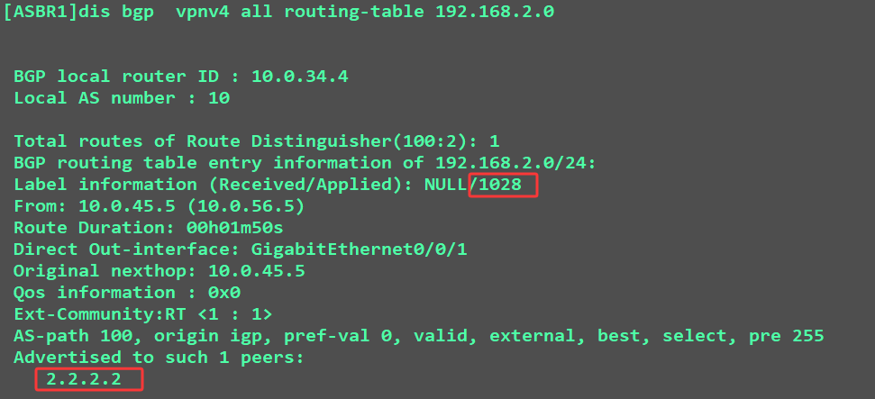
5.PE1得到192.168.2.0/24 这个路由后，通告在实例OSPF 2 下引入BGP，让OSPF 邻居CE1 学习到192.168.2.0/24.
**这样就是控制平面，如何单向想学习到该路由，想要数据通信，还要让CE2学习192.168.1.0/24**

### 转发（数据）平面：  
1.在PC1上ping 192.168.2.1  
到达网关：CE1  
2.CE1查路由表：存在该路由，下一跳为10.0.12.2
[CE1]dis ip routing-table 192.168.2.1

3.数据包到达PE1，PE1查vpn-instance表：该路由需要迭代到下一跳，4.4.4.4  
[PE1]dis ip routing-table vpn-instance A 192.168.2.1
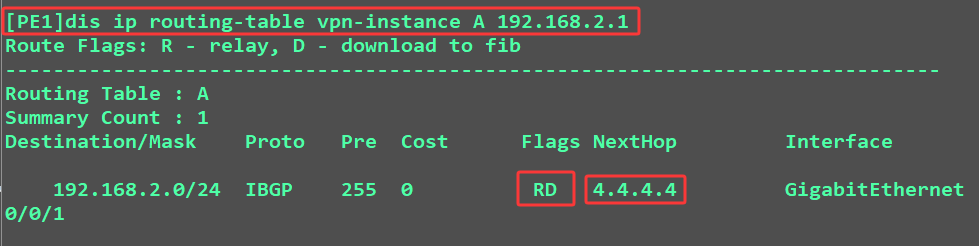

4.查看fib表项该路由是否进行mpls标签封装，通道ID非0，需要进行隧道封装
[PE1]display fib 4.4.4.4
  

5.查看封装什么私网标签：私网标签为：1026
[PE1]display bgp vpnv4 all routing-table 192.168.2.1
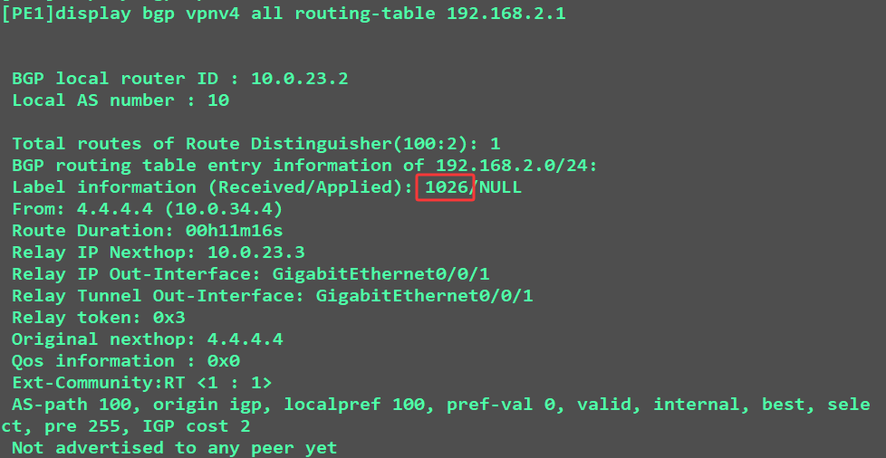
  
6.查看需要封装什么公网标签? 公网标签为：1025  
[PE1]display mpls lsp
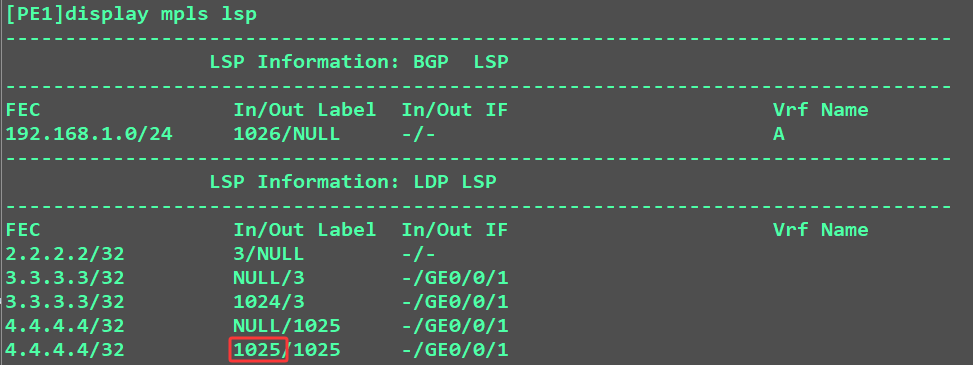  
  

7.到达ASBR1时，最后一条弹出公网标签，携带私网标签
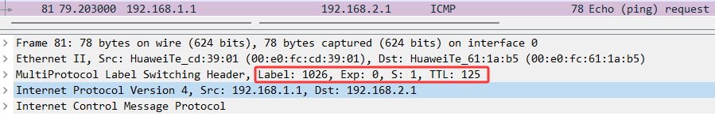  

8.ASBR1得到数据包后，之间与ASBR2进行IPv4数据交换。
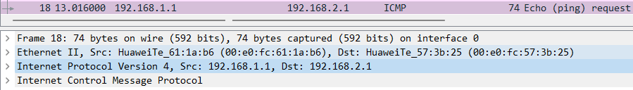  

9.数据包到达ASBR2后，ASBR2查看VPNv4路由表：从7.7.7.7收到1026的私网标签，封装  
[ASBR2]display bgp vpnv4 all routing-table 192.168.2.1
  

10.去7.7.7.7如何走是否需要走通道？TunnelID 非0 需要进行通道封装  
[ASBR2]display fib
  

11.去7.7.7.7封装什么公网标签：？1025
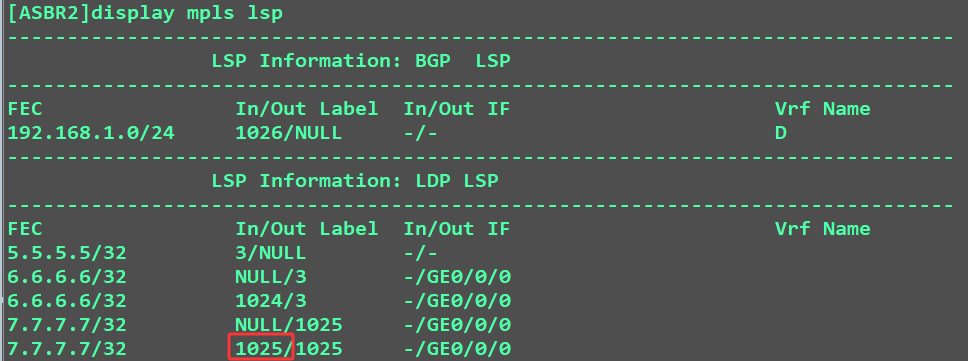  
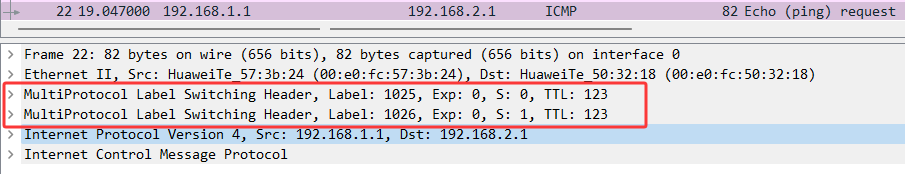
12.数据包到达PE2时 ，自动出栈公网标签，只携带私网标签

查看VPNv4路由，找到起源下一跳。走vpn-instance C
[PE2]display bgp vpnv4 all routing-table 192.168.2.1

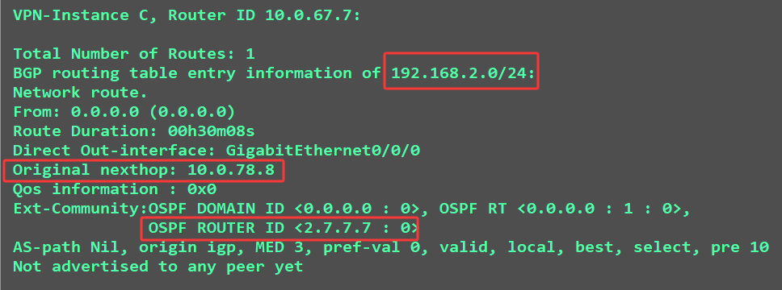
  
13.查看vpn-instance C的路由表：下一跳为CE2
[PE2]display ip routing-table vpn-instance C 192.168.2.1
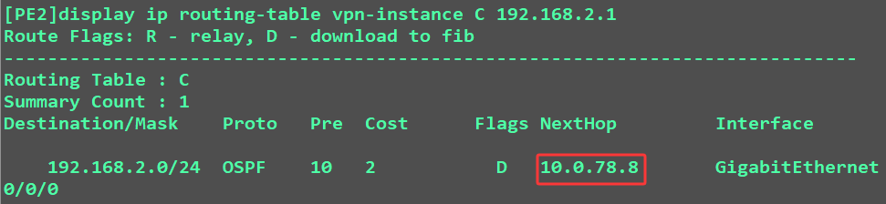  

14.在CE2上查看路由表：找到默认网关，
[CE2]dis ip routing-table 192.168.2.1
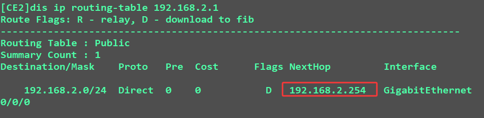