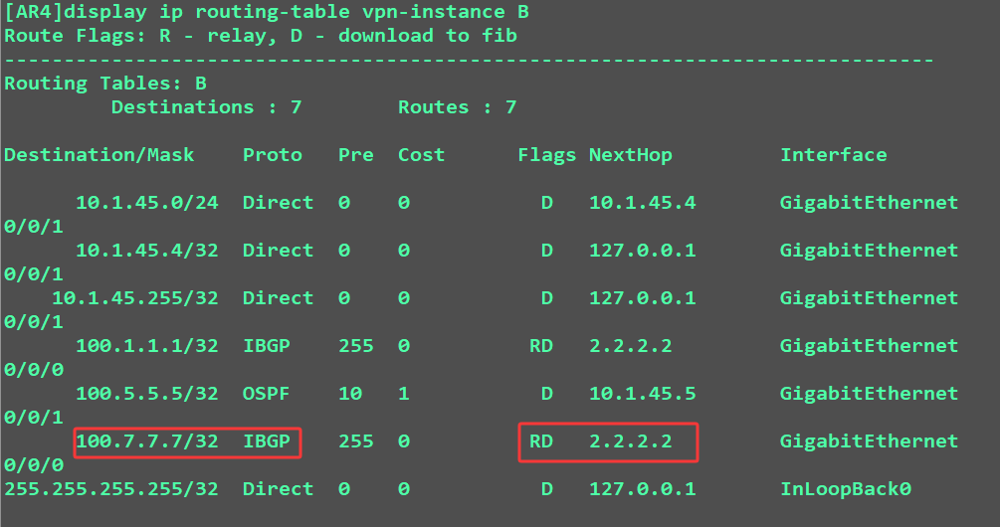
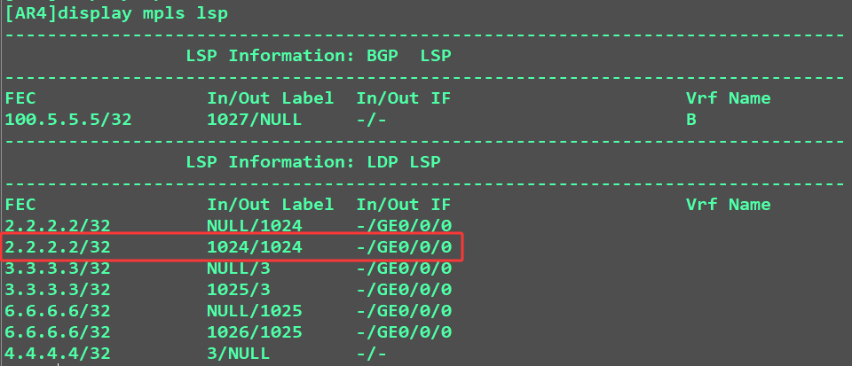
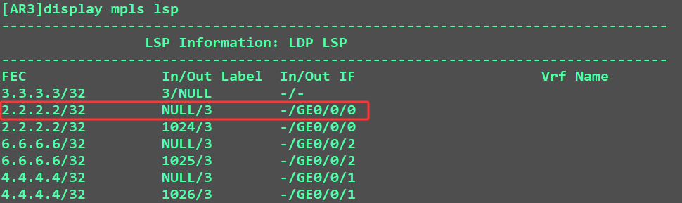
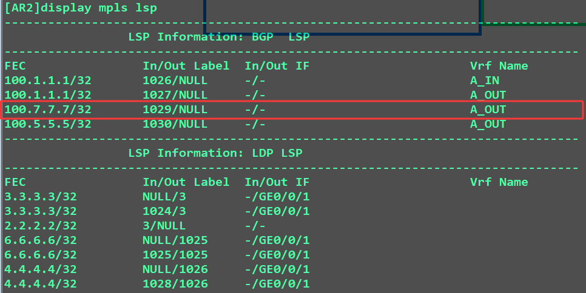
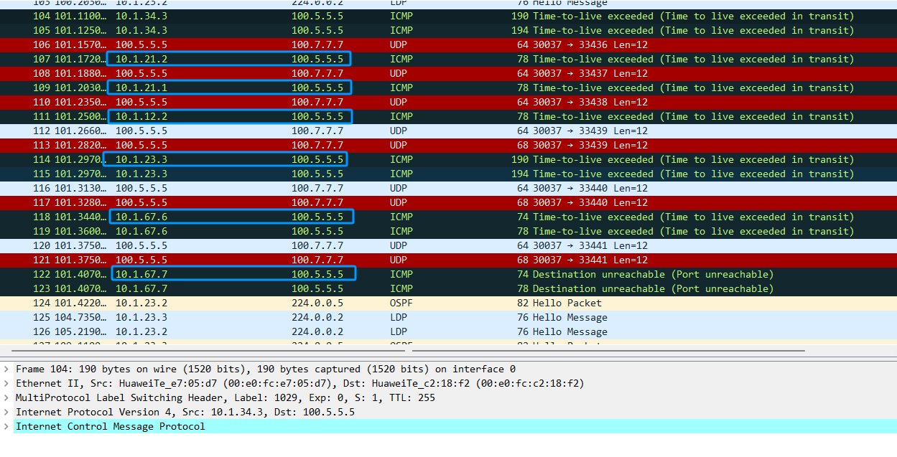

# hub-spoke模型
**对于MPLS VPN组网的方案：**  
	1.站点部分互联的，根据需求实现站点之间相互连接的  
	2.站点全互联的，将所有站点之间相互打通  
	3.站点星型互联的，将站点区分为hub和spoke两种

**hub站点（总部站点）存在一个，spoke站点（分支站点）存在多个   对于hub-spoke模型的部署：**
	1.spoke站点只能和hub站点建立隧道，spoke站点之间不建立隧道  
	2.该方案要求spoke之间的流量，要经过hub站点  
	3.hub站点可以审计spoke之间的流量
 
站点之间路由的相互学习和拒绝路由的相互学习，==实际上站点之间RT是否相互匹配  ==
通过为spoke和hub站点规划RT值实现站点之间路由的相互匹配（Spoke站点之间路由不匹配）
 
spoke的路由通过hub站点进行学习  
要求hub站点将spoke的路由学习后在发布出来  
hub站点的PE和CE之间需要构建两个互联的网段地址  
对于构建的两个网段地址（==实际上就是构建了两个IGP的邻居关系==）  
一个邻居关系接收分支的路由信息，一个邻居关系发布分支的路由信息

## **配置思路：**  
1.公网建立IGP和LDP邻居  
2.站点信息规划及配置  
	1.根据要求规划各站点RD与RT值  
	2.接口绑定VPN实例  
3.站点使用BGP、IGP或静态实现路由通信  
3.在公网设备之间构建MP-BGP邻居关系

**R2：**
```D
#  
ip vpn-instance A_IN  
 ipv4-family  
  route-distinguisher 100:1  
  vpn-target 2:3 import-extcommunity  
#  
ip vpn-instance A_OUT  
 ipv4-family  
  route-distinguisher 100:2  
  vpn-target 3:2 export-extcommunity  
#  
interface GigabitEthernet0/0/0  
 ip binding vpn-instance A_IN  
 ip address 10.1.12.2 255.255.255.0   
#  
interface GigabitEthernet0/0/2  
 ip binding vpn-instance A_OUT  
 ip address 10.1.21.2 255.255.255.0   
#
bgp 100
 peer 3.3.3.3 as-number 100
 peer 3.3.3.3 connect-interface LoopBack0
 #
 ipv4-family unicast
  undo synchronization
  undo peer 3.3.3.3 enable
 #
 ipv4-family vpnv4
  policy vpn-target
  peer 3.3.3.3 enable
 #
 ipv4-family vpn-instance A_IN
  peer 10.1.12.1 as-number 10
 #
 ipv4-family vpn-instance A_OUT
  peer 10.1.21.1 as-number 10
  peer 10.1.21.1 allow-as-loop
```
**AR1:**
```D
bgp 10
 peer 10.1.12.2 as-number 100
 peer 10.1.21.2 as-number 100
 #
 ipv4-family unicast
  undo synchronization
  network 100.1.1.1 255.255.255.255
  peer 10.1.12.2 enable
  peer 10.1.21.2 enable
```
**AR3：**
```D
#  
bgp 100  
 peer 2.2.2.2 as-number 100   
 peer 2.2.2.2 connect-interface LoopBack0  
 peer 4.4.4.4 as-number 100   
 peer 4.4.4.4 connect-interface LoopBack0  
 peer 6.6.6.6 as-number 100   
 peer 6.6.6.6 connect-interface LoopBack0  
 #  
 ipv4-family unicast  
  undo synchronization  
  undo peer 2.2.2.2 enable  
  undo peer 4.4.4.4 enable  
  undo peer 6.6.6.6 enable  
 #   
 ipv4-family vpnv4  
  undo policy vpn-target  关闭默认过滤功能  
  peer 2.2.2.2 enable  
  peer 2.2.2.2 reflect-client  
  peer 4.4.4.4 enable  
  peer 4.4.4.4 reflect-client  
  peer 6.6.6.6 enable  
  peer 6.6.6.6 reflect-client  
#
```
**AR6:**
```D
#
ip vpn-instance C
 ipv4-family
  route-distinguisher 300:3
  vpn-target 2:3 export-extcommunity
  vpn-target 3:2 import-extcommunity
#
ospf 2 router-id 10.6.6.6 vpn-instance C
 area 0.0.0.0
#
interface GigabitEthernet0/0/1
 ip binding vpn-instance C
 ip address 10.1.67.6 255.255.255.0
 ospf enable 2 area 0.0.0.0
#
```
**AR4:**
```D
#
ip vpn-instance B
 ipv4-family
  route-distinguisher 200:2
  vpn-target 2:3 export-extcommunity
  vpn-target 3:2 import-extcommunity
#
ospf 2 router-id 10.4.4.4 vpn-instance B
 area 0.0.0.0
#
interface GigabitEthernet0/0/1
 ip binding vpn-instance B
 ip address 10.1.45.4 255.255.255.0
 ospf enable 2 area 0.0.0.0
#
```
### **policy vpn-target 和 RT值匹配的区别：**
**policy vpn-target 默认是过滤所有的VPNv4路由**
==IRT值匹配ERT值的操作 优选于 policy vpn-target功能==
### **RT值与私网标签：**  
**对于RT值是在控制平面用于站点对路由接收使用的**  
**对于私网标签是在转发平面用于站点对流量接收使用**
==RT值和私网标签的使用方向是相反的==  
==简言之：RT 是 “路由带着标识找接收方”，标签是 “接收方给标识让发送方用”，二者方向相反。 ==
RT值和私网标签都是通过VPNv4路由携带的

## AR5-访问-AR7
1.在AR5查看路由表：得知：100.7.7.7是本地OSPF的外部路由，下一跳位10.1.45.4


2.在AR4上查看vpn-instance B 的路由表：得知：100.7.7.7 是IBGP路由学来的，存在标记Flags RD 需要递归查询？


3.查看FIB表 查看下一跳2.2.2.2 如何走：得知：走2.2.2.2 需要进行标签的封装

 
4.查看VPNv4 路由表查看封装私有标签情况：得知：需要封装私网标签：1029

5.查看公网标签如何封装：得知：需要封装公网标签：1024


6.在AR3上查看，到AR2的标签封装：得知是：3号标签，pop栈，剩下私网标签


7.在AR2上查看标签分配情况：

**得知：该数据路由是从A_OUT表进入AR2**
**为什么呢？**
因为：100.7.7.7的路由是从AR2从AR7学习到的，然后再从AR2发出，因此会携带AR2的ERT值，所以 RT值与标签有何区别联系？：
1.RT值是控制平面的，主要是接收匹配路由  
2.标签是转发（数据）平面的，主要是接收匹配流量

**简言之：RT 是 “路由带着标识找接收方”，标签是 “接收方给标识让发送方用”，二者方向相反。**

### 对于MPLS VPN的tracert 抓包：
	
  
     

