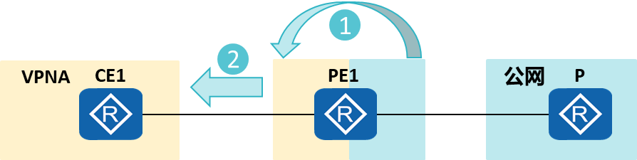
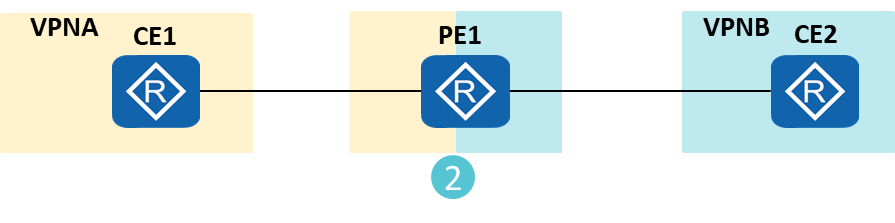

==模拟器不支持以下的操作==
# 配置将私网中的静态路由或IGP路由引入至公网中对应路由类型的路由表中。

1.在PE上将私网路由引入本地的公网路由表。
2.将本地的公网路由表引入其他协议，使P设备获取到路由信息。

```D
[Huawei] ip import-rib vpn-instance vpn-instance-name protocol { static | isis process-id | ospf process-id } [ valid-route ] [ route-policy route-policy-name | route-filter route-filter-name ]
```
# 配置将公网中的直连路由、VLINK直连路由、静态路由或IGP路由引入至私网中对应路由类型的路由表中。

1.在PE上将公网路由引入本地的私网路由表。
2.将本地的私网路由表引入其他协议，使CE设备获取到路由信息。
```D
[Huawei-vpn-instance-VPNA-af-ipv4] import-rib public protocol { direct | vlink-direct-route | { static | isis process-id | ospf process-id } [ valid-route ] } [ route-policy route-policy-name ]
```

# 部署私网与私网互通
## 配置将其他VPN实例中的直连路由、IGP路由或静态路由引入至指定VPN实例中对应路由类型的路由表中。

1.在PE上将VPNA的路由引入VPNB。
2.在PE上将VPNB的路由引入VPNA。
```D
[Huawei-vpn-instance-VPNA-af-ipv4] import-rib vpn-instance vpn-instance-name protocol { direct| { static | isis process-id | ospf process-id } [ valid-route ] } [ route-policy route-policy-name | route-filter route-filter-name ]
```