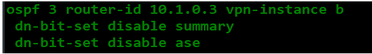
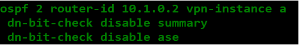

# Option A
## 在配置两端的ASBR时，如果使用IGP（OSPF，isis）连接ASBR时，在IGP中引入BGP中会存在3、5类会存在DNbit位置1的情况。
缺点：所以需要在IGP进程中取消对DNbit位置1的情况。
优点：如果Site是使用IGP（OSPF，并且进程号相同）那么，Site1的1、2、3、5类通告PE设备转换为3类和5类，让ASBR1学习到，再传给ASBR2，ASBR2再传给Site2也是（3、5类）保证了LSA类型的一致性。
**发送端：**

**接收端**

## 如果ASBR之间建立EBGP邻居，站点依旧使用IGP（OSPF）
Site1的1、2、3、5类通过整个MPLS VPN域后全会变成5类LSA。
### IGP引入到BGP中后，下一跳会自动更新为引入这条路由器的地址
默认情况下：从EBGP邻居学习到的路由，默认下一跳不会更改，需要配置next-hop local才会更改；
但是再MPLS VPN网络下==（传递VPNv4路由）==，从EBGP邻居学习到的路由，会修改下一跳地址

Option A的一些特点：
1.ASBR上存在大量的VPN实例（多个VRF表项）
2.不同AS上的RD值，RT值是独立的，互不影响。会经理私网标签的替换（两个AS的私网标签可能不同）例如ASBR1传递通过IP转发传递给ASBR2，那么ASBR2会为该路由重新分配私网标签。
3.ASBR之间可以通过IGP传递IPv4路由或者通过建立EBGP实例邻居传递IPv4路由（IP 转发）
4.ASBR之间可以通过增加物理接口连接、子接口连接。

缺点：需要再ASBR上建立大量的VPN实例，需要大量的资源
优点：配置简单，跨域的需求小可以考虑

其中涉及到的查表：
1.首先是CE2查找IP路由表，查找到对应的外部路由条目（或者是三类的路由OSPF情况）
2.然后PE2收到CE2发送的路由，查找对应FIB表项，对应Tunnel不为0
	获得私网标签
	以及下一跳
再通过查找mpls lsp找到对应的公网标签转发。
3.RR收到，更换标签，为3号标签弹出（倒数第二跳的情况）
4.ASBR2收到只带私网标签的路由，通过IP转发给ASBR2
5.ASBR1收到后通过查找FIB，为
	其封装上新的私网标签后
	查找mpls lsp添加上公网标签
然后将数据表传给RR
6.RR收到后由于是倒数第二条，去掉公网标发给PE1，
7.PE1收到数据包后，查找对应实例mpls lsp，发现是自己某个vpn实例下的路由，便传递给该VPN实例。
8.CE1收到该数据包。

