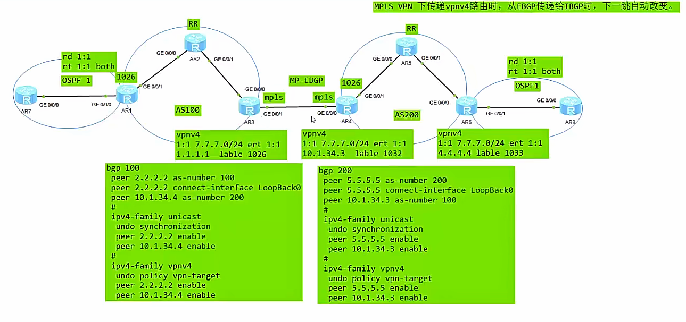

相对于OptionA来说，更为简单
ASBR之间建立MP-BGP邻居（VPNv4），并且关闭掉RT值的过滤，互联接口使能MPLS 标签转发功能
去除掉的配置：
	ASBR之间不需要多条链路
	ASBR之间不需要配置VPN实例
	不需要IGP于BGP的路由互相引入

控制平面：
1.PE1给CE1的路由分配私网标签，然后再分配一个公网标签传递给RR
2.RR收到后，反射给ASBR1，（并去除公网标签）
3.ASBR1收到后，去除私网标签，重新为该路由分配一个新的私网标签。抓发给ASBR2
4.ASBR2收到后，去除私网标签，重新为该路由分配一个新的私网标签。并添加上公网标签，发给RR
5.RR收到该路由后，去除公网标签，反射给PE2
6.PE2收到该路由
