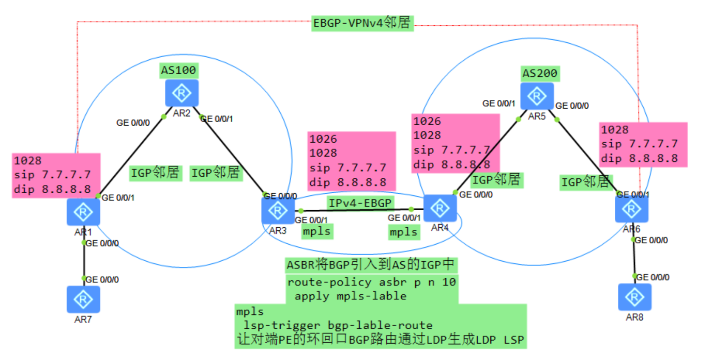
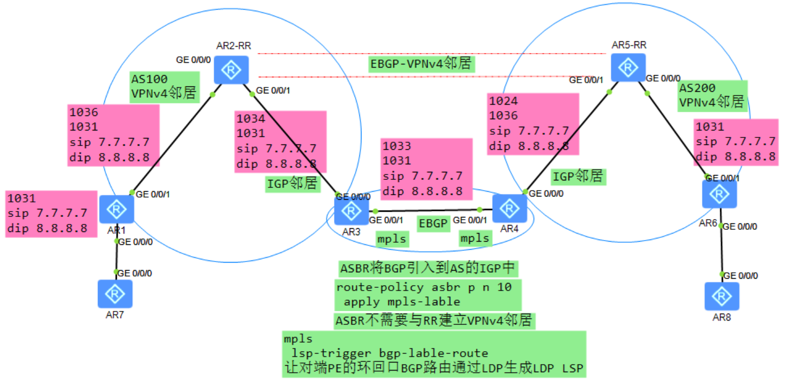

# 场景：
不存在RR，PE与ASBR直接无需通过BGP建立邻居，只有简单的IGP邻居。
PE通过ASBR引入的BGP路由，与对端PE建立BGP-VPNv4邻居。
## 1.不需要BGP协议产生标签路由，不存在RR的场景
1.ASBR之间建立EBGP邻居，
	2.并且通过route-policy分配mpls-lable ，
	3.使能标签路由的转发能力，
	4.宣告PE的环回口路由
	5.在mpls视图下：使能bgp-lable-route能力
	6.ASBR之间的接口使能mpls
2.PE收到对端PE的路由建立EBGP-VPNv4邻居
	1.注意EBGP多跳
	2.建立EBGP邻居的环回口

特点：
1.通过ASBR将对端ASBR宣告的对端PE的环回口路由 直接引入到本端的IGP中，再通过lsp-trigger bgp-lable-route 为其分配LDP LSP
2.最多就两层标签。

# 场景：
如果一个PE上存在多个对端PE的场景， 那么回导致PE与PE直接的连接数非常多，PE的压力也挺大的，所以可以采取通过在反射器之间建立多条的EBGP-VPNv4邻居，来降低PE设备的负载。
## 2.存在RR的场景
1.邻居有别，
	RR与PE建立IBGP-VPNv4邻居，与ASBR建立IGP邻居。
	RR之间建立EBGP-VPNv4
2.RR直接传递的路由保证下一跳不变，RR与PE直接转递的路由也保持不变，
	保证了，PE到对端某私网路由的下一跳为对端PE
