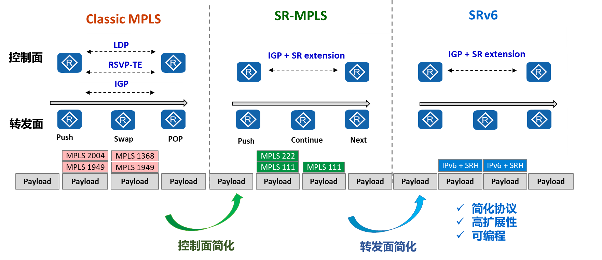
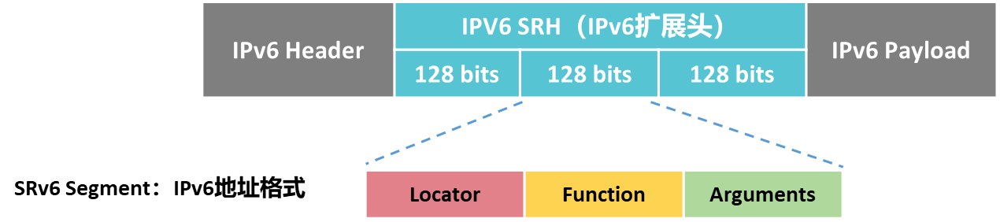

# 网络现状：

# 从MPLS到SRv6
MPLS带来了网络孤岛问题。SRv6统一转发平面，同时拥有简化协议、高扩展性和可编程等优势。

## SRv6原理简介
lSRv6在头节点上对数据压入段路由扩展报文头（SRH，Segment Routing Header）来指导数据转发。
lSRv6报文没有改变原有IPv6报文的封装结构，SRv6报文仍旧是IPv6报文，普通的IPv6设备也可以识别，所以说SRv6是Native IPv6技术。
lSRv6 的Native IPv6特质使得SRv6设备能够和普通IPv6设备共同组网，对现有网络具有更好的兼容性。

## IPv6 SRH介绍

## SRv6 Segment介绍
SRv6 Segment是IPv6地址形式，通常也可以称为SRv6 SID（Segment Identifier）。
如图所示，SRv6 SID由Locator、Function和Arguments三部分组成，格式为Locator:Function:Arguments。注意Length(L+F+A) <= 128。当长度和小于128时，保留位用0补齐。
如果没有Arguments字段，格式则是Locator:Function。Locator占据IPv6地址的高比特位，Function部分占据IPv6地址的剩余部分。

## SRv6 Segment类型介绍

## SRv6 Segment命名规则
SRv6 Segment的命名遵循一定规则，可以从命名组合中快速判断指令功能：
End：End是最基础的Segment Endpoint执行指令，表示中止当前指令，开始执行下一个指令。对应的转发动作是将SL值-1，并将SL指向的SID复制到IPv6报文头的目的地址中。
X：指定一个或一组三层接口转发报文。对应的转发行为是按照指定出接口转发报文。
T：查询路由表并转发报文。
D：解封装。移除IPv6报文头和与它相关的扩展报文头。
V：根据VLAN查表转发。
U：根据单播MAC查表转发。
M：查询二层转发表进行组播转发。
B6：应用指定的SRv6 Policy。
BM：应用指定的SR-MPLS Policy。

## SRv6 Flavors附加行为
Flavors是为了增强SRv6 Segment而定义的附加行为。这些附加行为是可选项，它们将会增强SRv6 Segment的执行动作，满足更丰富的业务需求。
Segment Routing over IPv6 (SRv6) Network Programming中定义了以下附加行为，PSP（Penultimate Segment Pop of the SRH，倒数第二段弹出SRH）、USP（Ultimate Segment Pop of the SRH，倒数第一段弹出SRH）和USD（Ultimate Segment Decapsulation，倒数第一段解封装）。

| 附加行为 | 功能描述                             | 附着的End指令                          |
| ---- | -------------------------------- | --------------------------------- |
| PSP  | 在倒数第二个Endpoint节点执行移除SRH操作。       | End、End.X、End.DT2、End.DT4、End.DT6 |
| USP  | 在最后一个Endpoint节点执行移除SRH操作。        | End、End.X、End.DT2、End.DT4、End.DT6 |
| USD  | 在最后一个Endpoint节点执行解封装外层IPv6报文头操作。 | End、End.X、End.DT2、End.DT4、End.DT6 |

根据目标地址，匹配的网络号进行转发。