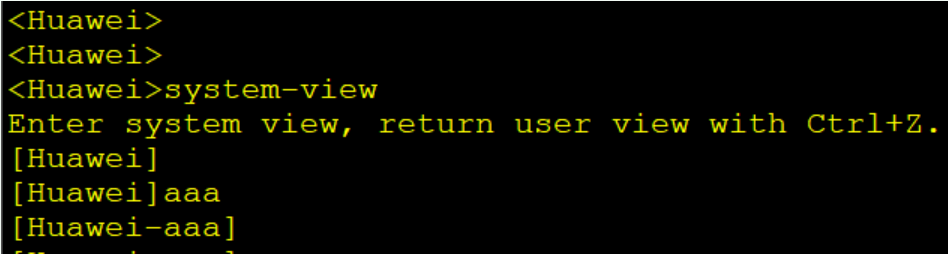

**VRP（Versatile Routing Platform ，通用路由平台）**  
	实现统一的用户界面和管理界面  
	实现控制平面功能，并定义转发平面接口规范  
	实现各产品转发平面与VRP控制平面之间的交互  
	屏蔽各产品链路层对于网络层的差异

**设备命令介绍：**  
1.命令结构：  
    1.命令字：  
		规定了系统应该执行的功能，  
		如display（查询设备状态），  
		reboot（重启设备）等命令字。  
    2.关键字：  
		特殊的字符构成，  
		用于进一步约束命令，是对命令的拓展，  
		也可用于表达命令构成逻辑而增设的补充字符串。  
    3.参数列表：  
		是对命令执行功能的进一步约束。  
		包括一对或多对参数名和参数值。  
```R
display interface GigabitEthernet 0/0/1
```


**2.设备试图介绍**  
  1.用户试图：\<Huawei\>  
      只能做简单的查询、测试、检测的操作  
      还可以进入系统试图 \<Huawei\>system-view  
  2.系统试图：[Huawei]  
      可以执行操作配置：[Huawei]sysname AR1 修改设备的名称  
      还可以进入其他试图：[AR1]aaa 进入aaa协议试图  
  3.其他试图：[AR1-aaa]  
      可以在指定试图下配置相关的操作配置


**3.功能命令介绍**  
  1.命令缩写：  
	将一个完成的命令进行简化，  
	只书写命令的前半部分即可  
  2."?" ：  
	如果直接在部分命令后使用，  
	则显示部分命令可以成为的全部信息  
    如果在命令后空格加？，  
	则显示命令可以调用的所有配置信息  
  3."tab"：  
	在部分命令后使用，可以补全该命令，  
	如果命令有多个则可以按多次tab依次补全
	
**4.快捷键：**  
  1.ctrl+z：直接返回用户试图  
  2.ctrl+c：终止运行  
  3.ctrl+x：清空本行  
  4.ctrl+w：清空最后一个命令  
  5.上下左右：调用历史命令


**5.命令日志提示**  
  1.info：日志，告知管理员执行了操作，且操作正常得到了相关的内容  
  2.warning：告警，管理员执行了高危操作，可以执行但可能存在风险  
  3.error：报错，管理员执行了操作配置，或设备运行出现故障


**常见文件系统操作命令 (1)**  
```R
1.查看当前目录  
	<Huawei>pwd  
2.显示当前目录下的文件信息  
	<Huawei>dir  
3.查看文本文件的具体内容  
	<Huawei\>more  
4.修改用户当前界面的工作目录  
	<Huawei\>cd  
5.创建新的目录  
	<Huawei\>mkdir  
6.删除目录  
	<Huawei\>rmdir  
7.复制文件  
	<Huawei\>copy   
8.移动文件  
	<Huawei\>move  
9.重命名文件  
	<Huawei\>rename  
10.删除文件  
	<Huawei\>delete    
11.恢复删除的文件  
	<Huawei\>undelete  
12.彻底删除回收站中的文件  
	<Huawei\>reset  recycle-bin 
```

**基本配置命令 (2)**  
1.配置设备名称  
	[Huawei] sysname name  
2.设置系统时钟    
	\<Huawei\> clock timezone time-zone-name { add | minus } offset  
用来对本地时区信息进行设置。  
	\<Huawei\> clock datetime [ utc ] HH:MM:SS YYYY-MM-DD  
用来设置设备当前或UTC日期和时间。  
	\<Huawei\> clock daylight-saving-time   
用来设置设备的夏令时。  
3.配置命令等级    
	[Huawei] command-privilege level level view view-name command-key  
用来设置指定视图内的命令的级别。  
命令级别分为参观、监控、配置、管理4个级别，分别对应标识0、1、2、3。  
4.配置用户通过Password方式登录设备  
	[Huawei]user-interface vty 0 4  
	[Huawei-ui-vty0-4]set authentication password cipher information  
用来进入指定的用户视图并配置用户认证方式为password。系统支持的用户界面包括Console用户界面和VTY用户界面，Console界面用于本地登录，VTY界面用于远程登  
录。默认情况下，设备一般最多支持15个用户同时通过VTY方式访问。  
5.配置用户界面参数  
	[Huawei] idle-timeout minutes [ seconds ]  
用来设置用户界面断开连接的超时时间。如果用户在一段时间内没有输入命令，系统  
将断开连接。缺省情况下，超时时间是10分钟。  
6.配置接口IP地址  
	[Huawei]interface interface-number  
	[Huawei-interface-number]ip address ip address  
7.查看当前运行的配置文件  
	\<Huawei\>display current-configuration   
8.配置文件保存  
	\<Huawei\>save  
9.查看保存的配置  
	\<Huawei\>display saved-configuration  
10.清除已保存的配置  
	\<Huawei\>reset saved-configuration  
11.查看系统启动配置参数  
	\<Huawei\> display startup   
用来查看设备本次及下次启动相关的系统软件、备份系统软  
件、配置文件、License文件、补丁文件以及语音文件。  
12.配置系统下次启动时使用的配置文件  
	\<Huawei\>startup saved-configuration configuration-file     
设备升级时，可以通过此命令让设备下次启动时加载指定的配置文件  
13.配置设备重启  
	\<Huawei\>reboot

**所有试图是可以任意切换的（除了用户试图以外）**  
  可以配置quit进行试图的回退  
   [AR1]quit  
   \<AR1\>  
  可以配置return直接退回用户试图  
   [AR1-GigabitEthernet0/0/1]return  
   \<AR1\>
