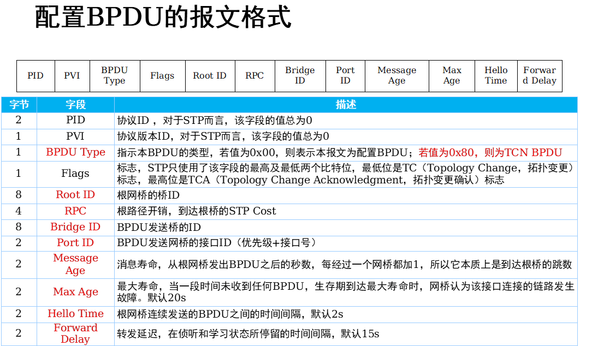
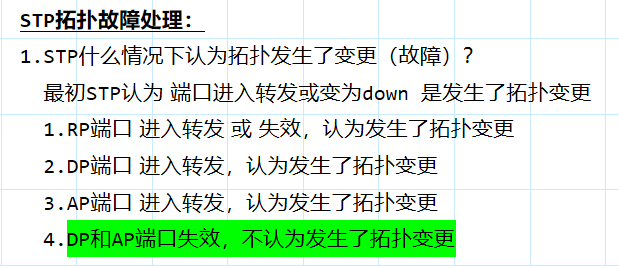

**1.生成树存在的必要性：**  
	单设备组网，容易发生单点故障，导致网络无法正常通信  
	部署多设备组网（提高网络的冗余能力），就会引发环路的问题  
	（管理员误接链路导致环路）所以需要部署二层的破环协议（STP）只要是交换机设备，就需要开启生成树

**2.环路的影响：**  
1.广播风暴  
	因为二层数据帧没有防环的字段（ICMP的生存时间TTL），所以二层环路后，会无休止的转发报文  
	**根本原因就是交换机的泛洪处理行为**  
2.MAC地址漂移  
	因为环路导致数据报文不断的在接口接收，就会导致MAC地址不断的替换接口  
	还有可能因为遭受了网络攻击导致的MAC地址漂移

**交换机默认开启了生成树协议**  
[Huawei]stp enable    开启生成树  
[Huawei]stp disable   关闭生成树  
[S1]stp mode stp  修改STP的模式为STP

**STP：生成树协议**
运行生成树协议的设备会发送STP的协议报文，交互检测完成后  
会构建一颗逻辑上的破环连接拓扑  
被破除的链路，因为增加阻塞接口

**STP基本内容：**
1.Brige ID：桥ID（交换机ID）  
   由16bit的桥优先级 + 48bit的桥MAC地址组成  
   桥优先级的后12bit是固定值，不能更改 固定为0  
   所以桥优先级的取值是0-65535，按照4096的倍数取值  
   [S1]stp priority \<0-61440\>  配置桥优先级（也叫根优先级，与接口优先级不同）  
   
   对于桥MAC可以通过配置命令查看  
   ```r
   [S1]display bridge mac-address   
    System bridge MAC address: 4c1f-ccbe-72bd
   ```
   **根桥设备的BID，也称为RID（根桥的ID）**
   
2.根桥：生成树的树根  
   通过每台设备的桥ID进行优选，得到根桥  
   1.优选桥优先级值小的设备成为根桥  
   2.优先级值相等，则比较桥MAC地址 越小越优先 (在数据链路层中一般都是值越小优先级越高)  
   *在一个生成树组网中，有且只有一个根桥  
   *根桥是可以抢占的*
   
3.cost：开销  
   每一个运行了STP的接口都会存在cost值  
   cost值和接口的工作模式、速率、计算方法有关  
   [S1]display stp interface GigabitEthernet 0/0/1 查看运行生成树接口的详细信息  
   [S1]stp pathcost-standard dot1t 修改cost的计算方法（dot1t为默认计算方法）  
   [S1-GigabitEthernet0/0/1]stp cost 1234  直接在接口修改cost值  
   接口带宽越大，则Cost值越小

4.RPC：根路径开销 （Root Path Cost）  
   非根桥设备到达根桥路径上叠加开销  
   在非根桥的视角上 去往根桥出接口的开销 叠加计算  
   在根桥的视角上 去往非根桥入接口的开销 叠加计算
   
5.PID：接口ID  
   由接口优先级（4bit）+端口编号（12bit）组成  
   接口优先级4bit为高4bit，低4bit是端口编号的高4bit  
   接口优先级配置时需要配置为16的倍数  
   [S1-GigabitEthernet0/0/1]stp port priority \<0-240\>  修改接口优先级值，默认为128  
   优先级值越小越优先，优先级值相等，接口编号越小越优先

6.BPDU：网桥协议数据单元（就是二层的数据报文）  
   1.配置BPDU（0x00）：设备之间正常交互的协议报文  
       flags字段：  
           0 bit：TC bit 表示拓扑变化的标志 （Topology Change）  
           7 bit：TCA bit 表示确认拓扑变更的通知（Topology Change Acknowledgment）
           
       hello time：2s发送一个报文，只有根桥会主动发送，其他非根桥设备转发根桥的BPDU  
       max age：20s根桥的最大老化时间，20s没有收到根桥的BPDU，认为根桥失效，选举新的  
       message age：消息寿命，非时间概念，而是记录转发次数，每经过一台交换机，该值+1  
       forward delay：15s转发延迟，限制在一定时间内选举出根桥（同时限制了网络规模）
   2.TCN BPDU（0x80）：拓扑改变通知协议报文  
```R
	[S2]stp timer hello 400 修改hello time时间（单位厘秒）  
	[S2]stp timer max-age 3000 修改max-age时间（单位厘秒）
```

**在国际单位制中，时间单位从大到小依次为：**  
	秒（s）：基础单位。  
	分秒（ds）：1秒 = 10分秒（部分资料中提及）。  
	厘秒（cs）：1分秒 = 10厘秒，即1秒 = 100厘秒。  
	毫秒（ms）：1厘秒 = 10毫秒，即1秒 = 1000毫秒。

**STP的BPDU整体交互过程：**  
	1.设备在启动后，会认为自身为根桥  
	2.设备接收其他设备的BPDU后，会进行对比，以选举根桥  
	  （报文的携带的RID值参数来选举）  
	3.可以进一步对比最好的配置BPDU  
	  （报文内携带其他参数 RPC、BID、PID）

**STP按照如下顺序选择最优的配置BPDU：**  
	最小的根桥ID  
	最小的RPC  
	最小的网桥ID  
	最小的接口ID

[S7]display stp brief   查看设备stp的状态
	
1.STP的协议报文是什么 有什么内容？  
     BPDU        BID、RPC、PID  
2.如何选择阻塞接口？（优先级+MAC）

DESI = DP = Designated Port 指定端口  
ALTE = AP = Alternate Port  备用端口  
ROOT = RP = Root Port       根端口

FORWARDING 转发  
DISCARDING 丢弃

STP：802.1D  
RSTP：802.1W  
MSTP: 802.1S

**STP的端口角色：**  
1.DP：指定端口，正常发送数据  
       在链路上发送最好的BPDU的端口 就是DP

2.RP：根端口，正常发送数据  
       在链路上接收最好的BPDU的端口 就是RP  
       只会在非根桥设备上才存在RP端口，且有且只有一个  
       在非根桥设备上 去往根桥最近的接口 就是RP

3.AP：预备端口，阻塞端口不发送数据  
      标准生成树中，不存在该接口，华为进行了优化，通过AP来表示阻塞端口的。  
      标准生成树中，对于阻塞接口通过 blocking状态来描述  
      没有成为DP，也没有成为RP的端口，就是AP端口

**STP的端口状态：**
	1.disable：关闭状态，不接收BPDU，不发送BPDU，不学习MAC地址，不转发业务数据。  
	2.blocking：阻塞状态，接收BPDU，不发送BPDU，不学习MAC地址，不转发业务数据。  
	3.listening：侦听状态，接收BPDU，发送BPDU，*不学习MAC地址*，不转发业务数据。  
		**存在15s的转发延迟时间，用于根桥选举以及设备STP的端口角色选举**  
	4.learning：学习状态，接收BPDU，发送BPDU，*学习MAC地址*，不转发业务数据  
	    **存在15s的转发延迟时间，用于端口学习MAC地址，防止大量未知单播帧的泛洪**
	5.forwarding：转发状态，接收BPDU，发送BPDU，学习MAC地址，转发业务数据  
	   *因为存在转发延迟时间，所以终端在正常接入网络后，无法直接通信

BP：边缘端口，可以将端口手工设置为BP端 
     可以让端口跳过转发延迟时间，直接进入转发状态  
     [S6]interface GigabitEthernet 0/0/1  
     [S6-GigabitEthernet0/0/1]stp edged-port enable 

**STP故障：**
1.设备故障  
	1.根桥故障，恢复时间为50s  
		（20sAP端口BPDU老化 +  30s转发延迟时间(listening15s+learning15s)）  
	2.非根桥故障  
	    1.非根桥不存在AP端口，恢复时间为30s（转发延迟时间(listening15s+learning15s)）  
	    2.非根桥存在AP端口，不需要恢复时间(AP端口直接用)  
2.链路故障（端口故障）  
   1.直连链路故障  
      1.根桥设备：  
          1.连接非根桥设备不存在AP端口，恢复时间为50s
          （20sAP端口BPDU老化 +  30s转发延迟时间）  
          2.连接非根桥设备存在AP端口，恢复时间为30s（转发延迟时间30s）  
      2.非根桥设备的DP端口故障，对端为RP端口，恢复时间30s  
      3.非根桥设备的AP端口故障，恢复时间为0s  
   2.非直连链路故障  
      恢复时间为50s（20s端口BPDU老化 +  30s转发延迟时间）

**STP拓扑故障处理：**  
	1.STP什么情况下认为拓扑发生了变更（故障）？  
		  最初STP认为 端口进入转发或变为down 是发生了拓扑变更  
		  1.RP端口 进入转发 或 失效，认为发生了拓扑变更  
		  2.DP端口 进入转发，认为发生了拓扑变更  
		  3.AP端口 进入转发，认为发生了拓扑变更  
		  4.DP和AP端口失效，不认为发生了拓扑变更
	2.STP发生拓扑变更后的处理：  
		 TCN 报文的英文名是 “Topology Change Notification Message”。

 
**STP拓补更新过程**
  1.发生拓扑变更的设备S7，会产生TCN BPDU，周期2s告知上游设备S6  
  2.S6收到TCN BPDU后，会回复一个TCA置位的配置BPDU，告知下游设备已经收到TCN BPDU，并终止下游发送TCN BPDU的行为  
  3.S6也会产生TCN BPDU，周期2s告知上游设备S5  
  *依次通告给根桥设备  
  4.根桥设备收到TCN BPDU，会回复一个TCA置位的配置BPDU，并且配置BPDU中TC bit置位  
    TC bit置位的作用：告知其他设备需要刷新设备的MAC地址（将MAC地址表老化时间置位15s（转发延迟时间））

**为什么要刷新设备的MAC地址表项**？  
  如果不刷新MAC表项，则会导致设备使用原有的表项执行数据转发，最终可能导致业务中断  
  MAC地址表项刷新后，设备可以正常执行泛洪操作，记录最优的路径  
  （模拟器中设备默认是不刷新MAC地址表项的）而真实设备是会自动刷新的



**核心概念：什么是 STP 中的“拓扑变更”？**  
在 STP/RSTP 中，**“拓扑变更”并不等于“物理链路状态改变”**。  
STP 宣告拓扑变更（发送 TCN BPDU 或 TC 置位 BPDU）的唯一目的是：**通知全网交换机清空/刷新 MAC 地址表**。
- 如果一个变化会导致流量路径改变，需要刷新 MAC 表 -\> **算拓扑变更**。
- 如果一个变化**不影响**当前的主流量路径，或者不需要全网重新学习 MAC -\> **不算拓扑变更**。
 
**深度解析第 4 点（绿色部分）**  
**1. 为什么 AP（Alternate Port）端口失效，不算拓扑变更？**

- **角色定位：** AP 端口是阻塞（Blocking/Discarding）状态的，它是 RP（根端口）的**备胎**。
- **当前状态：** 它平时**不转发任何用户流量**。
- **失效后果：** 如果这个“备胎”坏了，对正在公路上跑的车（数据流量）有影响吗？**完全没有**。主路（RP）依然畅通，流量依然正常转发。
- **结论：** 既然流量路径没变，其他交换机就不需要刷新 MAC 地址表。所以，**AP 失效 = 无事发生**。
    - _比喻：你车后备箱里的备胎漏气了，但这不影响你正在开的四个轮子，你不需要停车修理。_

**2. 为什么 DP（Designated Port）端口失效，不算拓扑变更？**  
这个最难理解。DP 是负责向下游转发流量的端口，它断了，下游明明断网了，为什么不算 TC？

- **RSTP 的改进逻辑（802.1w）：** 在 RSTP 标准中，为了减少网络的震荡，重新定义了拓扑变更的触发条件：**只有“非边缘端口进入 Forwarding（转发）状态”才算拓扑变更**。
- **失效后果：**
    - DP 变 Down，意味着这条路断了。
    - 对于**本设备**而言，去往根桥（Root）的路（RP）没有变，不需要切路径。
    - 对于**下游设备**而言，它失去了它的 RP，它会重新计算生成树。**如果下游设备找到了新的路并把端口变成了 Forwarding，那么下游设备会发起 TC。**
    - 但对于**本设备（DP 所在的设备）**，只是少了一个下游连接，并没有产生**新的**路径，也没有流量绕行的需求，所以本设备不会因为 DP Down 而触发 TC。
- **结论：** 链路断开（Down）在 RSTP 中被视为“由于某种原因不再可用”，这不需要全网刷新 MAC 表，除非有**新的链路**（新路径）建立起来填补空缺。
    - _比喻：大树的一根末梢树枝断了（DP断），整棵大树的主干（Root路径）并没有变，不需要整棵树“摇晃”一下（刷新MAC）。_
 
**对比理解：为什么 1、2、3 点算变更？**  
为了巩固理解，我们对比一下图片中的前三点：

1. **RP（根端口）失效：**
    - **严重性：** 这是本交换机去往“皇上”（根桥）的唯一主干道。
    - **后果：** 主路断了，必须启用备胎（AP）。AP 会从阻塞变成转发（Forwarding）。
    - **触发点：** 正是因为 **AP 变成了 Forwarding**（新路径产生），所以必须触发拓扑变更，告诉全网：“路变了，大家刷新一下 MAC 表！”
2. **DP/AP/RP 进入转发（Forwarding）：**
    - 只要有端口**进入转发状态**，就意味着网络中多了一条可用的路。
    - 多了一条路，原来的 MAC 地址可能走这条新路更快，或者原来的路通了，所以必须触发 TC，让大家重新学习。
 
**总结梳理**  
你可以用这句话来记忆该图片的逻辑（特别是针对 RSTP/华为 Datacom 逻辑）：

**“只有‘路通了’（变 Forwarding）才是大事；‘路断了’（变 Down），如果没引起备胎转正，那就不是大事。”**

- **AP 坏了：** 备胎坏了，主路没受影响 -\> **不算 TC**。
- **DP 坏了：** 树枝断了，没长出新树枝 -\> **不算 TC**。
- **RP 坏了：** 主路断了，**导致备胎（AP）转正**，AP 变成了 Forwarding -\> **算 TC**（本质是因为有端口进入了 Forwarding）。