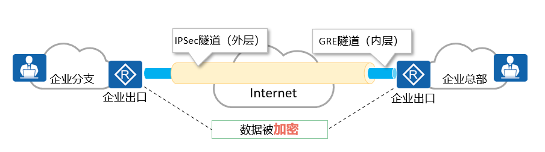

# GRE-VPN

**通用路由封装协议（General Routing Encapsulation，GRE）是一种三层VPN封装技术。**  
GRE可以对某些网络层协议（如IPX、IPv4、IPv6等）的报文进行封装，  
使封装后的报文能够在另一种网络中（如IPv4）传输，从而解决了跨越异种网络的报文传输问题。

**GRE构成要素分为3个部分：乘客协议、封装协议和运输协议。  **
- 乘客协议是指用户在传输数据时所使用的原始网络协议。  
- 封装协议的作用就是用来“包装”乘客协议对应的报文，使原始报文能够在新的网络中传输。  
- 运输协议是指被封装以后的报文在新网络中传输时所使用的网络协议。
 
==GRE的主要缺点是不支持加密和认证，数据的安全传输得不到很好的保障。  ==
==IPSec的主要缺点是只支持IP协议，且不支持组播。  ==
==**可通过部署GRE Over IPSec结合两种VPN技术的优点。**==



```R
[AR1]interface Tunnel 0/0/1  
[AR1-Tunnel0/0/1]tunnel-protocol gre     指定隧道的协议  
[AR1-Tunnel0/0/1]ip address 192.168.13.1 24   配置隧道的IP地址  
[AR1-Tunnel0/0/1]source 1.1.1.1          配置封装数据的SIP  
[AR1-Tunnel0/0/1]destination 3.3.3.3     配置封装数据的DIP  
对于封装数据的SIP和DIP 一定是可以路由通信的
[AR1]ip route-static 192.168.2.0 24 Tunnel 0/0/1 
```


