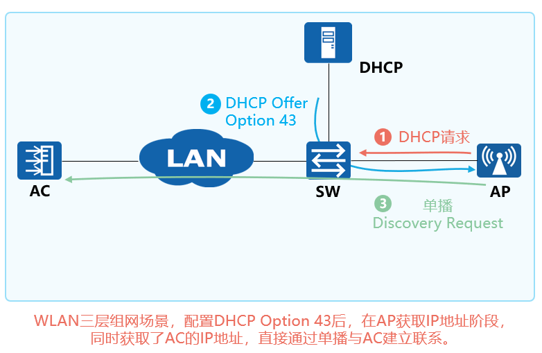
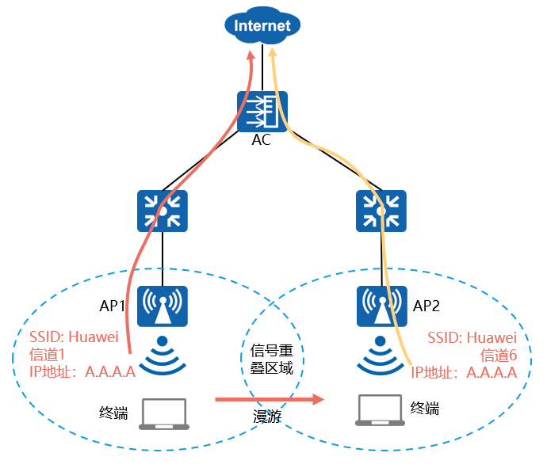
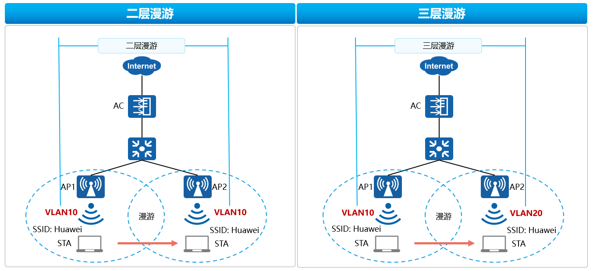
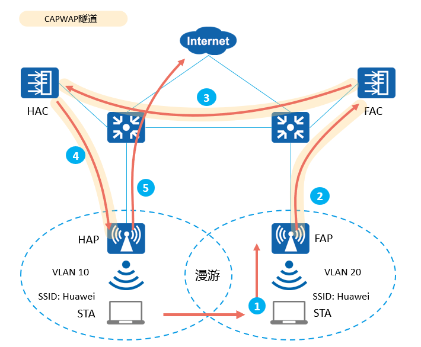
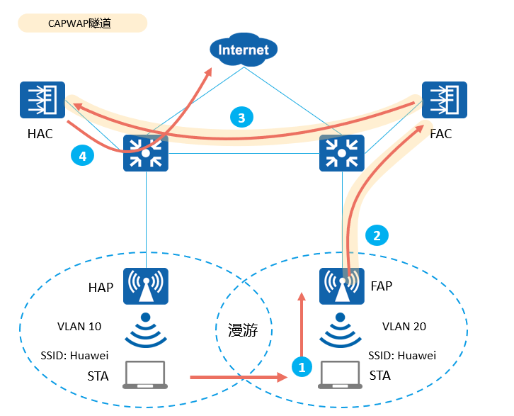

# WLAN三层组网概述

大型WLAN组网的特点：网络规模大，用户分布广，接入安全要求高，可靠性要求高

WLAN配合SDN控制器使用，由SDN控制器统一管理和配置，能够实现业务发放自动化、网络全生命周期管理，结合大数据和AI技术可实现园区网络的智能、极简和安全。园区网络更具备有线与无线的深度融合能力。

#  **大型WLAN网络关键技术：**

| ==技术==              | ==作用==                                                                                                  |
| ------------------- | ------------------------------------------------------------------------------------------------------- |
| VLAN Pool           | 通过VLAN Pool把接入的用户分配到不同的VLAN，可以减少广播域，减少网络中的广播报文，提升网络性能。                                                  |
| DHCP Option 43 & 52 | 当AC和AP间是三层组网时，AP通过发送广播请求报文的方式无法发现AC，这时需要通过DHCP服务器回应给AP的报文中携带的Option43字段（IPv4）或Option52（IPv6）来通告AC的IP地址。 |
| 漫游技术                | WLAN漫游是指STA在不同AP覆盖范围之间移动且保持用户业务不中断的行为。                                                                  |
| 高可靠性技术              | 为了保证WLAN业务的稳定运行，保证在主设备故障时业务能够顺利切换到备份设备的技术。                                                              |
| 准入控制                | 准入控制技术是通过对接入网络的客户端和用户的认证来保证网络的安全，是一种“端到端”的安全技术。                                                         |

#  **现有网络面临的挑战： 
- 无线网络终端的移动性导致特定区域IP地址请求较多。  
- 通过情况下，一个SSID只能对应一个业务VLAN，如果通过扩大子网增加IP地址则会导致广播域扩大，大量的广播报文造成网络拥塞。  

**VLAN Pool分配VLAN的算法：**

| 分配算法   | 优点                    | 缺点                |
| ------ | --------------------- | ----------------- |
| 顺序分配   | 各个VLAN用户数目划分均匀        | 重新上线VLAN容易变更、IP变化 |
| HASH分配 | 用户多次上线可分配相同的VLAN、IP不变 | 各个VLAN用户数划分不均衡    |

**AC作为DHCP Relay，在AC上配置dhcp server group**
dhcp server group AP   
dhcp-server 172.21.1.2 0
**在接口使能dhcp服务**
interface Vlanif10  
 ip address 10.1.1.2 255.255.255.0  
 dhcp select relay  
 dhcp relay server-select AP

==前提是AP所在的网络能够到达dhcp服务器所在的网络（二层组网）==

#  三层组网ap发现ac
当AC和AP间是三层组网时，AP通过发送广播请求报文的方式无法发现AC，这时需要通过DHCP服务器回应给AP的报文中携带的
Option43字段（IPv4）
Option52（IPv6）
来通告AC的IP地址。

## 漫游技术  
**WLAN漫游是指STA在不同AP覆盖范围之间移动且保持用户业务不中断的行为**。

实现WLAN漫游的两个AP必须==使用相同的SSID==和==安全模板==（安全模板名称可以不同，但是安全模板下的配置必须相同）
**认证模板的认证方式和认证参数也要配置相同。   **

**WLAN漫游策略主要解决以下问题**：   
- 避免漫游过程中的认证时间过长导致丢包甚至业务中断。  
- 保证用户授权信息不变。  
- 保证用户IP地址不变。

**WLAN漫游的相关术语：**
	HAC（Home AC）：一个无线终端首次与漫游组内的某个AC进行关联，该AC即为它的HAC。
	HAP（Home AP）：一个无线终端首次与漫游组内的某个AP进行关联，该AP即为它的HAP。
	FAC（Foreign AC）：一个无线终端漫游后关联的AC即为它的FAC。
	FAP（Foreign AP）：一个无线终端漫游后关联的AP即为它的FAP。

**WLAN漫游类型：**

**漫游的流量转发类型：**
1.二层组网直接转发：

2.三层组网隧道转发：

3.三层漫游直接转发（HAP为家乡代理）

3.三层漫游（HAC）为家乡代理：
