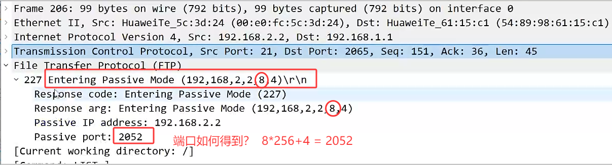

为什么要存在多协议通道？多协议通道是做什么用的？  
**ASPF（Application Specific Packet Filter，应用层状态检测--特定应用数据包过滤器）**

**ASPF 主要解决传统静态包过滤无法处理的动态端口问题：  **
- 许多应用层协议（如 FTP）在通信过程中会动态协商端口  
（例如从主动模式的 PORT 命令或被动模式的 PASV 命令中获取端口号），  
- ==传统防火墙仅根据固定的端口号进行过滤，无法识别这些动态端口，导致通信失败。== 

**ASPF 通过监测应用层协议的通信过程，动态识别并允许相关的后续数据连接通过防火墙，从而保证复杂协议的正常运行。**

**ASPF 支持的典型协议**
ASPF 可对以下协议进行状态检测和动态处理：
1. FTP（文件传输协议）
	处理主动模式（Active FTP）和被动模式（Passive FTP）的端口协商，允许数据连接通过防火墙。
2. H.323（视频会议协议）
	解析 H.225 控制通道的消息，提取媒体通道的端口信息，允许音视频流通过。
3. SIP（会话初始协议）
	检测 SIP 信令中的端口信息，动态放行 RTP/RTCP 媒体流。
4. RTSP（实时流协议）
	解析 RTSP 协议中的端口协商，确保流媒体数据正常传输。

**多通道协议在防火墙上的问题：**
如果在防火墙上配置严格的单向安全策略，那么防火墙将只允许业务单方向发起访问。这会导致一些特殊的协议无法工作，例如FTP。  
防火墙的工作流程：

```R
查看所有安全策略：display security-policy rule all  
查看当前防火墙当前所有的会话：display firewall session table all-system  
```

## **FTP多通道协议的处理:**
FTP：20、21
协议会建立两个通道，一个是控制通道，一个是数据通道
FTP的两种链接模式：==(站在服务器的视角)==
1.主动模式：
	客户端向服务器发送控制通道的链接
	服务器主动向客户端发起数据通道的链接
2.被动模式：
	客户端向服务器发送控制通道的链接
	服务器被动的带客户端发起数据通道的链接


### **控制通道：客户端主动发起链接**

| SIP | DIP | protocol | Sport | Dport |
| --- | --- | -------- | ----- | ----- |
| 1.1 | 2.2 | ftp      | 随机    | 21    |

随机的源端口：在防火墙收到流量后 就可以唯一的确定源端口了

防火墙收到客户端发送的流量信息后，可以根据流量信息自动生成5元组对应的会话表项 
**查看明细：display firewall session table verbose**
```Java
ftp  VPN: public --\> public  ID: c487f3d96d568c0232568311ef7  
 Zone: trust --\> untrust  TTL: 00:15:00  Left: 00:14:16  
 Recv Interface: GigabitEthernet1/0/0  
 Interface: GigabitEthernet1/0/2  NextHop: 192.168.2.2  MAC:5489-98ba-222b  
 \<--packets: 12 bytes: 793 --\> packets: 13 bytes: 589  
 192.168.1.1:2061(随机源端口) +-\> 192.168.2.2:21 PolicyName: FTP  
 TCP State: fin-1
```
 
### 数据通道：  
被动模式（客户端主动发起数据通道的链接）  

| SIP | DIP | protocol | Sport | Dport            |
| --- | --- | -------- | ----- | ---------------- |
| 1.1 | 2.2 | ftp-data | 随机    | 上一个报文中携带的（并不是20） |

**客户端如何得知要封装的Dport？ **
在控制通道建立后，服务器会通告一个responsed报文，报文内携带了数据通道要使用的端口值

==**对于Dport，防火墙存在ASPF协议，可以检测报文内的携带信息-计算出目的端口号**==


对于多通道协议，防火墙存在server-map表项
只需要匹配 SIP DIP protocol  Dport即可，所以该表项是不安全的  
一种临时使用的表项，等待流量经过，防火墙就会获取完整的流量信息即Sport也知晓  
根据5元组生成会话表项
[USG6000V1]dis firewall server-map   
```R
2025-05-24 01:35:47.080   
 Current Total Server-map : 1  
 Type: ASPF,  192.168.1.1 -\> 192.168.2.2:2053,  Zone:---  
 Protocol: tcp(Appro: ftp-data),  Left-Time:00:00:12  
 Vpn: public -\> public
```