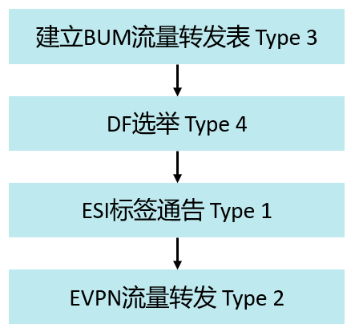

lEVPN的控制平面采用MP-BGP，数据平面支持多种类型的隧道，例如MPLS、GRE隧道、SRv6。本课程以MPLS作为外层隧道转发技术进行讲解。
EVPN其他优势：
- 支持CE多活接入PE
- 支持PE成员自动发现
- 环路避免
- 广播流量优化
- 支持ECMP

# EVPN基本术语
1.ES（Ethernet Segment）代表用户站点（设备或网络）连接到PE的一组以太链路，使用ESI（Ethernet 2.Segment Identifier）来表示。
3.EVI（EVPN instance）代表一个EVPN实例，用于标识一个EVPN客户。
4.MAC-VRF是PE上属于EVI的MAC地址表。
5.RD（Route Distinguisher）是EVPN的唯一标识，用于区分EVI。
6.RT（Route Target）用于控制EVPN路由的引入。
7.DF（Designated Forwarder）用于在CE多归属场景下只转发一份BUM流量至CE。
8.ESI Label是EVPN Type 1路由所携带的扩展团体属性。在多归场景下，用于实现快速收敛和水平分割。
9.BUM（Broadcast、Unknown unicast、Multicast）Label是由Type 3路由携带，用于转发BUM流量。
单播Label由Type 2路由携带，用于转发单播流量。

# EVPN四种类型路由的作用

| 路由类型                                | 作用                                       | 受益                               |
| ----------------------------------- | ---------------------------------------- | -------------------------------- |
| (Type 1) Ethernet A-D Route         | 别名   MAC地址批量撤销   多活指示   通告ESI标签 | 环路避免   快速收敛   负载分担 水平分割 |
| (Type 2) MAC/IP Advertisement Route | MAC地址学习通告   MAC/IP绑定   MAC地址移动性    | ARP抑制   主机迁移                  |
| (Type 3) Inclusive Multicast Route  | 组播隧道端点自动发现&组播类型自动发现                      | 支持BUM流量转发                        |
| (Type 4) Ethernet Segment Route     | ES成员自动发现 DF选举                         | 多活，单活支持                          |
| (Type 5) IP Prefix Route            | IP Prefix通告                              | 支持L3 VPN功能                       |

# EVPN工作流程
EVPN的工作流程分为两个阶段：
**启动阶段**：
	EVPN对等体交互EVPN Type 3路由建立BUM流量转发表。
	EVPN对等体交互Type 4路由完成ES发现和DF选举（在ES多归属场景下）。
	EVPN对等体交互Type 1路由，交互ESI标签，进而实现水平分割、别名等功能。
**流量转发**：CE侧流量触发PE通过Type 2路由通告MAC地址，该路由携带分配的标签信息，后续根据该标签执行单播流量转发。

# EVPN路由携带的关键参数
EVPN四种路由类型的作用和其携带的参数有密不可分的关系：
	Type 1路由携带ESI标签用于实现水平分割。
	Type 2路由携带单播标签指导单播流量转发。
	Type 3路由携带BUM标签指导BUM流量转发，但Type 3路由未携带ES相关信息。
	Type 4路由携带ESI用于DF选举，但Type 4路由未携带任何标签信息。

| 参数  路由类型 | RD  | ESI | Ethernet Tag ID | Originating Router's IP Address | MAC/IP Address | MPLS Label |
| :------------: | :-: | :-: | :-------------: | :-----------------------------: | :------------: | :--------: |
|     Type 1     |  √  |  √  |        √        |                                 |                | ESI Label  |
|     Type 2     |  √  |  √  |        √        |                                 |       √        |     √      |
|     Type 3     |  √  |     |        √        |                √                |                | BUM Label  |
|     Type 4     |  √  |  √  |                 |                √                |                |            |

# Ethernet A-D路由
以太自动发现路由（Ethernet Auto-Discovery Route）有两种类型：
	Ethernet A-D per ES route：主要用于快速收敛、冗余模式和水平分割。
	Ethernet A-D per EVI route：主要用于别名。

# DF选举
CE多归场景下，ES上可能会被配置有多个Ethernet Tag，只有一个PE会被选举为DF（Designated Forwarder）。DF选举由携带ES-Import属性的Type 4路由完成，其作用是：
	在指定的ES上向CE发送组播和广播。
	向CE泛洪未知单播流量。

