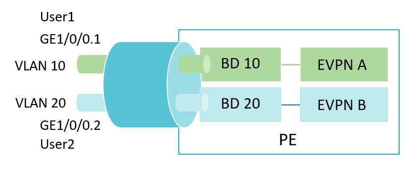
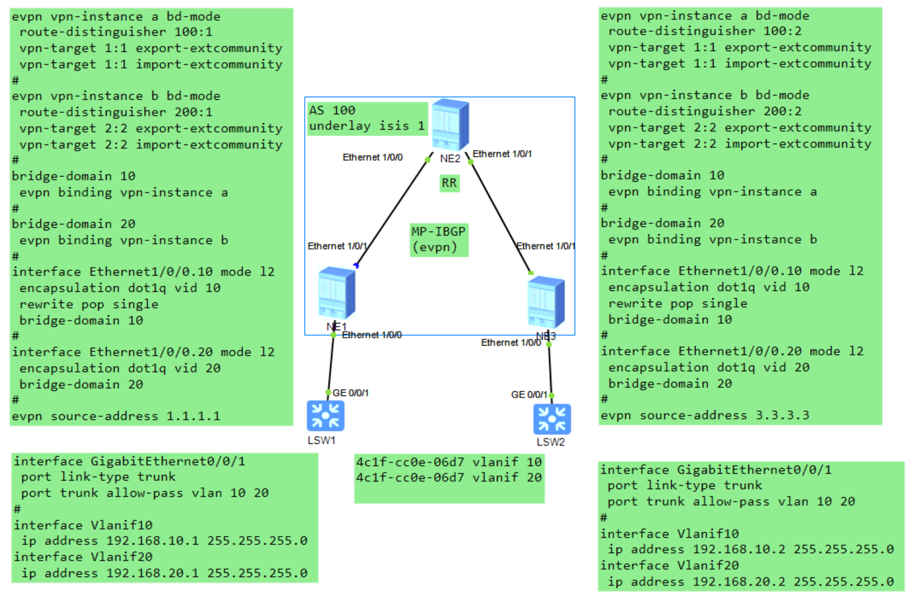
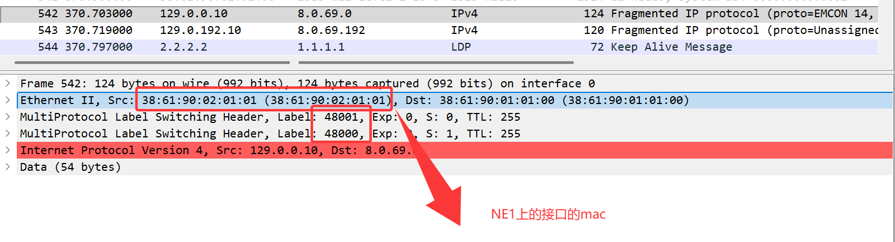
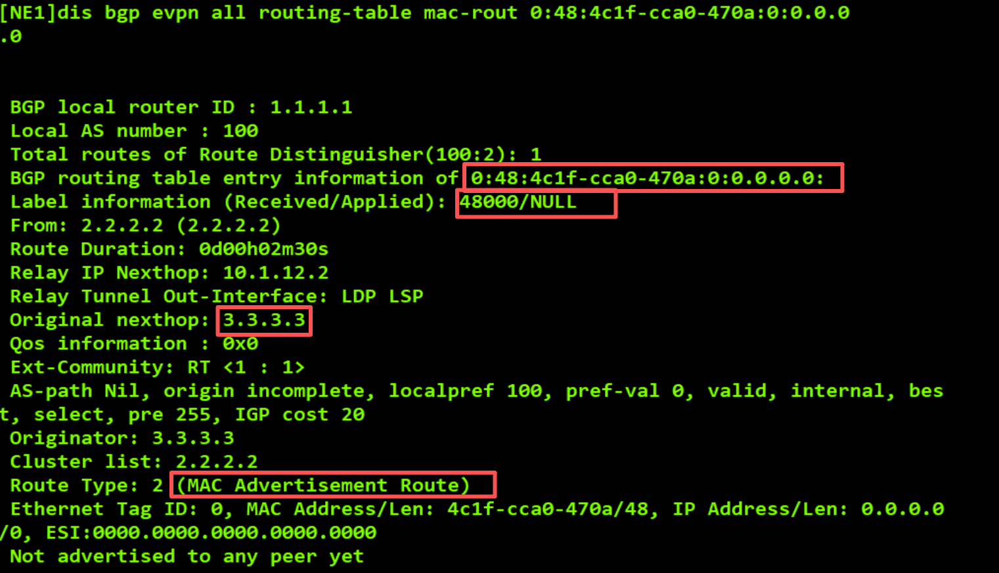
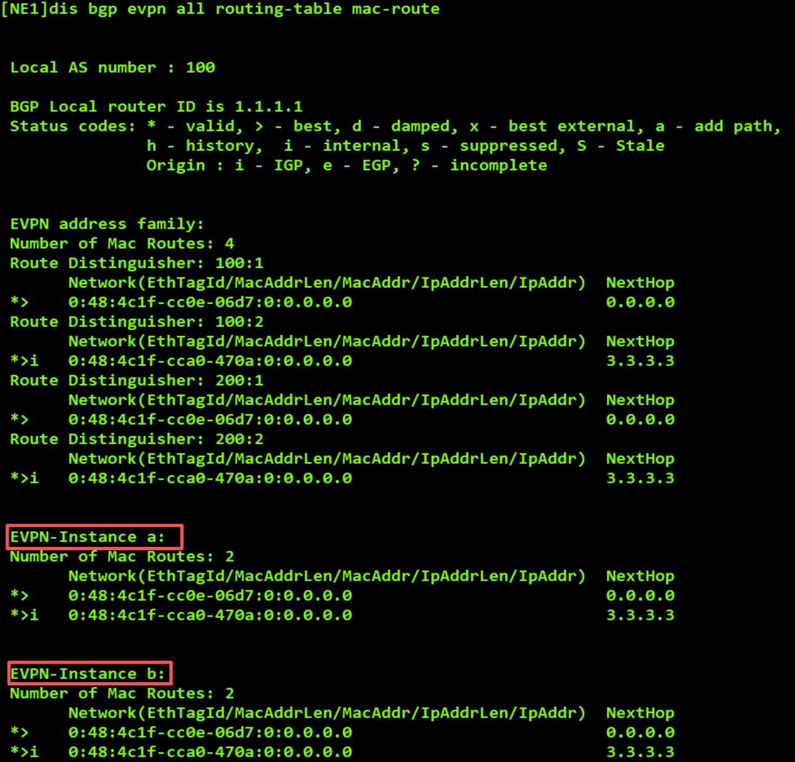

l在VLAN Based模式下，连接用户网络的物理接口划分成不同子接口，每个子接口关联不同的VLAN且加入不同的广播域BD（Bridge Domain）。每个广播域BD会与单独的一个EVPN实例进行绑定。此种服务模式可以用于承载二层业务或三层业务。本例有User1和User2，分别使用不同的子接口接入。

## 错误的原因是：由于evia和evib的rt值一致了，导致出现了问题
在你的**EVPN 二层互通（BD 模式）** 组网中，**EVI a/b 共用`vpn-target 1:1`** 是导致 MAC-Route 重复、VLAN20 不通的**底层根因**（S5720 共享 MAC 是放大问题的直接诱因）。

核心要先明确：**二层 EVPN（BD 模式）中，VPN Target 的作用对象是「MAC 路由」，而非三层 IP 路由**，它是 EVPN 实例（EVI）之间**二层隔离的唯一核心手段**—— 你的不通，本质是**VPN Target 共用导致 EVI 的 MAC 路由隔离失效，两个 VLAN 的 MAC 路由互相 “渗透” 到对方 EVI 中，让 NE40E 无法区分 MAC 所属的二层广播域（VLAN/EVI）**，最终转发决策彻底混乱。

下面结合你的实际组网（两台 NE40E+S5720，EVI a 绑 BD10/VLAN10、EVI b 绑 BD20/VLAN20），**从 VPN Target 的核心原理、共用的具体影响、独立配置的隔离效果**三部分，一步步讲清逻辑，完全贴合你的场景。

### 一、先搞懂：二层 EVPN（BD 模式）中 VPN Target 的核心原理

VPN Target 是**一对「导出（export）/ 导入（import）」标签**，本质是**MAC 路由的 “通行证”**，华为 EVPN BD 模式下，这个规则对**本地学习的 MAC 路由**和**远端发布的 MAC 路由**都生效，核心两步：

#### 1. 「导出」：给本 EVI 的 MAC 路由打 “专属标签”

NE40E 在**某个 EVI 内学习到 MAC 路由**（比如 EVI a 从 BD10/VLAN10 学到 S5720 的 MAC）时，会给这个 MAC 路由打上**该 EVI 配置的`export vpn-target`标签**（比如 10:1），再通过 BGP EVPN 发布给对端 NE40E。

#### 2. 「导入」：验证标签才接收 MAC 路由

NE40E 收到对端发布的 MAC 路由后，会检查路由携带的**export 标签**，只有标签与本 EVI 配置的`import vpn-target`**完全匹配**，才会将这个 MAC 路由**加入本 EVI 的 MAC 路由表**；不匹配则直接丢弃。

**二层 EVPN 的隔离核心**：**让不同 EVI 的「导出 / 导入标签」互不相通**，这样每个 EVI 只能接收自身专属的 MAC 路由，实现 VLAN 与 EVI 的 1:1 二层广播域隔离 —— 这也是你 VLAN Base 场景的铁律。

### 二、你的问题：共用`vpn-target 1:1`的**四层连锁影响**（直接导致不通）

你给 EVI a 和 EVI b 都配置了`export 1:1 + import 1:1`，相当于**两个 EVI 共用同一个 “通行证”**，结合你的组网，会触发四层连锁问题，最终表现为**MAC-Route 重复、VLAN20 回程流量错走、二层隔离失效**，和你实际遇到的现象完全对应。

#### 影响 1：本地 MAC 路由被**同时导入两个 EVI**，本端 NE40E MAC-Route 直接重复

以 NE40E（1.1.1.1）为例：

- 从 Eth1/0/0.10（VLAN10）学到 S5720 的 MAC（记为 MAC-S），归入**EVI a**，给这个 MAC 路由打`1:1`导出标签；
- 本端 NE40E 的**EVI b**配置了`import 1:1`，会识别到这个带`1:1`标签的 MAC 路由，**错误地将其也加入 EVI b 的 MAC 路由表**；
- 最终：本端 NE40E 的 EVI a 和 EVI b 的 MAC-Route 中，**都有 MAC-S**，这是你看到「两个 EVI MAC-Route 一致」的**第一层原因**。

#### 影响 2：远端 MAC 路由被**交叉导入两个 EVI**，两端 NE40E MAC-Route 全重复

你的两台 NE40E 已建立 BGP EVPN 邻居，路由会双向发布，问题会放大到全网：

- NE40E（1.1.1.1）将 EVI a 的 MAC-S（带 1:1）发布给 NE40E（3.3.3.3）；
- NE40E（3.3.3.3）的**EVI a 和 EVI b**都导入 1:1，因此**两个 EVI 都接收并加入这个 MAC-S 路由**；
- 同理，NE40E（3.3.3.3）的本地 MAC 路由也会反向发布给 1.1.1.1，且被两个 EVI 接收；
- 最终：**两台 NE40E 的 EVI a 和 b，MAC-Route 完全重复**，这是你看到的完整现象。

#### 影响 3：NE40E 无法区分 MAC 所属 EVI/VLAN，**转发决策随机绑定首次学习的接口**

NE40E 为**每个 EVI 维护独立的二层转发表**，但现在两个 EVI 有**同一个 MAC**，且这个 MAC 是从**两个不同子接口（Eth1/0/0.10/20）** 学习到的：

- NE40E 会遵循 **「首次学习优先」** 原则，将这个 MAC**永久绑定到首次学习的接口**（你的场景中是 VLAN10 的 Eth1/0/0.10）；
- 后续无论这个 MAC 从哪个接口（10/20）再次出现，NE40E 都**不会更新绑定的接口**—— 这就是你**VLAN10 通、VLAN20 不通**的**核心转发层原因**（和 S5720 共享 MAC 叠加后，这个问题被彻底放大）。

#### 影响 4：二层广播域融合，**VLAN10/20 的二层流量互相干扰**

VPN Target 的隔离失效，直接导致**EVI a 和 EVI b 对应的二层广播域（VLAN10/20）完全融合**：

- VLAN10 的广播 / 组播流量，会通过 EVI b 转发到 VLAN20 的网段；
- VLAN20 的流量也会渗透到 VLAN10，不仅会导致丢包 / 不通，还会引发**MAC 漂移、广播风暴**等二次问题。

### 三、对比：独立配置 VPN Target（EVI a=10:1、EVI b=20:1）的**隔离效果**

当你给 EVI a 配置`export 10:1 + import 10:1`，EVI b 配置`export 20:1 + import 20:1`后，**所有问题会从底层消失**，核心隔离逻辑如下（以 NE40E 1.1.1.1 为例）：

1. EVI a 从 BD10/VLAN10 学到 MAC-S，打**10:1**标签发布，本端 EVI b 的 import 是 20:1，**不接收**这个路由，EVI b 的 MAC-Route 无 MAC-S；
2. EVI b 从 BD20/VLAN20 学到 MAC-S（S5720 共享 MAC 的 MAC），打**20:1**标签发布，本端 EVI a 的 import 是 10:1，**不接收**这个路由，EVI a 的 MAC-Route 仅保留自身的 MAC-S；
3. 对端 NE40E 3.3.3.3 的 EVI a 仅导入 10:1、EVI b 仅导入 20:1，因此**仅接收对应 EVI 的 MAC 路由**，两台 NE40E 的 EVI a/b MAC-Route**完全独立，无任何重复**；
4. NE40E 能清晰区分：**MAC-S（VLAN10）属于 EVI a / 接口 10**，**MAC-S（VLAN20）属于 EVI b / 接口 20**（此时 S5720 共享 MAC 的问题会暴露，这也是为什么需要给 Vlanif 配独立 MAC 的原因）。

**简单说**：独立的 VPN Target 让**EVI a 和 b 变成两个 “互不相通的二层容器”**，各自装自己 VLAN 的 MAC 路由，而共用的 VPN Target 则是把两个容器 “打通了”，MAC 路由互相乱窜，最终转发崩溃。

### 四、你的场景中：VPN Target + 共享 MAC **叠加后的不通完整链路**

现在把**VPN Target 共用（底层根因）** 和**S5720 Vlanif 共享 MAC（直接诱因）** 结合，就是你**VLAN10 通、VLAN20 不通**的**完整逻辑链**，一步不差：

1. 你给 EVI a/b 共用`vpn-target 1:1`，导致两台 NE40E 的 EVI a/b MAC-Route 完全重复；
2. S5720 的 Vlanif10/20 共享 MAC-S，向 NE40E 发送 VLAN10/20 的二层帧时，源 MAC 都是 MAC-S；
3. NE40E**首次从 VLAN10 的接口 10 学到 MAC-S**，将其绑定到 EVI a / 接口 10（首次学习优先）；
4. 后续 S5720 发送 VLAN20 的二层帧（源 MAC-S），NE40E 虽从接口 20 收到，但因 VPN Target 共用，MAC-S 已存在于 EVI a/b，**不更新接口绑定**；
5. 当你从 Vlanif20 ping 192.168.20.2 时，NE40E 将 ICMP 请求转发到对端，但**回程流量的目标 MAC-S 被绑定到接口 10**，因此从 VLAN10 的接口 10 发回；
6. S5720 收到 VLAN10 标签的帧，目标 IP 是 Vlanif20 的 192.168.20.1，**VLAN 标签与 Vlanif 不匹配**，直接丢弃，ping 不通；
7. 而 VLAN10 的 ping，回程流量从接口 10 发回，标签匹配 Vlanif10，因此能正常通。

### 五、关键补充：二层 EVPN vs 三层 MPLS VPN，VPN Target 的作用差异

你可能接触过三层 MPLS VPN 的 VPN Target，这里要明确区分，避免混淆，你的场景是二层 EVPN（BD 模式），核心差异如下：

|特性|二层 EVPN（BD 模式，你的场景）|三层 MPLS VPN|
|---|---|---|
|作用对象|**MAC 路由**（二层）|**IP 路由**（三层）|
|核心目的|实现 EVI 之间的**二层广播域隔离**|实现 VPN 之间的**三层 IP 隔离**|
|路由发布 / 接收|发布 MAC 路由打 export 标签，导入验标签|发布 IP 路由打 export 标签，导入验标签|
|与组网的绑定关系|EVI→BD→VLAN，1:1 绑定|VPN→VRF，1:1 绑定|

**核心结论**：在你的二层 EVPN 中，**VPN Target 是比 MAC 地址更底层的隔离手段**—— 如果 VPN Target 共用，即使给 S5720 配了独立 MAC，两个 EVI 的 MAC-Route 还是会重复（只是 MAC 不同），最终还是会出现转发混乱，只是不会有 “同一 MAC 绑定错误接口” 的问题。

### 最终总结

在你的 EVPN 二层互通组网中：

1. **VPN Target 共用`1:1`是底层根因**：导致 EVI a/b 的 MAC 路由隔离失效，MAC-Route 交叉导入、完全重复，NE40E 无法区分 MAC 所属的 VLAN/EVI；
2. **S5720 Vlanif 共享 MAC 是直接诱因**：放大了 VPN Target 的问题，让 NE40E 将同一 MAC 绑定到首次学习的 VLAN10 接口，最终导致 VLAN20 的回程流量错走、丢包；
3. 两个问题**叠加**，才出现了你看到的「MAC-Route 完全一致、VLAN10 通 VLAN20 不通」的现象 ——**先修正 VPN Target（独立配置），再修正共享 MAC（配独立 MAC）**，是解决问题的唯一正确顺序（先解决底层隔离，再解决转发绑定）。

简单记：**在 EVPN VLAN Base 场景中，VPN Target 必须和 EVI/VLAN 一一对应，这是铁律，比配置 MAC 地址更重要**。