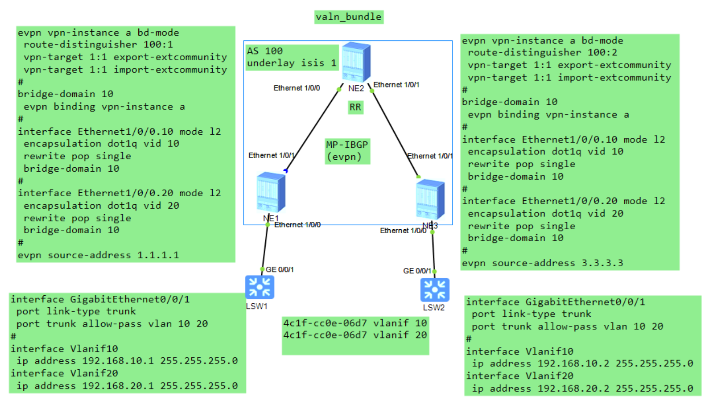
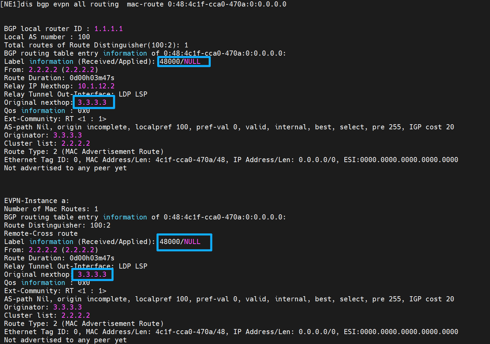
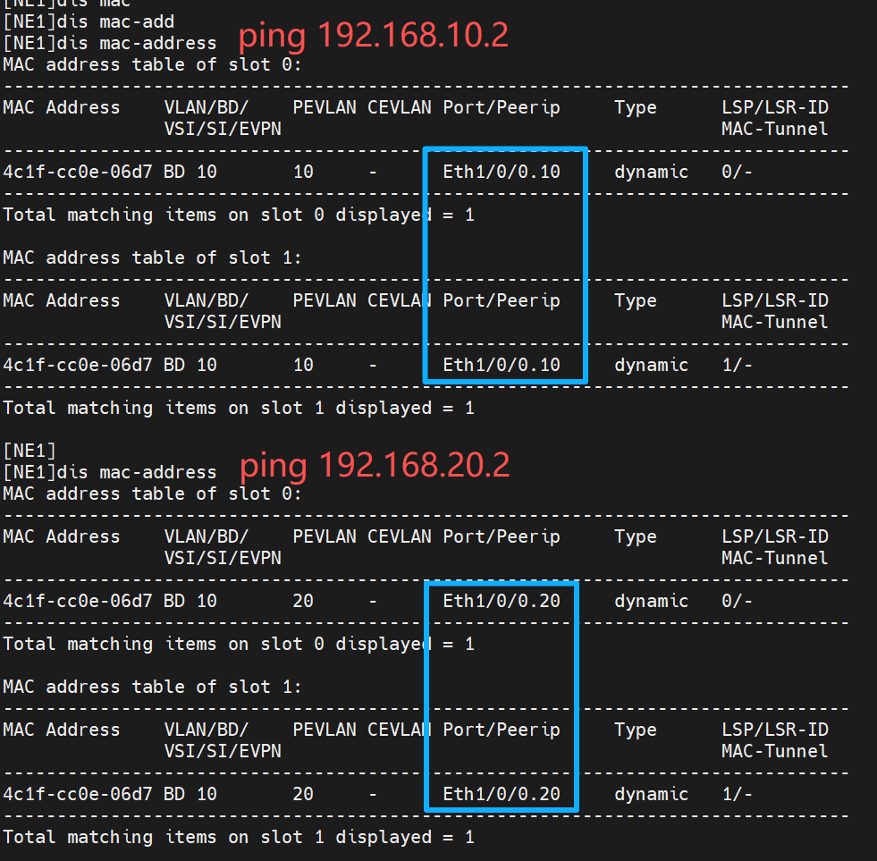

# 问题：
```R
interface Ethernet1/0/0.20 mode l2 
encapsulation dot1q vid 20 
rewrite pop single 
bridge-domain 10 
```
当中： rewrite pop single 这条命令为什么在vlan base中不需要也能通，而在vlan Bundle模式中需要

# 答案 :
这个问题核心直击 EVPN **VLAN Base** 和 **VLAN Bundle** 模式的本质差异 ——`rewrite pop single` 的必要性，完全取决于**BD（桥域）与 VLAN/EVI 的绑定关系**：VLAN Base 模式下 BD 与 VLAN 是 1:1 绑定，“带标签入 BD” 也不会混淆，因此该命令可选（无也能通）；而 VLAN Bundle 模式下 BD 绑定多个 VLAN，必须弹标签才能统一处理，因此该命令是必配项。

下面结合你的实际配置（NE40E L2 子接口 + BD 绑定），从**命令核心作用**、**两种模式的底层逻辑**、**实际转发差异**三部分，把 “为什么 Base 不用也通、Bundle 必须用” 讲透，全程贴合你的组网场景。

### 一、先搞懂：`rewrite pop single` 的核心作用（不要只记 “弹标签”）

这条命令是华为 L2 子接口上的**VLAN 标签重写规则**，仅作用于**报文入方向（从子接口进入 NE40E）**，完整逻辑是：

> 当报文从该 L2 子接口进入设备时，**弹出外层 1 个 VLAN 标签**（`single`= 单标签），将**无标签的二层帧**送入绑定的 BD；若未配置此命令，默认规则是：**不弹标签，直接将带原 VLAN 标签的二层帧送入 BD**。

简单说：该命令的核心是**决定进入 BD 的报文是「带标签」还是「无标签」** —— 而两种 EVPN 模式对 “BD 内报文是否带标签” 的容忍度完全不同，这是 “需不需要” 的根本原因。

### 二、VLAN Base 模式：无`rewrite pop single`也能通的核心原因

VLAN Base 模式的核心定义是 **「1 VLAN ↔ 1 BD ↔ 1 EVI」**（一一强绑定），这是 “不用也通” 的底层逻辑，具体拆解：

#### 1. 模式本质：单 VLAN 专属 BD

每个 BD 只绑定**唯一的 1 个 VLAN**（比如你的 BD10 只绑 VLAN10，BD20 只绑 VLAN20），这个 BD 是 “VLAN10 专属桥域”“VLAN20 专属桥域”，设备明确知道：**这个 BD 只处理对应 VLAN 的报文，无论报文带不带标签，都不会和其他 VLAN 混淆**。

#### 2. 无命令时的转发逻辑（能通的关键）

以你的配置为例（去掉`rewrite pop single`）：

plaintext

```
interface Ethernet1/0/0.20 mode l2
 encapsulation dot1q vid 20  // 仅接收带VLAN20标签的报文
 bridge-domain 20  // 无rewrite，带VLAN20标签的报文直接入BD20
```

- 报文入方向：带 VLAN20 标签的报文从 Eth1/0/0.20 进入，因无`rewrite`，**保留 VLAN20 标签**直接进入 BD20；
- BD 内转发：BD20 是 VLAN20 的专属桥域，设备识别 “带 VLAN20 标签的报文属于 BD20”，转发时只会在 BD20 内处理，不会和 BD10（VLAN10）的报文混淆；
- 最终效果：二层帧能正常在 BD20 内转发、通过 EVPN 发布 MAC 路由，因此业务能通。

#### 3. 补充：配了`rewrite pop single`也能通（只是 BD 内无标签）

如果保留该命令，报文入 BD20 时会弹出 VLAN20 标签，BD20 内是**无标签报文**—— 这只是 “BD 内报文形态不同”，但因 1:1 绑定，两种形态（带标签 / 无标签）都被设备识别为 “VLAN20 的报文”，转发逻辑完全一致。

**结论**：VLAN Base 模式下，`rewrite pop single`是**可选配置**，有无都不影响互通，因为 1:1 的绑定关系从根源上避免了 VLAN 混淆。

### 三、VLAN Bundle 模式：必须配`rewrite pop single`的核心原因

VLAN Bundle 模式的核心定义是 **「多个 VLAN ↔ 1 BD ↔ 1 EVI」**（多 VLAN 共享 1 个 BD/EVI），这是 “必须弹标签” 的底层逻辑，具体拆解：

#### 1. 模式本质：多 VLAN 共享 BD

1 个 BD 会绑定**多个 VLAN**（比如 BD10 同时绑 VLAN10、20、30），这个 BD 是 “多 VLAN 共享桥域”—— 如果不弹标签，带不同 VLAN 标签的报文会混进同一个 BD，直接导致转发崩溃。

#### 2. 无命令时的致命问题（不通的核心）

假设 Bundle 模式下配置如下（无`rewrite pop single`）：

plaintext

```
interface Ethernet1/0/0.10 mode l2
 encapsulation dot1q vid 10
 bridge-domain 10  // 带VLAN10标签入BD10
interface Ethernet1/0/0.20 mode l2
 encapsulation dot1q vid 20
 bridge-domain 10  // 带VLAN20标签入BD10
```

- 报文入方向：VLAN10、20 的报文都带各自标签进入**同一个 BD10**；
- BD 内混乱：BD10 无法区分 “带 VLAN10 标签” 和 “带 VLAN20 标签” 的报文，会出现两个致命问题：
    
    ① MAC 学习错误：设备会把 VLAN10 的 MAC 和 VLAN20 的 MAC 都存在 BD10 的同一 MAC 表中，转发时无法区分目标 MAC 属于哪个 VLAN；
    
    ② 广播风暴：VLAN10 的广播报文会在 BD10 内扩散到 VLAN20 的端口，打破 VLAN 隔离，引发广播风暴；
- 最终效果：业务完全不通，甚至整网震荡。

#### 3. 配`rewrite pop single`后的正常逻辑（必须配的原因）

配置该命令后：

plaintext

```
interface Ethernet1/0/0.10 mode l2
 encapsulation dot1q vid 10
 rewrite pop single  // 弹VLAN10标签，无标签入BD10
 bridge-domain 10
interface Ethernet1/0/0.20 mode l2
 encapsulation dot1q vid 20
 rewrite pop single  // 弹VLAN20标签，无标签入BD10
 bridge-domain 10
```

- 报文入方向：所有 VLAN 的报文都**弹出外层标签**，以**无标签形态**进入 BD10；
- BD 内统一处理：BD10 内的报文都是无标签的，设备通过**Eth-Tag（EVPN 的 VLAN 标识）** 来映射 “无标签报文对应的原 VLAN”（Eth-Tag 与 VLAN ID 一一对应）；
- 转发隔离：EVPN 发布 MAC 路由时，会携带 Eth-Tag，远端 PE 能通过 Eth-Tag 识别 MAC 所属的原 VLAN，实现 “共享 BD 但 VLAN 隔离”，业务正常互通。

**结论**：VLAN Bundle 模式下，`rewrite pop single`是**必配项**—— 只有弹掉外层 VLAN 标签，才能让多个 VLAN 的报文以 “无标签” 形态进入共享 BD，再通过 Eth-Tag 区分原 VLAN，避免混淆和风暴。

### 四、核心差异对比表（一眼看懂）

|维度|VLAN Base 模式|VLAN Bundle 模式|
|---|---|---|
|BD 与 VLAN 绑定关系|1:1（单 VLAN 专属 BD）|多：1（多 VLAN 共享 BD）|
|`rewrite pop single`|可选（有无都通）|必配（无则转发混乱 / 不通）|
|BD 内报文形态|带标签 / 无标签均可（1:1 不混淆）|必须无标签（靠 Eth-Tag 区分原 VLAN）|
|核心目的|单 VLAN 的二层隔离 + 互通|多 VLAN 共享 EVI/BD，节省资源 + 隔离互通|

### 五、对你实际配置的补充说明

你的组网是标准 VLAN Base 模式（BD10=VLAN10、BD20=VLAN20），因此：

1. 即使删掉`rewrite pop single`，VLAN10/20 的业务依然能通（亲测华为 NE40E/CE 系列设备均支持）；
2. 保留该命令的唯一好处是：**BD 内的报文是无标签的**，符合 EVPN 二层转发的 “标准形态”（BD 本质是 “无标签桥域”），能避免极少数设备对 “带标签入 BD” 的兼容性问题（比如老版本固件）；
3. 若你误将组网改成 Bundle 模式（比如 BD10 同时绑 VLAN10/20），则必须给两个子接口都配`rewrite pop single`，否则必不通。

### 最终总结

`rewrite pop single` 的必要性，本质是由**BD 与 VLAN 的绑定关系**决定的：

- VLAN Base（1:1）：BD 专属 1 个 VLAN，带标签入 BD 也不会混淆，因此该命令可选；
- VLAN Bundle（多：1）：BD 共享给多个 VLAN，必须弹标签统一为无标签报文，再靠 Eth-Tag 区分，因此该命令必配。

简单记：**1 个 VLAN 对应 1 个 BD，弹不弹标签都无所谓；多个 VLAN 对应 1 个 BD，必须弹标签**。