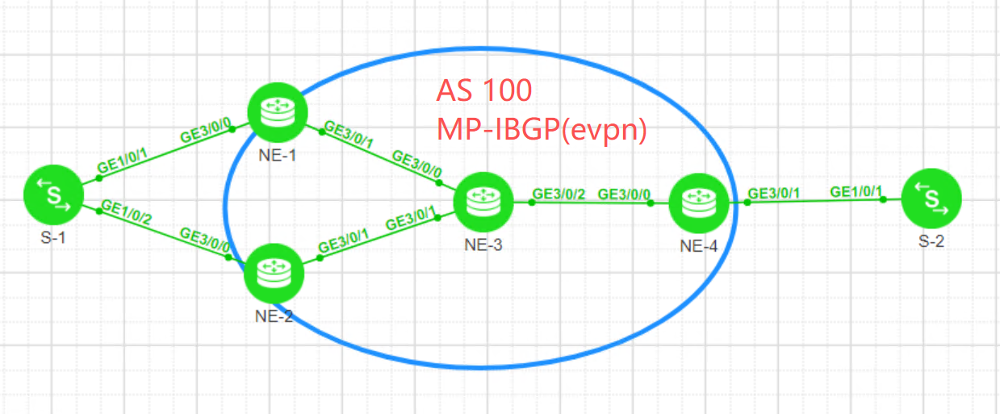

```
[NE1]dis bgp evpn all routing mac-route 
 Local AS number : 100
 BGP Local router ID is 1.1.1.1
 Status codes: * - valid, > - best, d - damped, x - best external, a - add path,

               h - history,  i - internal, s - suppressed, S - Stale

               Origin : i - IGP, e - EGP, ? - incomplete
 EVPN address family:
 Number of Mac Routes: 5
 Route Distinguisher: 100:1
       Network(EthTagId/MacAddrLen/MacAddr/IpAddrLen/IpAddr)  NextHop
 *>    0:48:fa13-e5d4-0051:0:0.0.0.0                          0.0.0.0                          
 *>    0:48:fa13-e5d4-0054:0:0.0.0.0                          0.0.0.0                          
 Route Distinguisher: 100:2
       Network(EthTagId/MacAddrLen/MacAddr/IpAddrLen/IpAddr)  NextHop
 *>i   0:48:fa13-e5d4-0054:0:0.0.0.0                          2.2.2.2                          
 Route Distinguisher: 100:4
       Network(EthTagId/MacAddrLen/MacAddr/IpAddrLen/IpAddr)  NextHo
 *>i   0:48:fa13-e5d4-0061:0:0.0.0.0                          4.4.4.4                          
 *>i   0:48:fa13-e5d4-0064:0:0.0.0.0                          4.4.4.4                          

 EVPN-Instance a:
 Number of Mac Routes: 5
       Network(EthTagId/MacAddrLen/MacAddr/IpAddrLen/IpAddr)  NextHop
 *>    0:48:fa13-e5d4-0051:0:0.0.0.0                          0.0.0.0                          
 *>    0:48:fa13-e5d4-0054:0:0.0.0.0                          0.0.0.0                          
 * i                                                          2.2.2.2                          
 *>i   0:48:fa13-e5d4-0061:0:0.0.0.0                          4.4.4.4                          
 *>i   0:48:fa13-e5d4-0064:0:0.0.0.0                          4.4.4.4 
```

```
[NE1]dis bgp evpn all routing ad-route 
 Local AS number : 100
 BGP Local router ID is 1.1.1.1
 Status codes: * - valid, > - best, d - damped, x - best external, a - add path,
               h - history,  i - internal, s - suppressed, S - Stale
               Origin : i - IGP, e - EGP, ? - incomplete

 EVPN address family:
 Number of A-D Routes: 4
 Route Distinguisher: 100:1
       Network(ESI/EthTagId)                                  NextHop
 *>    0000.1111.2222.1111.1111:0                             127.0.0.1                       
 Route Distinguisher: 100:2
       Network(ESI/EthTagId)                                  NextHop
 *>i   0000.1111.2222.1111.1111:0                             2.2.2.2                         
 Route Distinguisher: 1.1.1.1:0
       Network(ESI/EthTagId)                                  NextHop
 *>    0000.1111.2222.1111.1111:4294967295                    127.0.0.1                       
 Route Distinguisher: 2.2.2.2:0
       Network(ESI/EthTagId)                                  NextHop
 *>i   0000.1111.2222.1111.1111:4294967295                    2.2.2.2                                      
 EVPN-Instance a:
 Number of A-D Routes: 3
       Network(ESI/EthTagId)                                  NextHop
 *>    0000.1111.2222.1111.1111:0                             127.0.0.1                       
 * i                                                          2.2.2.2                         
 *>i   0000.1111.2222.1111.1111:4294967295                    2.2.2.2                            
```


```
[NE1]dis bgp evpn all routing es-route 
 Local AS number : 100
 BGP Local router ID is 1.1.1.1
 Status codes: * - valid, > - best, d - damped, x - best external, a - add path,
               h - history,  i - internal, s - suppressed, S - Stale
               Origin : i - IGP, e - EGP, ? - incomplete
 EVPN address family:
 Number of ES Routes: 2
 Route Distinguisher: 1.1.1.1:0
       Network(ESI/IpAddrLen/OriginalIp)                      NextHop
 *>    0000.1111.2222.1111.1111:32:1.1.1.1                    127.0.0.1                       
 Route Distinguisher: 2.2.2.2:0
       Network(ESI/IpAddrLen/OriginalIp)                      NextHop
 *>i   0000.1111.2222.1111.1111:32:2.2.2.2                    2.2.2.2                                    
 EVPN-Instance a:
 Number of ES Routes: 2
       Network(ESI/IpAddrLen/OriginalIp)                      NextHop
 *>    0000.1111.2222.1111.1111:32:1.1.1.1                    127.0.0.1                       
 *>i   0000.1111.2222.1111.1111:32:2.2.2.2                    2.2.2.2    
```

```
[NE1]dis bgp evpn all routing mac-route  0:48:fa13-e5d4-0061:0:0.0.0.0
 BGP local router ID : 1.1.1.1
 Local AS number : 100
 Total routes of Route Distinguisher(100:4): 1
 BGP routing table entry information of 0:48:fa13-e5d4-0061:0:0.0.0.0:
 Label information (Received/Applied): 48012/NULL
 From: 3.3.3.3 (3.3.3.3) 
 Route Duration: 0d00h03m13s
 Relay IP Nexthop: 10.1.13.3
 Relay IP Out-Interface: GigabitEthernet3/0/1
 Relay Tunnel Out-Interface: GigabitEthernet3/0/1
 Original nexthop: 4.4.4.4
 Qos information : 0x0
 Ext-Community: RT <1 : 1>, SoO <4.4.4.4 : 0>
 AS-path Nil, origin igp, localpref 100, pref-val 0, valid, internal, best, select, pre 255, IGP cost 20
 Originator: 4.4.4.4
 Cluster list: 3.3.3.3
 Route Type: 2 (MAC Advertisement Route)
 Ethernet Tag ID: 0, MAC Address/Len: fa13-e5d4-0061/48, IP Address/Len: 0.0.0.0/0, ESI:0000.0000.0000.0000.0000
 Not advertised to any peer yet
 

 EVPN-Instance a:
 Number of Mac Routes: 1
 BGP routing table entry information of 0:48:fa13-e5d4-0061:0:0.0.0.0:
 Route Distinguisher: 100:4
 Remote-Cross route
 Label information (Received/Applied): 48012/NULL
 From: 3.3.3.3 (3.3.3.3) 
 Route Duration: 0d00h03m13s
 Relay Tunnel Out-Interface: GigabitEthernet3/0/1
 Original nexthop: 4.4.4.4
 Qos information : 0x0
 Ext-Community: RT <1 : 1>, SoO <4.4.4.4 : 0>
 AS-path Nil, origin igp, localpref 100, pref-val 0, valid, internal, best, select, pre 255, IGP cost 20
 Originator: 4.4.4.4
 Cluster list: 3.3.3.3
 Route Type: 2 (MAC Advertisement Route)
 Ethernet Tag ID: 0, MAC Address/Len: fa13-e5d4-0061/48, IP Address/Len: 0.0.0.0/0, ESI:0000.0000.0000.0000.0000
 Not advertised to any peer yet

```


```
[NE1]dis eth-trunk 
Eth-Trunk10's state information is:
(h): high priority
(r): reference port
Local:
LAG ID: 10                      WorkingMode: STATIC
Preempt Delay: Disabled         Hash arithmetic: According to flow
System Priority: 1              System ID: 00e0-fc00-0000(Local)
Least Active-linknumber: 1      Max Active-linknumber: 32
Operate status: up              Number Of Up Ports In Trunk: 1
Timeout Period: Slow          
PortKeyMode: Auto
------------------------------------------------------------------------------------
ActorPortName              Status   PortType PortPri PortNo PortKey PortState Weight
GigabitEthernet3/0/0(hr)   Selected 100M     32768   1      2593    10111100  1     
Partner:
------------------------------------------------------------------------------------
ActorPortName              SysPri   SystemID        PortPri PortNo PortKey PortState
GigabitEthernet3/0/0       32768    fa13-e5d4-0051  32768   1      2609    10111100 
```

```
[NE1]dis eth-trunk brief 
Status: Operate status
Role: E-Trunk status
Act: Active link number
Inact: Inactive link number
Cfgd: Configured link number
BW: Bandwidth
Interface              Mode      Status    Role      Act/Inact/Cfgd   BW(Mbps)    
Eth-Trunk10            STATIC    Up        M         1/0/1            100         
[NE1]
```

```
[NE1]dis eth-trunk 10 verbose 
Eth-Trunk10's state information is:
(h): high priority
(r): reference port
Local:
LAG ID: 10                      WorkingMode: STATIC
Preempt Delay: Disabled         Hash arithmetic: According to flow
System Priority: 1              System ID: 00e0-fc00-0000(Local)
Least Active-linknumber: 1      Max Active-linknumber: 32
Operate status: up              Number Of Up Ports In Trunk: 1
Timeout Period: Slow          
PortKeyMode: Auto
------------------------------------------------------------------------------------
ActorPortName              Status   PortType PortPri PortNo PortKey PortState Weight
GigabitEthernet3/0/0(hr)   Selected 100M     32768   1      2593    10111100  1     
Partner:
------------------------------------------------------------------------------------
ActorPortName              SysPri   SystemID        PortPri PortNo PortKey PortState
GigabitEthernet3/0/0       32768    fa13-e5d4-0051  32768   1      2609    10111100 
Flow statistic
 Interface GigabitEthernet3/0/0
    Last 300 seconds input rate 160 bits/sec, 1 packets/sec
    Last 300 seconds output rate 160 bits/sec, 1 packets/sec
    1924 packets input, 0 bytes, 0 drops
    1391 packets output, 0 bytes, 0 drops

 Interface Eth-Trunk10
    Last 300 seconds input rate 160 bits/sec, 1 packets/sec
    Last 300 seconds output rate 160 bits/sec, 1 packets/sec
    1925 packets input, 0 bytes, 0 drops
    1391 packets output, 0 bytes, 0 drops
```

```
[NE1]dis lacp brief 
System Priority: 32768
System ID      : 38ba-0c47-bf01
--------------------------------------------------------------------------------
Eth-Trunk10:
System Priority: 1
System ID      : 00e0-fc00-0000(Local)
```

```
[NE1]dis e-trunk 1 state-change member-interface Eth-Trunk 10 
Time                           SourceState  DestState   Reason       
-----------------------------------------------------------------------
2026-01-27 11:22:42+00:00      Backup       Master      FORCE_MASTER   
```