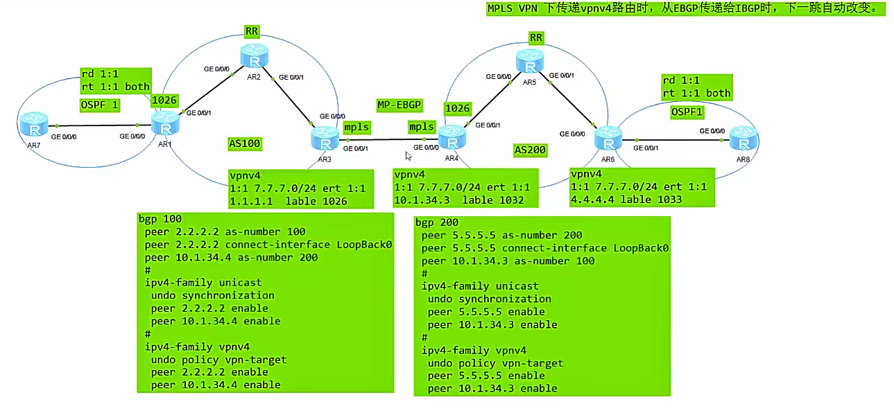

相对于OptionA来说，更为简单
ASBR之间建立MP-EBGP邻居（VPNv4），并且关闭掉RT值的过滤，互联接口使能MPLS 标签转发功能
去除掉的配置：
	ASBR之间不需要多条链路
	ASBR之间不需要配置VPN实例
	不需要IGP于BGP的路由互相引入

控制平面：
1.PE1给CE1的路由分配私网标签，然后再分配一个公网标签传递给RR
2.RR收到后，反射给ASBR1，（并去除公网标签）E
3.ASBR1收到后，去除私网标签，重新为该路由分配一个新的私网标签。抓发给ASBR2
4.ASBR2收到后，去除私网标签，重新为该路由分配一个新的私网标签。并添加上公网标签，发给RR
5.RR收到该路由后，去去除网标签，反射给PE2
6.PE2收到该路由，分配私网标签，背CE2引入。

数据平面：
1.CE2根据路由表转发。（IP 转发）
2.PE2接收到该数据包，根据目的地址查表（dis fib），需要MPLS隧道转发，为其分配上私网标签（dis bgp vpnv4 all routing-table x.x.x.x），和公网标签发（dis mpls lsp）给下一跳RR
3.RR接收到后，去掉公网标签，传递给ASBR2，ASBR2接收到数据包后，根据下一跳，更换私网标签(dis bgp vpnv4 all routing-table x.x.x.x)，传递给ASBR1，
4.ASBR1接收到该路由后，跟换私网标签(dis bgp vpnv4 all routing-table x.x.x.x)，并打上公网标签传递给RR（dis mpls lsp），
5.RR去掉公网标签，将数据包传递给PE1。
6.PE1收到数据包后，查看对应的路由表，根据私网标签，将数据包发给对应的vpn实例。
7.CE1接收到数据包。

OptionB 会存在不同的3个私网标签：
1. PE设备会为私网路由分配一个私网标签
2. ASBR1设备会对私网标签进行替换
3. ASBR2会对从ASBR1接收到的私网标签进行替换

# 二、ASBR 之间接口使能 MPLS 的**真正目的**（3 层关键作用）

### 1. 让接口**能识别 MPLS 标签帧**

MPLS 报文的以太网类型是：`0x8847（MPLS 单播）`
普通 IP 接口只识别：`0x0800（IPv4）`

**使能 mpls 就是告诉接口：
“这不是普通 IP 口，是标签转发口，请处理 0x8847 帧。”**

### 2. 在 ASBR 之间**建立跨域 LSP 隧道**

ASBR 属于**不同 AS**：
- 无共享 IGP
- 无法自动生成域内 LSP
必须在 ASBR 之间手工建立一条**跨域点到点 LSP**（LDP 或静态）。
而 **LSP 只能跑在 MPLS 使能的接口上**。
这条 LSP 的作用：
给跨域报文提供**外层隧道标签**。

---
### 3. 保证**标签栈完整传递**（OptionB 灵魂）
跨域报文是 **双层标签**：
- 内层：VPN 标签（标识私网）
- 外层：LSP 隧道标签（标识路径）
ASBR 只做标签交换，**绝对不能丢内层 VPN 标签**。
只有 MPLS 转发平面，才能保证标签栈完整透传。
