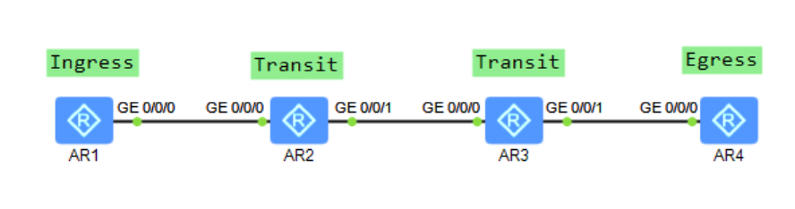

基于OSPF建立的 基于RSVP-TE的动态CR-LSP的建立，（没设置带宽）

**关键配置如下：**
```R
mpls lsr-id 1.1.1.1
mpls
 mpls te
 mpls rsvp-te
 mpls te cspf
#
interface GigabitEthernet0/0/0
 ip address 10.1.12.1 255.255.255.0
 ospf enable 1 area 0.0.0.0
 mpls
 mpls te
 mpls rsvp-te
#
interface LoopBack0
 ip address 1.1.1.1 255.255.255.255
 ospf enable 1 area 0.0.0.0
#
interface Tunnel0/0/0
 ip address unnumbered interface LoopBack0
 tunnel-protocol mpls te
 destination 4.4.4.4
 mpls te tunnel-id 104
 mpls te commit
#
ospf 1 router-id 1.1.1.1
 opaque-capability enable
 area 0.0.0.0
  mpls-te enable
#
```

