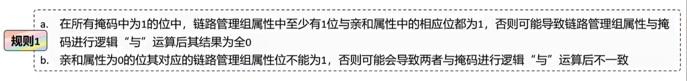
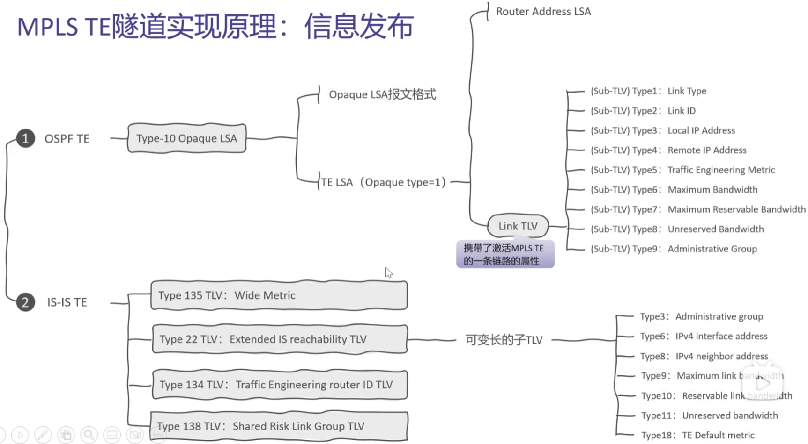
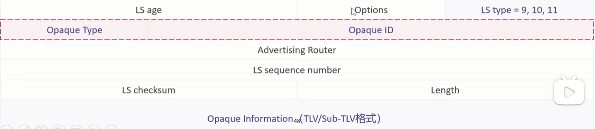
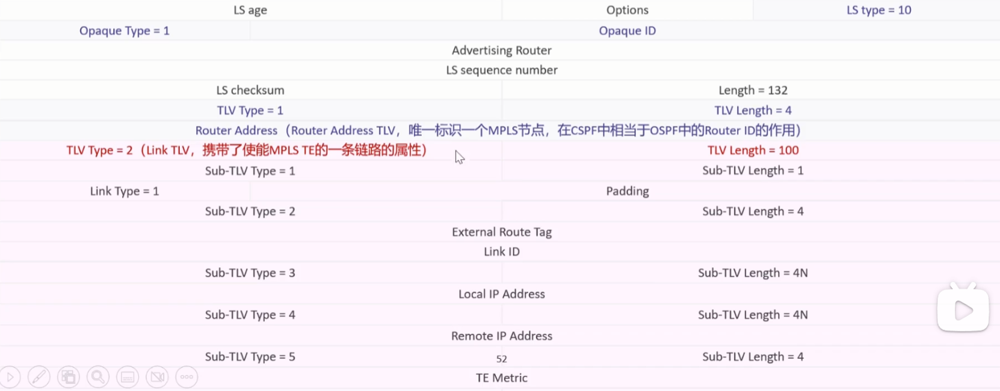
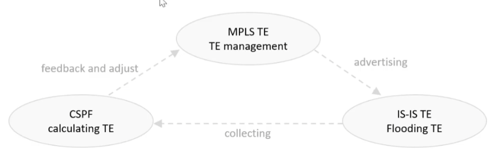

# MPLS TE的实现框架
**动态MPLS TE隧道建立的实现过程主要依靠信息发布，路径计算，路径建立和流量转发4大功能组件**
- 在网络中部署MPLS TE，需要配置链路属性和隧道属性，之后MPLS TE自动建立相应的隧道。隧道建立后，需要将流量引入隧道进行流量转发协议报文交互 
- 对于静态CR-Lsp来说，由于其是用户手工建立，因此不涉及信息发布和路经计算

IGP（OSPF/IS-IS）的路由收敛过程：
1.建立邻居关系
2.互相通告链路状态信息
3.路径计算
4.生成路由表

MPLS TE的实现步骤：
1.通过IGP的路由表，以及路径的约束信息，生成TEDB
2.通过TEDB进行路径计算
3.路径建立
4.将流量引入LSP隧道

## 信息发布
**链路状态信息**
- MPLS TE信息的发布基于对现有的IGP协议进行扩展，所以依然会发布IGP本身收集的信息(链路状态信息)，如接口IP地址、链路类型、链路开销等
**TE Mertric**
- 为了增强对TE隧道路径计算的可控性，MPLS TE提供了TE Metric，使得隧道在计算路径时能独立于IGP的路由选路。MPLS TE缺省采用链路的IGP Metric
**带宽信息**
MPLs DS-TE(Differentiated Services TE)是将MPLS TE和MPLs DiffServ相结合的一种提供有效的Qos保证的技术
	 1.MPLs DS-TE将LSP的带宽划分为8个部分，每部分被赋予不同的服务等级。这样一条或一组LsP的相同服务等级的带宽集合称为一个CT(Class Type)。这样就可以将具有相同PHB(Per-Hop Behavior)的流量映射到同一个CT上，并为每个CT单独分配资源
	 2.DS-TE最多支持8个CT，可记为CT0-CT7
- BC(Bandwidth Constraints，约束带宽):根据CT带宽可分为Bco-BC7
- 最大可预留带宽(Maximum Reservable Bandwidth):端口最大预留给Tunnel的带宽
- 在==非MPLS DS-TE场==景下使用BCO,CTo在建立隧道时预留带宽，为业务提供带宽保护
**管理组**
- MPLS TE可以给不同的链路着上不同的颜色，实现隧道根据链路的颜色进行选路
- 管理组 (Administration Group)
	1.也称链路颜色，用来描述链路的属性。由32个Bit组成，每一位都可以单独表示链路的一个属性，用于管理拥有这些特征的链路，在物理接口下配置
	2.链路管理组需要和隧道亲和属性配合使用来达到控制隧道路径的目的
**亲和属性**
- 亲和属性(Affinity Attributes)是用来描述TE隧道所需链路的32位向量值，与管理组属性类似，在这里可以理解为隧道颜色，在隧道的首节点配置实施(隧道信息，不通过iGP发布)。
- 掩码(Mask)，由32个Bit组成，决定了设备需要检查的链路属性，只有隧道颜色和链路颜色匹配才能进行- 正常的数据转发。实际应用中，就是通过修改掩码来选择链路。
- 在Tunnel进行路径选择时，接口(链路)的管理组属性需匹配其亲和属性才有资格被选择

- 计算示例1:假设亲和属性为0x0000FFFF，掩码为oxFFFFFFFF，请问可用的链路管理组属性的取值范围?
	- 高16位只能取0，因为本示例中亲和属性的高16位全为0，而规则1b中规定亲和属性为0的位其对应的链路管理组属性位不能为1
	- 低16位中至少有1位为1，因为掩码和亲和属性的低16位都全为1，而规则1中规定所有掩码为1的位中，其链路管理组属性位中至少有1位与亲和属性中的相应位都为1
	
- 链路管理组属性取值范围是“ox00000001~0x0000FFFF”

- 计算示例2:亲和属性为0xFFFFFFFF，掩码为0xFFFF0000，则可用链路的管理组属性取值?
	- 高16位至少有1位为1，因为掩码和亲和属性的高16位均全为1，而“规则1.”规定所有掩码为1的位中，链路管理组属性中至少有1位与亲和属性中的相应位都为1
	- 低16位则可以任意取0或1，因为掩码的低16位全为o，而规则2规定对于掩码为o的位，不对链路管理组属性的相应位进行检查，即可以任意是0或者1
- 链路管理组属性取值范围是“ox00010000~oxFFFFFFFF”

- 计算示例3:假设亲和属性为oxFFFFFFFo，掩码为0x0000FFFF，请问对应的链路管理组属性的取值范围?
	- 因为掩码的高16位为0000，则可用链路管理组属性的高16位可以任意取0或1;
	- 因为掩码的低16位为FFFF，且亲和属性相对应的低16位为“FFO”，那么，链路管理属性的17~28位中至少有1位为1，且低4位(29~32位)不能为1。
- 链路管理组属性取值范围是“ox0000001F~OxFFFFFFF

==总结：==
1.当存在mask中的1位为1，（至少有1位）那么对应位的 affinity 和 administrator 都必须为1
2.当affinity中的一位为0时，administrator 对应为不能为1
3.当mask中的1为位0时，不用理会 affinity 与 administrator 的对应关系

## 对于IGP（OSPF/IS-IS）如何发布信息

在MPLS-TE体系结构中OSPF起到了信息发布组件的作用:
1.收集TE相关信息
2.在同一个区域中的各设备间扩散TE信息
3.把同步收集到的TE信息组成流量工程数据库TEDB(TEDataBase)提供给CSPF计算

**OSPF TE：** Opaque LSA
Opaque (不透明的)LSA在RFC2370中定义，分为3类，分别为第9、10、11类LSA。
- 第9类LSA只能在某一个接口上扩散;
- 第10类LSA只能在某一个区域内扩散;而
- 第11类LSA则与第5类LSA具有相同的扩散范围，可以在除了STUB、NSsA之外的整个自治系统内部扩散

Opaque LSA与其它几类LSA具有相同的头部结构。
只是4字节的Link State ID字段被分为了两部分:
1.Opaque Type:1字节，区分此LsA的应用类型
2.OpaqueID:3字节，区分同一种应用类型的不同的LSA

- OSPF通过新增Type10 Opaque LSA来实现收集和发布流量工程信息的目的。这种LSA中包含了流量工程所需要的链路状态信息，包括最大链路带宽、最大可预留带宽、当前预留带宽、链路颜色等信息。Type10 Opaque LSA利用OSPF泛洪机制在一个区域内的设备间同步这些信息，最终形成统一的TEDB，为路径计算做好准备
- OSPF TE与CSPF交互：OSPF通过Type10-LSA收集区域内的TE信息，包括带宽、优先级、链路开销(Metric)等，经过处理后，把这些信息提供给CSPF进行路径计算
- Opaque Type10LSA是在OSPF区域内发布的，所以CSPF计算也是基于区域的，跨区域需要分段计算

应用于流量工程扩展的LSA称为TE LSA，属于第10类LSA，其应用类型为“1”。因此，TELSA都具有"1.x.xX”形式的uink State
ID，而其扩散范围被限制在一个区域内

**IS-IS TE**
S-IS TE是IS-IS为了支持MPLS TE而做的扩展，它遵循RFC5305和RFC4205中关于IS-S部分扩展的规定，通过在IS-IS LSP报文中定义新的TLV的方式，携带该路由器MPLS TE的配置信息，通过LSP的泛洪同步，实现MPLS TE信息的泛洪和同步。
IS-S TE把所有Lsp中携带的TE信息提取出来，传递给MPLS的CSPF(Constraint Shortest Path First)模块，用来计算隧道路径。IS-IS TE在MPLSTE的流程中扮演着“搬运工”的角色

IS-IS TE新增TLV
IS-IS TE为了在LSP中携带TE信息，在RFC5305中新定义了如下4种TLV:
1. Extended IS reachability TLV (Type 22)
	- 此TLV用来替换ISreachability TLV，并采用sub TLV的形式扩展了原来的TL格式。sub TLV在TLV中的实现方式与TLV在LSP中的实现方式相同。这些sub TLv用来携带配置在物理接口下的TE信息
	- 目前支持RFC5305中定义的所有sub TLV以及RFC4124中定义的22号sub TLV2. Traffic Engineering router ID TLV (Type 134)此TLV type为134，包含了四字节的RouterID，在目前实现中就是MPLsLSR-ID。对于MPls TE来说，Router ID用来唯一的标识一台路由器，它必须要和路由器一一对应
2. Extended IP reachability TLV (Type 135)
	- 此TLV用来替换IP reachability TLV，用来携带路由信息。扩展了路由开销值的范围(4个字节)，并可以携带sub TLV
3. Shared Risk Link Group TLV (Type 138)
	- 此TLV type为138，用来携带共享风险链路组信息。每个共享链路信息为四字节的正整数值，该TLV可以携带多个共享链路信息

