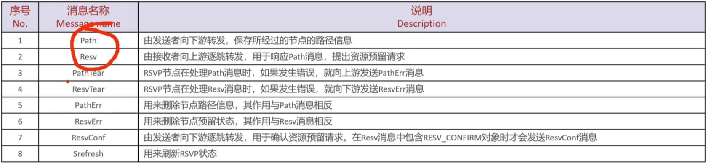
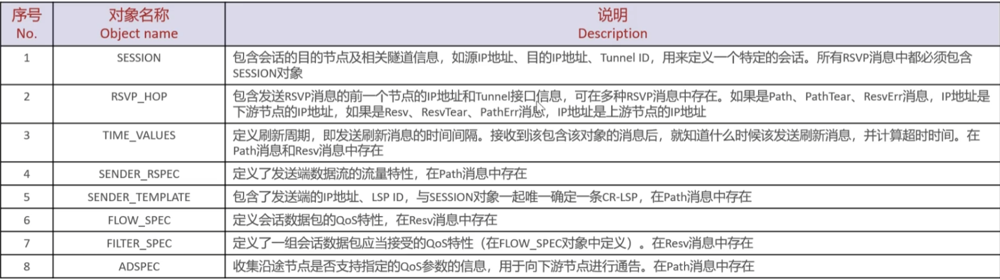
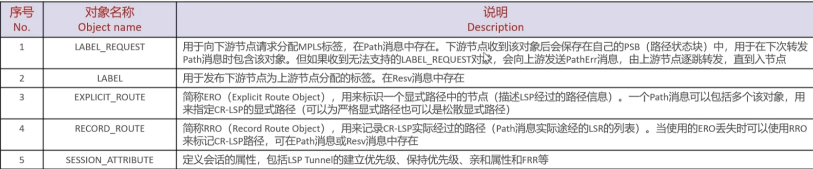
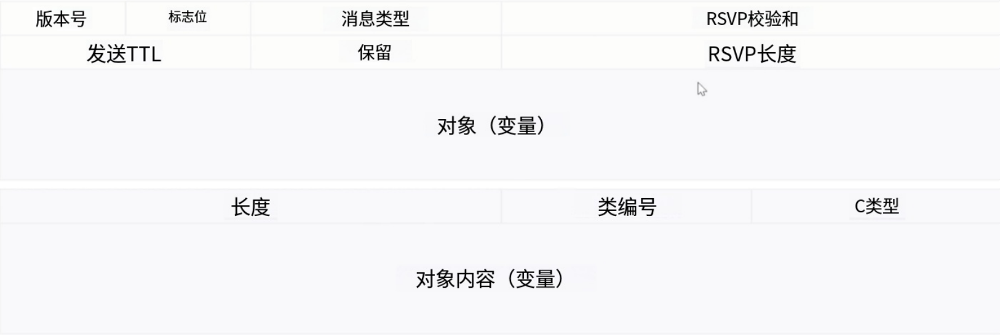
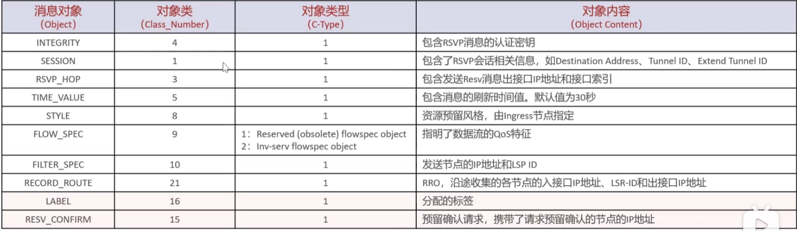

# 路径建立-概述
CR-LSP的建立方式可以分为静态建立和动态建立
**静态CR-LSP配置与维护**
- 配置静态CR-LSP的过程比较简单，手工分配标签，不使用信令协议，不需要交互控制报文，因此消耗资源比较小，且不涉及IGP TE扩展或CSPF。但静态CR-LSP不能根据网络的变化动态调整，因此实际应用有限
- 静态CR-LSP的配置按照设备的角色可分为三个部分:
	1.入节点:配置入节点LSP的转发表项并将LSP绑定到TE隧道接口
	2.中间节点:配置中间节点LSP的转发表项
	3.出节点:配置出节点LSP的转发表项
- 在配置静态MPLS TE隧道之前，需要完成以下任务:
	1.配置各LSR的LSR-ID
	2.在各LSR节点上全局和接口下激活MPLS以及MPLS TE功能

**动态路径建立——概述**
- 使用CSPF算法计算出满足约束条件的路径后，MPLS TE通过标签分发协议RSVP-TE沿着计算出的路径建立CR-LSP，并在路径经过的节点上预留资源(在路径计算完成之后，TE需要沿途预留资源，建立LSP隧道)
- 动态CR-LSP的建立主要分为两个步骤:
	1.Ingress节点向Egress节点发送Path消息
	2.Egress节点向Ingress节点发送Resv消息
- Path消息用于创建RSVP会话和关联路径状态，接收了Path消息的途径节点会建立路径状态块(PSB，Path State Block)
- Resv消息携带了资源预留信息，发送时途径的节点会建立资源预留状态块(RSB，Reservation State Block)和分配标签
- 中间如果发生错误，则会触发对应的Err(如PathErr或ResvErr)消息的发送
- 建立好的CR-LSP还可能在使用的过程中需要改变路径，这涉及CR-LSP路径切换
# **MPLS RSVP-TE(信令)协议**
**MPLS RSVP-TE(信令)协议——概述**
- 在MPLS TE隧道中建立CR-LSP的信令协议是RSVP-TE
- RSVP协议是一种基于软状态(Soft-state)的协议。它需要定期在网络中重复通告预留信息
- 资源预留协议RsVP是为Integrated Service（集成服务）模型而设计的，用于在一条传输路径的各节点上进行带宽资源预留。这种带宽预留能力使得其非常适合作为MPLS TE路径建立的信令协议。RSVP-TE在原始RSVP协议进行了==一定程度的扩展==以满足MPLS TE的要求。
- RSVP-TE对RSVP扩展的内容主要有:
	1.在Path消息中引入Label Request象，支持发起标签请求；在Resv消息中引入Labe对象，支持标签分配
	2.扩展的消息除了可以携带标签绑定信息外，还可以携带路径约束条件信息
	3.通过扩展对象支持MPLS-TE带宽约束条件，使其具有资源预留功能
- RSVP-TE可以为每条CR-LSP预留指定的带宽资源，以确保所建立的每条CR-LSP都有一定的带宽保障。RSVP-TE与RSVP一样，只为单向的数据流请求资源，即在双向通信中，需要为双向数据流分别进行资源预留

**MPLS RSVP-TE(信令)协议——新增对象**
- RSVP-TE协议除继承了RSVP协议的带宽预留功能外，还支持了MPLS网络中的MPLS标签的分发功能
- 相对RSVP来说RSVP-TE新增了5个对象:
	1.标签请求(LABEL_REQUEST)
	2.标签(LABEL)
	3.显式路径(EXPLICIT_ROUTE)
	4.记录路径(RECORD_ROUTE)
	5.会话属性(SESSION_ATTRIBUTE)
- 新增的对象除了可以携带标签信息外，还可以携带对LSR选路时的限制性要求，从而可以建立由入节点到出节点间的CR-LSP

**MPLS RSVP-TE(信令)协议——消息类型**

**MPLS RSVP-TE(信令)协议——对象类型(1)**

**MPLS RSVP-TE(信令)协议——对象类型(2)**

**MPLS RSVP-TE(信令)协议一报文格式**
- RSVP消息在IP报头中的==协议类型号为46==，每个RSVP消息都包含一个通用的RSVP头部，随后是一个或者多个可变长度、类型的消息对象(objects)

**MPLS RSVP-TE(信令)协议——报文格式**

**MPLS RSVP-TE(信令)协议——Path报文格式**
- Path消息用于创建RSVP会话和关联路径状态。Path消息是从Ingress节点沿着数据流方向发送到Egress节点，途经的节点上会建立路径状态块PSB(Path State Block)。Path消息IP源地址是入节点的LSR-ID，目的地址是出节点的LSR-ID

**MPLS RSVP-TE(信令)协议一Resv报文格式**
当Egress节点收到Path消息时，将发送一个Resv消息作为回应。Resv消息携带了资源预留信息，从Egress节点逐跳发送给前一跳节点。沿途的每个节点会创建和维护资源预留状态块 RSB(Reserved State Block)并分配标签。当Resv消息到达Ingress时，一条LSP就建立成功了

# MPLS RSVP-TE(信令)协议——工作过程概述
- RSVP-TE的信令过程:资源的保留通过起点向终点发送Path消息进行申请，终点通过Resv消息完成资源的保留
- RSVP协议有三种基本功能:
	1.路径的建立和维护
	2.路径的拆除
	3.错误的通告
- RSVP-TE通过扩展对象实现对于 TE LSP Tunnel的扩展:
	1.支持DoD(Downstream-on-demand)方式的标签分配
	2.支持为显式的LSP Tunnel分配网络资源
	3.支持在已建立好的LSP Tunnel被抢占时，采用Make Before Break的方式拆除原有隧道
	4.支持记录LSP Tunnel经过的每个节点，可以用来防止环路
	5.支持对LSP Tunnel进行诊断

**MPLS TE Tunnel**
- MPLS TE Tunnel是由隧道的首端发起建立，是一条head-end的LSP隧道
- RSVP-TE按照CSPF计算出来的路径，由接收者发起对资源预留的请求，通过Path和Resv消息去请求建立LSP，并维护资源预留信息
- MPLS TE Tunnel是单向的

**动态CR-LSP路径建立原理**
- 动态CR-LSP的建立主要分为入节点向出节点发送Path消息和出节点向入节点发送Resv消息
	1.Path消息用于创建RSVP会话和关联路径状态，发送时途经的节点上会建立路径状态块PSB (Path State Block)
	2.Resv消息携带了资源预留信息，发送时途经的节点会建立资源预留状态块RSB(Reservation State Block)和分配标签