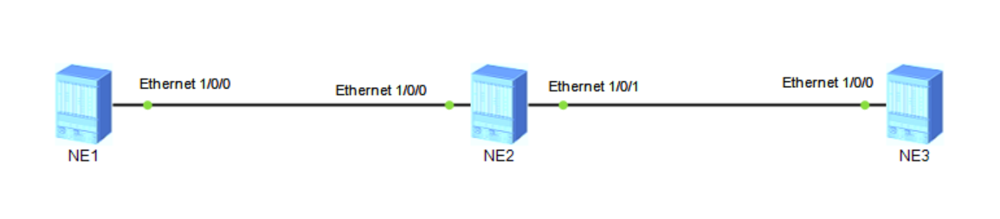

#### 产生原因
通常在传输网络中，要求业务两端的正反方向路径都经过相同的链路和节点。同时，传输网络不运行路由协议。因此提出了静态双向共路LSP来确保在此场景下MPLS技术仍可以使用。

#### 相关概念
静态双向共路LSP是由用户手工建立，且经过相同节点和链路的两条流量转发方向相反的LSP。
静态双向共路LSP是一个整体，整条LSP对应两个转发表，必须两个方向的转发条件都满足整条LSP才会变为Up状态。如果一个方向满足另一个方向不满足则双向均处于Down状态。而且两个方向的转发表项之间互相感知对方的存在，在没有IP转发能力的情况下，任意中间节点可以沿原路径返回回应报文。相比两条独立的方向相反的LSP，静态双向共路LSP在两个转发方向的时延和抖动都更加一致，有利于双向业务的QoS保证。
#### 实现过程
手工分配标签需要遵循的原则是：==上游节点出标签的值等于下游节点入标签的值。==



关键配置：

```
mpls lsr-id 1.1.1.1
#
mpls
 mpls te
#
bidirectional static-cr-lsp ingress Tunnel10
 forward nexthop 10.21.1.2 out-label 20 bandwidth ct0 10000 pir 10000
 backward in-label 20
#
interface Ethernet1/0/0
 ip address 10.21.1.1 255.255.255.0
 mpls
 mpls te
 mpls te bandwidth max-reservable-bandwidth 100000
 mpls te bandwidth bc0 100000
#
interface LoopBack1
 ip address 1.1.1.1 255.255.255.255
#
interface Tunnel10
 ip address unnumbered interface LoopBack1
 tunnel-protocol mpls te
 destination 3.3.3.3
 mpls te signal-protocol cr-static
 mpls te tunnel-id 100
 mpls te bidirectional
#
ip route-static 2.2.2.2 255.255.255.255 10.21.1.2
ip route-static 3.3.3.3 255.255.255.255 10.21.1.2

```


```
mpls lsr-id 2.2.2.2
#
mpls
 mpls te
#
bidirectional static-cr-lsp transit lsp1
 forward in-label 20 nexthop 10.32.1.2 out-label 40 bandwidth ct0 10000 pir 10000
 backward in-label 16 nexthop 10.21.1.1 out-label 20 bandwidth ct0 10000 pir 10000
#
interface Ethernet1/0/0
 ip address 10.21.1.2 255.255.255.0
 mpls
 mpls te
 mpls te bandwidth max-reservable-bandwidth 100000
 mpls te bandwidth bc0 100000
#
interface Ethernet1/0/1
 ip address 10.32.1.1 255.255.255.0
 mpls
 mpls te
 mpls te bandwidth max-reservable-bandwidth 100000
 mpls te bandwidth bc0 100000
#
interface LoopBack1
 ip address 2.2.2.2 255.255.255.255
#
ip route-static 1.1.1.1 255.255.255.255 10.1.12.1
ip route-static 3.3.3.3 255.255.255.255 10.1.23.3
```


```
mpls lsr-id 3.3.3.3
#
mpls
 mpls te
#
bidirectional static-cr-lsp egress Tunnel20
 forward in-label 40 lsrid 1.1.1.1 tunnel-id 100
 backward nexthop 10.32.1.1 out-label 16 bandwidth ct0 10000 pir 10000
#
interface Ethernet1/0/0
 ip address 10.32.1.2 255.255.255.0
 mpls
 mpls te
 mpls te bandwidth max-reservable-bandwidth 100000
 mpls te bandwidth bc0 100000
#
interface LoopBack1
 ip address 3.3.3.3 255.255.255.255
#
interface Tunnel20
 ip address unnumbered interface LoopBack1
 tunnel-protocol mpls te
 destination 1.1.1.1
 mpls te signal-protocol cr-static
 mpls te tunnel-id 200
 mpls te passive-tunnel
 mpls te binding bidirectional static-cr-lsp egress Tunnel20
#
ip route-static 1.1.1.1 255.255.255.255 10.32.1.1
ip route-static 2.2.2.2 255.255.255.255 10.32.1.1

```


#### 现象展示
```R
[LSRA]display mpls te bidirectional static-cr-lsp
TOTAL          : 1     STATIC CRLSP(S)
UP             : 1     STATIC CRLSP(S)
DOWN           : 0     STATIC CRLSP(S)
Name                FEC                I/O Label        I/O If                      Status
Tunnel10            3.3.3.3/32         NULL/20          -/Eth1/0/0
                                       20/NULL          Eth1/0/0/-                  Up
```

```R
[LSRA]display mpls te bidirectional static-cr-lsp verbose
 No                      : 1
 LSP-Name                : Tunnel10
 LSR-Type                : Ingress
 FEC                     : 3.3.3.3/32
 Forward In-Label        : NULL
 Forward Out-Label       : 20
 Forward In-Interface    :
 Forward Out-Interface   : Ethernet1/0/0
 Forward NextHop         : 10.21.1.2
 Forward ProtectType     : -
 Backward In-Label       : 20
 Backward Out-Label      : NULL
 Backward In-Interface   : Ethernet1/0/0
 Backward Out-Interface  :
 Backward NextHop        : -
 Backward ProtectType    : -
 LSP Status              : Up
 Down Reason             : -
 LSP Loopback State      : No loopback
 Loopback Remain Time    : -

```

```R
[LSRB]display mpls te bidirectional static-cr-lsp verbose
 No                      : 1
 LSP-Name                : lsp1
 LSR-Type                : Transit
 FEC                     : -/32
 Forward In-Label        : 20
 Forward Out-Label       : 40
 Forward In-Interface    : Ethernet1/0/0
 Forward Out-Interface   : Ethernet1/0/1
 Forward NextHop         : 10.32.1.2
 Forward ProtectType     : -
 Backward In-Label       : 16
 Backward Out-Label      : 20
 Backward In-Interface   : Ethernet1/0/1
 Backward Out-Interface  : Ethernet1/0/0
 Backward NextHop        : 10.21.1.1
 Backward ProtectType    : -
 LSP Status              : Up
 Down Reason             : -
 LSP Loopback State      : No loopback
 Loopback Remain Time    : -

```


```R
[LSRC]display mpls te bidirectional static-cr-lsp verbose
 No                      : 1
 LSP-Name                : Tunnel20
 LSR-Type                : Egress
 FEC                     : 1.1.1.1/32
 Forward In-Label        : 40
 Forward Out-Label       : NULL
 Forward In-Interface    : Ethernet1/0/0
 Forward Out-Interface   :
 Forward NextHop         : -
 Forward ProtectType     : -
 Backward In-Label       : NULL
 Backward Out-Label      : 16
 Backward In-Interface   :
 Backward Out-Interface  : Ethernet1/0/0
 Backward NextHop        : 10.32.1.1
 Backward ProtectType    : -
 LSP Status              : Up
 Down Reason             : -
 LSP Loopback State      : No loopback
 Loopback Remain Time    : -

```


