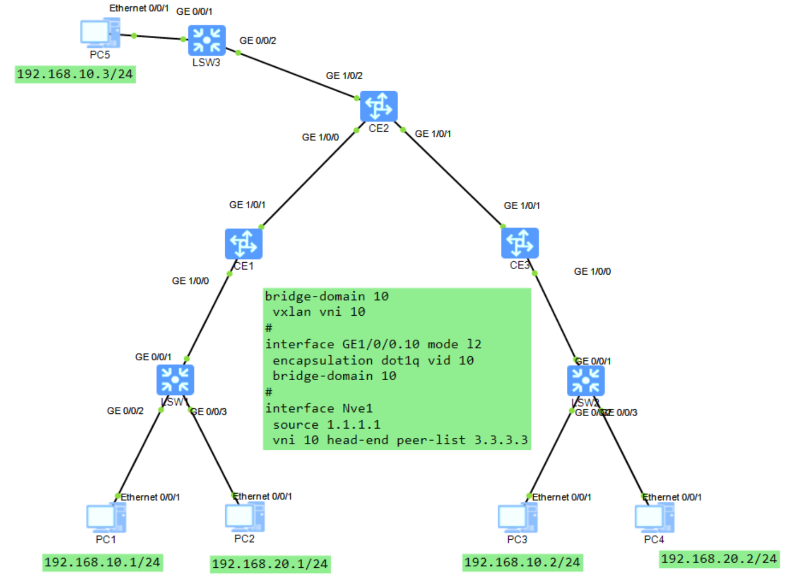
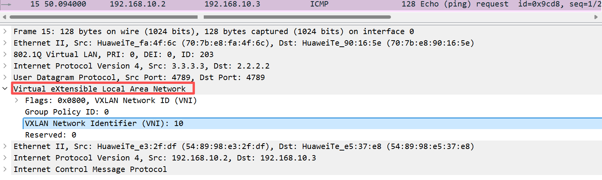
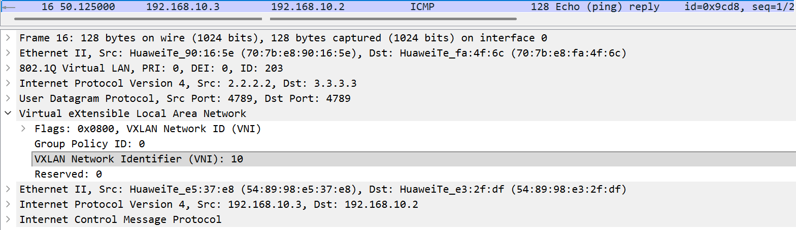

两次虚拟化：
第一次：在vtep 之间建立隧道
第二次：通过VNI （类似划vlan）再次虚拟化（解决地址冲突）


BUM报文的转发机制

VXLAN中默认的BUM报文转发机制:
如果收到BUM报文，根据vni查找head-end peer-list向每个peer-List中的地址进行头端复制，从而实现BUM报文在VxLAN网络中的泛洪。





```R
[CE2]dis mac-address 
Flags: * - Backup  
BD   : bridge-domain   Age : dynamic MAC learned time in seconds
-------------------------------------------------------------------------------
MAC Address    VLAN/VSI/BD   Learned-From        Type                Age
-------------------------------------------------------------------------------
707b-e8fa-4f6c 203/-/-       GE1/0/1             dynamic               -
707b-e8fe-6e74 102/-/-       GE1/0/0             dynamic               -
707b-e8fa-4f6c 203/-/-       GE1/0/1             dynamic               -
707b-e8fe-6e74 102/-/-       GE1/0/0             dynamic               -
5489-98e3-2fdf -/-/10        3.3.3.3             dynamic               -
5489-98e5-37e8 -/-/10        GE1/0/2.10          dynamic               -
5489-98e3-2fdf -/-/10        3.3.3.3             dynamic               -
5489-98e5-37e8 -/-/10        GE1/0/2.10          dynamic               -
-------------------------------------------------------------------------------
Total items: 8

```

```R
[CE2]display vxlan vni 10 
VNI            BD-ID            State   
---------------------------------------
10             10               up          

[CE2]display vxlan vni 10 verbose 
    BD ID                  : 10
    State                  : up
    NVE                    : 20
    Source Address         : 2.2.2.2
    Source IPv6 Address    : -
    UDP Port               : 4789
    BUM Mode               : head-end
    Group Address          : -
    Peer List              : 3.3.3.3 
    IPv6 Peer List         : -

```

```R
[CE2]display vxlan peer vni 10
Number of peers : 1
Vni ID    Source                  Destination            Type      Out Vni ID
-------------------------------------------------------------------------------
10        2.2.2.2                 3.3.3.3                static    10   
```

```R
[CE2]display vxlan tunnel verbose 
    Tunnel ID              : 4026531842
    Source                 : 2.2.2.2
    Destination            : 3.3.3.3
    State                  : up
    Type                   : static
    Uptime                 : 00:13:14
```




