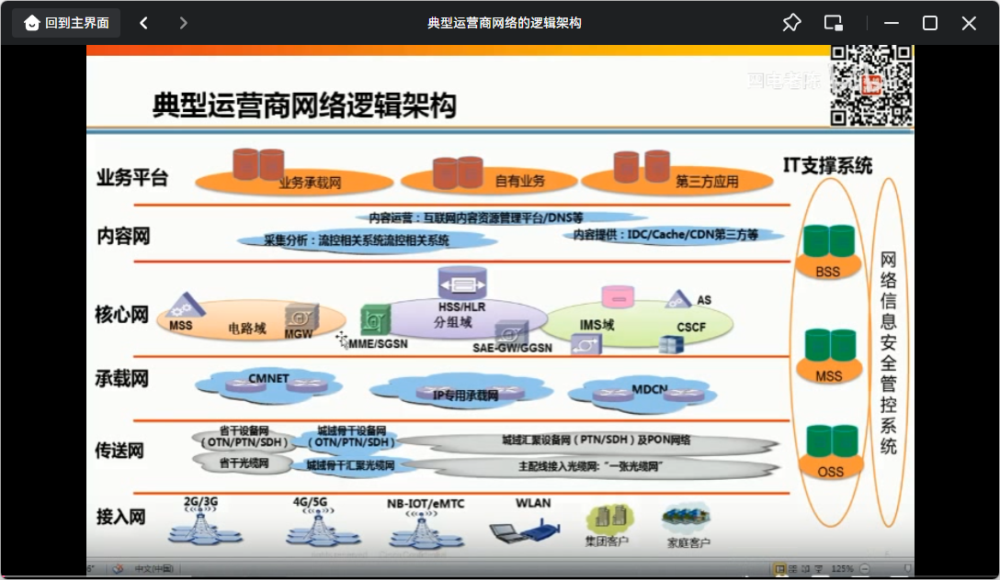

BRAS (Broadband Remote Access Server)
一种面向宽带网络应用的新型接入网关。它是宽带接入网的骨干网之间的桥梁，提供基本的接入手段和宽带接入网的管理功能。它位于网络的边缘，提供宽带接入服务、实现多种业务的汇聚与转发，能满足不同用户对传输容量和带宽利用率的要求，因此是宽带用户接入的核心设备。

SR-Service Router--全业务路由器
第二IP边缘节点，其功能与第一IP边缘节点BRAS类似,用来终结和管理用户的PPPoE/IPoE会话.BRAS作为传统的互联网业务的入口，而SR作为新的精品业务的入口。这个架构是目前国内大多数城域网的现状。

按 TR-101的术语,IP 边缘节点统称为 BNG(Broadband Network Gateway ),BRAS和 SR 都属于BNG的细分形式-可以理解为狭义的BNG。BRAS和SR在功能上并无本质不同,二者最主要的差别是硬件体系架构和平台的速度。是否支持PPPoE或IPoE/DHCP接入方式，并不是BRAS和SR的本质区别,原则上广义的BNG应支持所有的用户接入方式。但从体系架构上讲，从SR向统一的边缘节点演进更符合运营商的思路并贴合实际的硬件能力.

中国电信总局对城域网中的SR路由器有如下定义:“SR路由器主要作为针对大客户的专线接入网关、MPLSVPN PE设备以及组播业务网关”。随着宽带互联、企业VPN、NGN业务的迅速增长以及未来开展IPtV的需要，在城域网的接入层面，单纯依靠原有提供PPPoE接入、L2TP VPN的BRAS设备已经越来越不能满足城域网对开展多种业务的要求，因此需要新型的业务路由器(SR),这种新型的业务路由器具备以下明显的技术特征:

1.具备高密度的高速接口，便于在节省光纤资源、提供更高链路带宽的前提下连接城域网核心路由器(CR)或者骨干网的PE设备。
2.能提供大容量的L3VPN,L2VPN(VLL)和 VPLS业务的能力，支持跨域的L3VPN、L2VPN服务。
3.Qos保证具有强大、灵活的Qos能力,能实现层次化Qos，对于延时敏感的业务(如Voice)能提供LLQ的

4.提供高性能的组播复制、转发能力，为了便于今后IPtV和视频业务在城域网的部署，业务路由器也应该具备或者在未来能够提供Multicat VPN的能力。
5.实现系统级的高可靠性，除了在硬件组件上具有高冗余、高可靠性(硬件关键组件应实现备份机制，如:风扇、电源、交换网板、时钟板、路由引擎等).还要在数据转发和协议的控制层面上实现NSF/SSO。
6.具有安全防御手段,能够抵御网络攻击。
7.提供灵活、丰富、便于实施维护的网络管理平台,方便业务部署、网络维护和故障分析.

此外,不同规模的城域网也对SR路由器提出了略有差异的需求.对于规模较小的城域网络，自SR路由器以下的宽带接入网基本上是扁平的L2(二层)网络，大部分的三层终结业务都要发生在SR路由器上，因此除了上述要求之外，还需要SR路由器能够提供灵活的接入方式，如:VLAN接入(单层VLAN Tag)、VLAN QinQ接入(双层VLANTag).而对于规模较大的城域网络，一般在宽带接入网内都进行了网络分层，接入路由器(ISR系列)和L3汇聚交换机已经实现了L3业务的终结.那么此时对于城域接入网或者说对于SR路由器的要求则增加了:基于IGP路由优化和快速检测机制(比如:BFD或者Fast Hello)以实现L3网络部分的快速收敛。