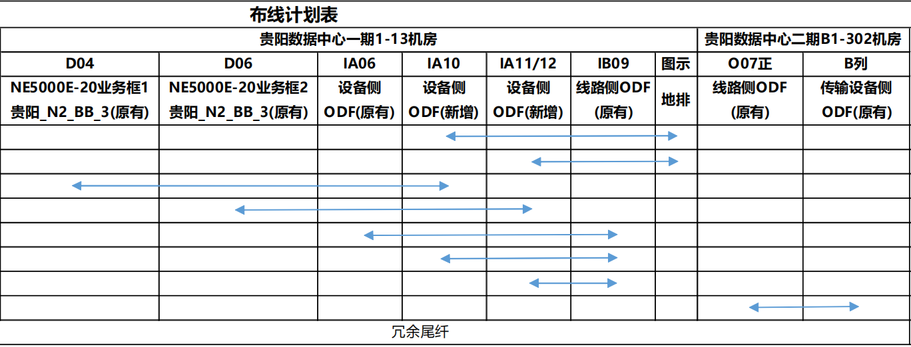

# 集群N+M
2N代表2个集群中央框
M代表几个业务框
- **CLC (Cluster Line-card Chassis)：集群线卡框**
    
    负责**业务接入与转发**，插业务线卡、主控、交换网板，对外提供端口，是集群的 “业务面”Huawei Carrier。
- **CCC (Cluster Central Chassis)：集群中央框 / 交换框**
    
    负责**多框间的集中交换与控制**，不插业务线卡，只做 CLC 之间的数据与控制互联，是集群的 “交换枢纽”Huawei Carrier

| 维度       | CLC（线卡框）     | CCC（中央框）     |
| -------- | ------------ | ------------ |
| **核心定位** | 业务接入、转发      | 跨框交换、集群枢纽    |
| **插什么板** | 业务线卡、主控、交换网板 | 仅交换网板（无业务线卡） |
| **对外端口** | 有（用户 / 网络侧）  | 无（仅集群内部互联）   |
| **独立工作** | 可以（单框模式）     | 不可以（必须配 CLC） |
| **数量关系** | 多台（1~8/16）   | 通常 2 台（冗余）   |
|          |              |              |

# ODF角色
#### 1. 设备侧 ODF

**定义**：直接对接  ** 业务设备（如核心路由器、交换机、防火墙等）**  光口的 ODF 区域 / 端口，是「设备 ↔ 光纤链路」的中间接口。
#### 2. 线路侧 ODF

**定义**：直接对接 ** 外部光缆线路（如机房主干光缆、局间光缆、运营商入局光缆）** 的 ODF 区域 / 端口，是「外部线路 ↔ 内部设备 / 传输」的中间接口。
#### 3. 传输设备侧 ODF

**定义**：专门对接 ** 传输设备（如 PTN/OTN/SDH 等长距传输设备）** 光口的 ODF 区域 / 端口，是「传输设备 ↔ 光纤链路」的中间接口。

